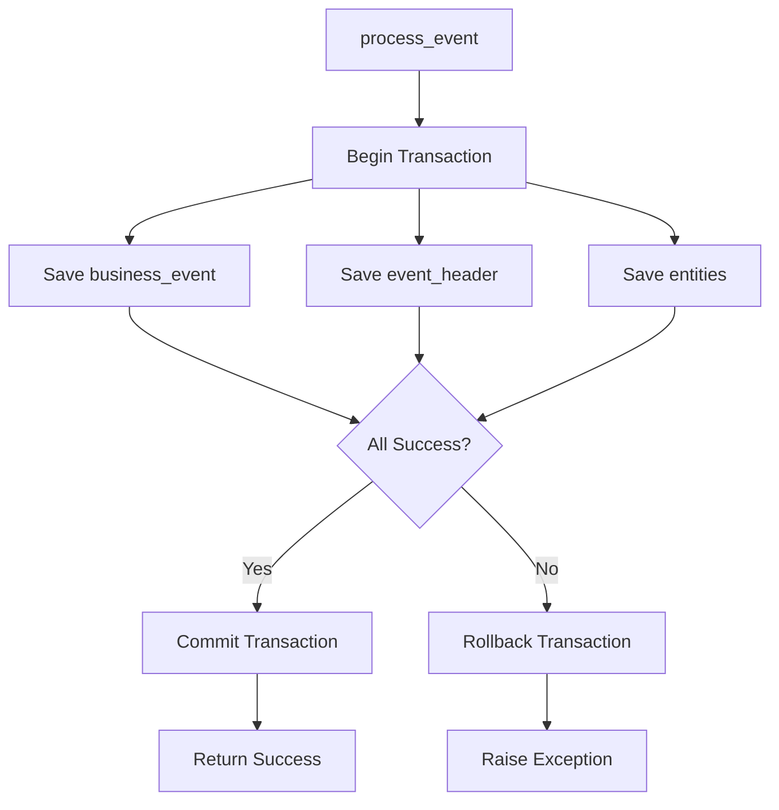

# Back-End Implementation Guide

This document covers the back-end infrastructure components including AWS Lambda functions, Aurora PostgreSQL, Aurora DSQL, and RDS Proxy for the CDC streaming architecture.

## Table of Contents

1. [Database Options](#database-options)
   - [Aurora PostgreSQL Database](#aurora-postgresql-database)
   - [Aurora DSQL Database](#aurora-dsql-database)
2. [RDS Proxy for Connection Pooling](#rds-proxy-for-connection-pooling)
3. [Aurora Auto-Start/Stop for Cost Optimization](#aurora-auto-startstop-for-cost-optimization)
4. [Lambda Functions](#lambda-functions)
5. [Configuration and Deployment](#configuration-and-deployment)

## Database Options

The project supports two database options for event storage:

1. **Aurora PostgreSQL** - Traditional managed PostgreSQL database with connection pooling and auto-start/stop features
2. **Aurora DSQL** - Serverless distributed SQL database (released May 2025) with IAM authentication and VPC endpoints

Both databases support the same schema and CDC streaming functionality. Choose based on your requirements:
- **Aurora PostgreSQL**: Better for traditional workloads, supports RDS Proxy, auto-start/stop, and standard password authentication
- **Aurora DSQL**: Better for serverless workloads, auto-scales, uses IAM authentication, and VPC endpoints (no RDS Proxy needed)

## Aurora PostgreSQL Database

### Overview

Aurora PostgreSQL serves as the source of truth for event headers stored in the `event_headers` table. The database uses a hybrid data model combining relational columns for efficient filtering and a JSONB column for header data. The `event_headers` table has a foreign key relationship to the `business_events` table.

### Database Schema

The `event_headers` table schema uses a hybrid approach:

```sql
CREATE TABLE event_headers (
    -- Relational columns for efficient filtering and querying
    id VARCHAR(255) PRIMARY KEY,
    event_name VARCHAR(255) NOT NULL,
    event_type VARCHAR(255),
    created_date TIMESTAMP WITH TIME ZONE,
    saved_date TIMESTAMP WITH TIME ZONE,
    
    -- JSONB column for event header structure
    header_data JSONB NOT NULL,  -- Contains: {uuid, eventName, eventType, createdDate, savedDate}
    
    -- Foreign key to business_events
    CONSTRAINT fk_event_headers_business_events 
        FOREIGN KEY (id) REFERENCES business_events(id) 
        ON DELETE CASCADE
);
```

**Benefits of This Approach**:

1. **Efficient Filtering**: Relational columns (`event_type`, `event_name`) enable fast filtering in Flink SQL without JSON parsing
2. **Header Data Preservation**: JSONB `header_data` column preserves event header structure
3. **Index Support**: PostgreSQL can index relational columns for fast queries
4. **Flexibility**: Consumers can access both relational metadata and header data
5. **CDC Compatibility**: CDC connectors can efficiently capture both column values and JSONB content
6. **Note**: Only header information is streamed via CDC. Entity information is stored separately and can be queried from the database if needed.

### Logical Replication Configuration

For CDC to work, logical replication must be enabled:

```sql
-- Enable logical replication
ALTER SYSTEM SET wal_level = logical;
ALTER SYSTEM SET max_replication_slots = 10;
ALTER SYSTEM SET max_wal_senders = 10;

-- Create replication slot (done by connector)
SELECT pg_create_logical_replication_slot('business_events_cdc_slot', 'pgoutput');
```

### How It Works

- Producer APIs insert event headers into `event_headers` table with both relational columns and header JSONB data
- PostgreSQL Write-Ahead Log (WAL) records all changes
- Logical replication slots enable CDC capture without impacting database performance
- CDC connector captures both relational column values and the `header_data` JSONB content
- Relational columns enable efficient filtering in Flink SQL
- JSONB column preserves event header structure for consumers
- Note: Only header information is streamed. Entity information must be queried from the database separately if needed.

### Event Processing Transaction Flow

The Python Lambda API processes events atomically within a single database transaction. All related data (business events, event headers, and entities) are saved together, ensuring data consistency:



**Transaction Benefits**:

1. **Atomicity**: All operations (business_events, event_headers, entities) succeed or fail together
2. **Data Consistency**: Foreign key relationships are maintained (event_headers.id → business_events.id, entities.event_id → event_headers.id)
3. **Error Handling**: If any operation fails, all changes are automatically rolled back
4. **Referential Integrity**: Foreign key constraints ensure event headers cannot exist without corresponding business events

## Aurora DSQL Database

### Overview

Aurora DSQL (DynamoDB SQL) is a serverless, distributed SQL database released by AWS in May 2025. It provides PostgreSQL compatibility with serverless auto-scaling, IAM authentication, and VPC endpoint connectivity.

### Key Features

- **Serverless**: Auto-scales based on load using Aurora Capacity Units (ACU)
- **IAM Authentication**: Uses IAM roles/users instead of passwords
- **VPC Endpoints**: Connects via VPC endpoints (not direct VPC access)
- **PostgreSQL Compatible**: Supports PostgreSQL 16 feature subset
- **Multi-Region**: Supports active-active deployments across regions
- **No RDS Proxy Needed**: Built-in connection management
- **No Auto-Start/Stop**: Serverless auto-scales, no manual lifecycle management

### Architecture

- DSQL cluster created via `aws_dsql_cluster` resource (not `aws_rds_cluster`)
- VPC endpoint created for connectivity (always uses private subnets)
- KMS encryption required (custom KMS key)
- IAM database users mapped to IAM roles/users
- Lambda functions connect via VPC endpoint DNS name

### Connection Details

- **Authentication**: IAM-based (no master password)
- **Connection String**: Uses VPC endpoint DNS name
- **Port**: 5432 (PostgreSQL standard)
- **Hostname**: Format `<cluster-id>.<service-suffix>.<region>.on.aws` (for SNI)
- **VPC Required**: Lambda must be in VPC to access VPC endpoint

### Configuration

- **Managed via Terraform**: `terraform/modules/aurora-dsql/`
- **Enabled via**: `enable_aurora_dsql_cluster = true`
- **Scaling**: Configured via `aurora_dsql_min_capacity` and `aurora_dsql_max_capacity` (ACU)
- **Auto-Pause**: Can be enabled for cost optimization (`aurora_dsql_auto_pause = true`)

### Differences from Aurora PostgreSQL

| Feature | Aurora PostgreSQL | Aurora DSQL |
|---------|------------------|-------------|
| Authentication | Password-based | IAM-based |
| Connection | Direct VPC or RDS Proxy | VPC endpoints only |
| Scaling | Manual instance sizing | Serverless ACU auto-scaling |
| Start/Stop | Manual or auto-start/stop | Serverless (no start/stop) |
| RDS Proxy | Supported | Not needed |
| Cost Model | Instance-based | ACU-based (pay per use) |

### CDC Support

- DSQL supports CDC via Debezium connector
- Custom Debezium connector available: `debezium-connector-dsql/`
- See [Debezium DSQL Connector README](../debezium-connector-dsql/README.md) for setup details

### When to Use DSQL

- **Serverless workloads**: Auto-scaling Lambda functions
- **IAM-first security**: Prefer IAM authentication over passwords
- **Cost optimization**: Pay-per-use ACU model for variable workloads
- **Multi-region**: Need active-active deployments
- **Modern architecture**: Building new serverless applications

### When to Use Aurora PostgreSQL

- **Traditional workloads**: Predictable, steady-state workloads
- **Password authentication**: Existing password-based auth systems
- **RDS Proxy**: Need connection pooling for high concurrency
- **Auto-start/stop**: Want manual lifecycle management for cost savings
- **Established patterns**: Existing PostgreSQL tooling and workflows

## RDS Proxy for Connection Pooling

### Overview

For high-throughput write operations from serverless Lambda functions, **RDS Proxy** is deployed to enable connection pooling and multiplexing.

### Purpose

Manages database connections efficiently for Lambda functions writing events to `business_events` table.

### Benefits

- **Connection Multiplexing**: 2000+ concurrent Lambda instances share a pool of 1,442 actual connections to Aurora (80% of max)
- **Reduced Connection Overhead**: Eliminates "too many clients already" errors by pooling connections
- **Automatic Failover**: Handles connection health checks and automatic failover
- **Improved Latency**: Reuses connections, avoiding connection setup overhead

### Architecture

- Lambda functions connect to RDS Proxy endpoint (not directly to Aurora)
- RDS Proxy maintains a connection pool to Aurora PostgreSQL
- Each Lambda uses 1-2 connections (reduced from 5), with RDS Proxy managing the pool
- CDC connectors continue to connect directly to Aurora (not through proxy)

### Configuration

- **Managed via Terraform**: `terraform/modules/rds-proxy/`
- **Enabled for test environment**: When `enable_aurora = true`, `enable_python_lambda_pg = true`, `enable_rds_proxy = true`, and `environment = "test"`
- **Disabled for dev environment**: Minimizes infrastructure costs in dev
- **Can be disabled**: Via `enable_rds_proxy = false` variable
- **Note**: RDS Proxy is only for Aurora PostgreSQL. Aurora DSQL uses VPC endpoints and doesn't require RDS Proxy (it has built-in connection management).

### Capacity

- Supports 2000+ concurrent Lambda executions vs ~16 without proxy

### Monitoring

Monitor CloudWatch metrics to detect saturation:

- `ConnectionBorrowedWaitTime`: Time waiting for available connections
- `DatabaseConnections`: Number of active database connections
- `CPUUtilization`: Proxy CPU usage

## Aurora Auto-Start/Stop for Cost Optimization

### Overview

For test environments, **Aurora Auto-Start/Stop** functionality is deployed to automatically manage Aurora PostgreSQL database lifecycle and reduce costs during periods of inactivity.

**Note**: Auto-start/stop is only available for Aurora PostgreSQL, not Aurora DSQL. DSQL is serverless and auto-scales, so it doesn't require manual start/stop management.

### Purpose

Automatically stops Aurora cluster when inactive and starts it when API requests arrive.

### Benefits

- **Cost Savings**: Reduces compute costs by stopping the database during off-hours or low-activity periods
- **User Experience**: Provides seamless experience with automatic startup on first request
- **Environment**: Only enabled for test environment (not dev or prod)

### Auto-Stop Lambda

**Purpose**: Monitors API Gateway invocations and automatically stops Aurora cluster after a period of inactivity.

**How It Works**:

1. **Scheduled Execution**: Runs every hour via EventBridge (rate: 1 hour)
2. **Activity Monitoring**: Checks CloudWatch metrics for API Gateway invocations in the last N hours (default: 3 hours)
3. **Decision Logic**:
   - If API invocations detected → Keeps cluster running
   - If no invocations for 3+ hours → Stops Aurora cluster
4. **Fail-Safe**: If metrics cannot be checked, keeps cluster running (prevents accidental shutdowns)

**Configuration**:

- **Trigger**: EventBridge schedule (every 1 hour)
- **Inactivity Threshold**: 3 hours (configurable via `inactivity_hours` variable)
- **Monitoring**: API Gateway `Count` metric from CloudWatch
- **Actions**: `rds:DescribeDBClusters`, `rds:StopDBCluster`, `rds:StartDBCluster`
- **Terraform Module**: `terraform/modules/aurora-auto-stop/`

**Example Flow**:

```text
Hour 0: API receives requests → Cluster running
Hour 1: No requests → Auto-stop Lambda checks → Activity detected → Keeps running
Hour 2: No requests → Auto-stop Lambda checks → Activity detected → Keeps running
Hour 3: No requests → Auto-stop Lambda checks → No activity for 3 hours → Stops cluster
Hour 4: Cluster stopped (saving compute costs)
```

### Auto-Start Lambda

**Purpose**: Automatically starts Aurora cluster when API requests arrive and database is stopped.

**How It Works**:

1. **Trigger**: Invoked by API Lambda when database connection fails
2. **Status Check**: Checks Aurora cluster status via RDS API
3. **Start Logic**:
   - If cluster is `stopped` → Starts cluster immediately
   - If cluster is `available` or `starting` → Returns current status
   - If cluster is in transition → Returns status without action
4. **Response**: Returns status information for API Lambda to provide user feedback

**Integration with API Lambda**:

The Python REST Lambda handler includes automatic database startup logic:

1. **Connection Error Detection**: Catches database connection errors during API requests
2. **Auto-Start Invocation**: Invokes auto-start Lambda to check/start database
3. **User-Friendly Response**: Returns HTTP 503 with retry guidance:

   ```json
   {
     "error": "Service Temporarily Unavailable",
     "message": "The database is currently starting. Please retry your request in 1-2 minutes.",
     "status": 503,
     "retry_after": 120
   }
   ```

4. **Retry Header**: Includes `Retry-After: 120` header for client guidance

**Example Flow**:

```text
1. User submits event to API
2. API Lambda attempts database connection → Fails (database stopped)
3. API Lambda detects connection error
4. API Lambda invokes auto-start Lambda
5. Auto-start Lambda checks status → Cluster is stopped
6. Auto-start Lambda starts cluster
7. API Lambda returns 503: "Database is starting, please retry in 1-2 minutes"
8. User retries after 1-2 minutes → Database is available → Request succeeds
```

**Configuration**:

- **Trigger**: Invoked by API Lambda on connection failure
- **Actions**: `rds:DescribeDBClusters`, `rds:StartDBCluster`
- **Terraform Module**: `terraform/modules/aurora-auto-start/`
- **IAM Permissions**: API Lambda has permission to invoke auto-start Lambda
- **Environment Variable**: `AURORA_AUTO_START_FUNCTION_NAME` set in API Lambda

### Cost Optimization Benefits

**Cost Savings**:

- **Compute Costs**: Aurora compute charges only apply when cluster is running
- **Storage Costs**: Storage charges continue (minimal compared to compute)
- **Typical Savings**: 50-70% cost reduction for dev/staging environments with intermittent usage
- **Example**: If database is stopped 12 hours/day → ~50% cost savings

**When Auto-Start/Stop is Enabled**:

- **Environments**: Only test environment (not dev or prod)
- **Conditions**:
  - `enable_aurora = true`
  - `enable_python_lambda_pg = true`
  - `environment = "test"`
- **Terraform**: Automatically deployed when conditions are met
- **Note**: Auto-start/stop only applies to Aurora PostgreSQL. Aurora DSQL is serverless and doesn't support manual start/stop.

### Monitoring

Key CloudWatch metrics to monitor:

```bash
# Auto-Stop Lambda Metrics
- Invocations: Should be ~24/day (once per hour)
- Duration: Should be < 5 seconds typically
- Errors: Should be 0 (fail-safe keeps cluster running on errors)

# Auto-Start Lambda Metrics
- Invocations: Varies based on API usage patterns
- Duration: Should be < 5 seconds typically
- Errors: Monitor for RDS API errors

# Aurora Metrics
- DBClusterStatus: Monitor transitions (available → stopped → starting → available)
- DatabaseConnections: Should be 0 when stopped

# API Lambda Metrics
- 503 Responses: Track when database is starting
- Connection Errors: Should decrease after auto-start implementation
```

### Best Practices

1. **Confluent Cloud Environments**: Auto-start/stop is disabled for Confluent Cloud to ensure availability
2. **CDC Connectors**: CDC connectors connect directly to Aurora (not through RDS Proxy)
   - **Note**: If database is stopped, CDC connectors will fail until database restarts
   - **Recommendation**: For production CDC pipelines, keep database running or use separate production database
3. **Startup Time**: Aurora typically takes 1-2 minutes to start from stopped state
   - API returns 503 with retry guidance during this period
   - Clients should implement exponential backoff retry logic
4. **Monitoring**: Set up CloudWatch alarms for:
   - Auto-start Lambda errors
   - Excessive 503 responses from API
   - Database startup failures
5. **Aurora DSQL**: Auto-start/stop doesn't apply to DSQL. DSQL is serverless and auto-scales based on load.

### Configuration Files

- **Auto-Stop Module**: `terraform/modules/aurora-auto-stop/`
  - `main.tf`: Lambda function and EventBridge schedule
  - `variables.tf`: Configuration variables
  - `outputs.tf`: Function name and ARN
- **Auto-Start Module**: `terraform/modules/aurora-auto-start/`
  - `main.tf`: Lambda function code
  - `variables.tf`: Configuration variables
  - `outputs.tf`: Function name and ARN
- **API Lambda Handler**: `producer-api-python-rest-lambda-pg/lambda_handler.py`
  - Includes connection error detection
  - Invokes auto-start Lambda on connection failure
  - Returns user-friendly 503 responses

### Disabling Auto-Start/Stop

To disable auto-start/stop functionality:

1. **Via Terraform Variables**: Set `environment = "dev"` or `environment = "prod"` (auto-start/stop only enabled for test environment)
2. **Manual Override**: Comment out auto-start/stop modules in `terraform/main.tf`
3. **Keep Database Running**: Manually start database and disable auto-stop Lambda schedule

## Lambda Functions

### Producer API Lambda

The project includes two Python REST Lambda implementations for different database backends:

#### Python REST Lambda for PostgreSQL (`producer-api-python-rest-lambda-pg/`)

- **Purpose**: REST API endpoint for creating business events with Aurora PostgreSQL
- **Database Connection**: Uses RDS Proxy endpoint for connection pooling (test environment) or direct Aurora connection (dev)
- **Auto-Start Integration**: Automatically invokes auto-start Lambda on connection failures (test environment only)
- **Error Handling**: Returns user-friendly 503 responses when database is starting

**Key Features**:

- Connection pooling via RDS Proxy (test environment)
- Automatic database startup on connection failure (test environment)
- User-friendly error responses with retry guidance
- Support for both local and Aurora PostgreSQL
- Password-based authentication

**Configuration**:

- Environment variables:
  - `DATABASE_URL`: Database connection string (RDS Proxy endpoint in test, Aurora endpoint in dev)
  - `AURORA_AUTO_START_FUNCTION_NAME`: Auto-start Lambda function name (test environment only)
- IAM Permissions:
  - `rds-db:connect` for database access
  - `lambda:InvokeFunction` for auto-start Lambda invocation (test environment)

#### Python REST Lambda for DSQL (`producer-api-python-rest-lambda-dsql/`)

- **Purpose**: REST API endpoint for creating business events with Aurora DSQL
- **Database Connection**: Uses VPC endpoints for DSQL connectivity
- **Authentication**: IAM-based authentication (no passwords)
- **Scaling**: DSQL auto-scales based on load (no manual start/stop needed)

**Key Features**:

- IAM-based authentication (no password management)
- VPC endpoint connectivity
- Serverless auto-scaling
- Same API interface as PostgreSQL version

**Configuration**:

- Environment variables:
  - `AURORA_DSQL_ENDPOINT`: DSQL VPC endpoint DNS name
  - `AURORA_DSQL_PORT`: DSQL port (default: 5432)
  - `IAM_USERNAME`: IAM database username
  - `AURORA_DSQL_CLUSTER_RESOURCE_ID`: DSQL cluster resource ID for IAM permissions
  - `DSQL_HOST`: DSQL hostname for SNI (format: `<cluster-id>.<service-suffix>.<region>.on.aws`)
- IAM Permissions:
  - `dsql:DbConnect` for database access
  - `kms:Decrypt` and `kms:DescribeKey` for KMS encryption (DSQL uses KMS)

**Terraform Variables**:

- `enable_python_lambda_pg`: Enable PostgreSQL Lambda (default: false)
- `enable_python_lambda_dsql`: Enable DSQL Lambda (default: false)

## Configuration and Deployment

### Terraform Modules

All back-end infrastructure is managed via Terraform:

- **Aurora PostgreSQL**: `terraform/modules/aurora/`
- **Aurora DSQL**: `terraform/modules/aurora-dsql/`
- **RDS Proxy**: `terraform/modules/rds-proxy/` (PostgreSQL only)
- **Auto-Stop Lambda**: `terraform/modules/aurora-auto-stop/` (PostgreSQL, test environment only)
- **Auto-Start Lambda**: `terraform/modules/aurora-auto-start/` (PostgreSQL, test environment only)
- **Lambda Functions**: `terraform/modules/lambda/`

### Deployment Steps

1. **Configure Terraform Variables**:

   For Aurora PostgreSQL:
   ```hcl
   enable_aurora = true
   enable_python_lambda_pg = true
   enable_rds_proxy = true  # Only enabled for test environment
   environment = "test"  # "test" for auto-start/stop, "dev" for minimal setup, "prod" for production
   ```

   For Aurora DSQL:
   ```hcl
   enable_aurora_dsql_cluster = true
   enable_python_lambda_dsql = true
   environment = "dev"  # or "test" or "prod"
   ```

2. **Deploy Infrastructure**:
   ```bash
   cd terraform
   terraform init
   terraform plan
   terraform apply
   ```

3. **Verify Deployment**:
   - Check Aurora cluster status
   - Verify RDS Proxy endpoint
   - Test Lambda function connectivity
   - Monitor CloudWatch metrics

### Environment-Specific Configuration

**Development (`environment = "dev"`)**:
- Minimal infrastructure (1 day logs, 1 day backups)
- No RDS Proxy (minimizes costs)
- No auto-start/stop
- Smaller instance class (db.t3.medium)
- Aurora PostgreSQL or DSQL supported

**Test (`environment = "test"`)**:
- Standard setup (3 days logs, 3 days backups)
- RDS Proxy enabled (for PostgreSQL)
- Auto-start/stop enabled (for PostgreSQL)
- Larger instance class (db.r5.large for PostgreSQL)
- Aurora PostgreSQL or DSQL supported

**Production (`environment = "prod"`)**:
- Auto-start/stop disabled
- RDS Proxy enabled (for PostgreSQL)
- Database always running
- Enhanced monitoring and alerting
- Longer backup retention
- Aurora PostgreSQL or DSQL supported

## Related Documentation

- [ARCHITECTURE.md](ARCHITECTURE.md): Overall system architecture
- [CONFLUENT_CLOUD_SETUP_GUIDE.md](CONFLUENT_CLOUD_SETUP_GUIDE.md): Confluent Cloud setup and Flink configuration
- [README.md](README.md): Main documentation and quick start guide
