# How Data Gets Into PostgreSQL for CDC Pipeline

## Overview

This document explains how events enter the PostgreSQL database, which is the source for the CDC (Change Data Capture) streaming pipeline. Understanding this flow is critical for deploying and operating the system.

## Complete Data Flow

```mermaid
flowchart LR
    A[Client/Test Script] -->|HTTP POST /api/v1/events| B[Producer API Java REST]
    B -->|R2DBC Transaction| C[(Aurora PostgreSQL)]
    C -->|WAL Log| D[Debezium CDC Connector]
    D -->|Publish| E[raw-event-headers Topic]
    E -->|Consume| F[Stream Processor]
    F -->|Filter & Route| G[Filtered Topics]
    
    style A fill:#e1f5ff
    style B fill:#fff9c4
    style C fill:#c8e6c9
    style D fill:#ffccbc
    style E fill:#f3e5f5
    style F fill:#e8f5e9
    style G fill:#fff3e0
```



## Step-by-Step: How Events Enter PostgreSQL

### Step 1: Event Submission

**Entry Point**: Producer API Java REST (Spring Boot Application on EC2)

Events are submitted via HTTP POST request to the Producer API endpoint:

```bash
POST http://<producer-api-url>:8081/api/v1/events
Content-Type: application/json

{
  "eventHeader": {
    "uuid": "event-123",
    "eventName": "Car Created",
    "eventType": "CarCreated",
    "createdDate": "2024-01-15T10:30:00Z",
    "savedDate": "2024-01-15T10:30:05Z"
  },
  "entities": [
    {
      "entityHeader": {
        "entityId": "car-456",
        "entityType": "Car",
        ...
      },
      ...
    }
  ]
}
```

**Who Submits Events?**

1. **E2E Test Script**: `cdc-streaming/scripts/submit-test-events.sh`
   - Used for testing the pipeline
   - Submits 10 events of each type (40 total)
   - Called by `test-e2e-pipeline.sh` in Step 5

2. **Production Applications**: Any application that needs to create events
   - External systems
   - Web applications
   - Mobile apps
   - Other microservices

### Step 2: Producer API Processing

**Service**: Producer API Java REST (Spring Boot with R2DBC)

The Producer API receives the event and processes it in a **single database transaction**:

```java
// Pseudo-code from producer-api-java-rest
public Mono<Void> processEvent(Event event) {
    return databaseClient.inTransaction(db -> {
        // 1. Save entire event to business_events table
        return saveBusinessEvent(event, db)
            .then(saveEventHeader(event, db))  // 2. Save event header (CDC source!)
            .then(Flux.fromIterable(event.getEntities())
                .flatMap(entity -> processEntityUpdate(entity, db))  // 3. Save entities
                .then());
    });
}
```

**What Gets Written to PostgreSQL?**

The Producer API writes to **three types of tables**:

1. **`business_events`** table:
   - Stores the complete event JSON in `event_data` JSONB column
   - Includes both `eventHeader` and `entities`
   - Primary key: `id` (from `eventHeader.uuid`)

2. **`event_headers`** table (CDC Source):
   - Stores event header information
   - **This is the table monitored by CDC connector**
   - Has relational columns: `id`, `event_name`, `event_type`, `created_date`, `saved_date`
   - Has JSONB column: `header_data` (full eventHeader JSON)
   - Primary key: `id` (same as business_events.id)

3. **Entity tables** (`car_entities`, `loan_entities`, etc.):
   - Store individual entities extracted from the event
   - Each entity type has its own table
   - Foreign key: `event_id` → `event_headers.id`

### Step 3: Database Schema

**Key Table: `event_headers`** (CDC Source)

```sql
CREATE TABLE event_headers (
    id VARCHAR(255) PRIMARY KEY,              -- from eventHeader.uuid
    event_name VARCHAR(255) NOT NULL,          -- from eventHeader.eventName
    event_type VARCHAR(255),                   -- from eventHeader.eventType
    created_date TIMESTAMP WITH TIME ZONE,     -- from eventHeader.createdDate
    saved_date TIMESTAMP WITH TIME ZONE,      -- from eventHeader.savedDate
    header_data JSONB NOT NULL,               -- full eventHeader JSON
    CONSTRAINT fk_event_headers_business_events 
        FOREIGN KEY (id) REFERENCES business_events(id) 
        ON DELETE CASCADE
);
```

**Why This Structure?**

- **Relational columns** (`event_type`, `event_name`) enable efficient filtering in Flink SQL
- **JSONB column** (`header_data`) preserves full event header structure
- **CDC connector** captures both column values and JSONB content
- **Only header information** is streamed (not entities)

### Step 4: CDC Capture

**Debezium CDC Connector** (Running in Confluent Cloud)

Once data is in PostgreSQL:

1. **PostgreSQL WAL (Write-Ahead Log)** records the change
2. **Logical replication slot** enables CDC capture
3. **Debezium connector** monitors the `event_headers` table
4. **Connector captures**:
   - Relational column values as separate fields
   - `header_data` JSONB as JSON string
   - CDC metadata: `__op` (operation: 'c'=create, 'u'=update, 'd'=delete)
   - CDC metadata: `__table` (table name: "event_headers")
   - CDC metadata: `__ts_ms` (timestamp)

5. **Publishes to Kafka** topic: `raw-event-headers`

### Step 5: Stream Processing

**Stream Processor** (Spring Boot or Flink SQL)

- Consumes from `raw-event-headers` topic
- Filters events based on `event_type` and `__op`
- Routes to filtered topics: `filtered-*-events-spring` or `filtered-*-events-flink`

## Important Points

### 1. Producer API Java REST is the Entry Point

**The Producer API Java REST IS part of the EC2 deployment.** It's a Spring Boot service that:
- Receives HTTP POST requests with events at `POST /api/v1/events`
- Writes events to Aurora PostgreSQL using R2DBC (reactive database driver)
- Runs on port 8081
- Connects directly to Aurora PostgreSQL (no Lambda required)

### 2. Database Must Be Pre-Configured

**Aurora PostgreSQL must have:**
- Schema created (tables: `business_events`, `event_headers`, entity tables)
- Logical replication enabled (`wal_level = logical`)
- Replication slots configured (done by CDC connector)
- Proper permissions for Producer API to write (database user credentials in `.env`)

### 3. CDC Connector Must Be Running

**Confluent Cloud CDC Connector must:**
- Be configured to monitor `event_headers` table
- Have connection to Aurora PostgreSQL
- Be running and healthy
- Publish to `raw-event-headers` topic

### 4. Events Flow One Way

```
Lambda API → PostgreSQL → CDC → Kafka → Stream Processor → Filtered Topics → Consumers
```

**Note**: The EC2 deployment (stream-processor, metadata-service, consumers) does NOT write to PostgreSQL. It only:
- Reads from Kafka topics
- Processes and filters events
- Consumes filtered events

## For EC2 Deployment

### What You Need

1. **Producer API URL**: Running on EC2
   ```bash
   # Default: http://localhost:8081 (if on same EC2)
   # Or: http://<ec2-public-ip>:8081
   export PRODUCER_API_URL=http://localhost:8081
   ```

2. **Aurora Endpoint**: From Terraform outputs or AWS Console
   ```bash
   terraform output -raw aurora_endpoint
   ```

3. **Database Credentials**: From AWS Secrets Manager or Terraform
   - Database name: `car_entities` (default)
   - Username: `postgres` (default, or from Terraform)
   - Password: From Terraform outputs or Secrets Manager
   - R2DBC URL: `r2dbc:postgresql://<endpoint>:5432/<database>`

### How to Inject Test Data

**Using the E2E Test Script:**

```bash
cd /opt/api-performance-multi-lang/cdc-streaming

# Run complete E2E pipeline (submits events via Producer API)
./scripts/test-e2e-pipeline.sh

# Or submit events manually
./scripts/submit-test-events.sh http://localhost:8081 /tmp/events.json
```

**Using curl directly:**

```bash
# Submit a single event
curl -X POST http://localhost:8081/api/v1/events \
  -H "Content-Type: application/json" \
  -d @data/schemas/event/samples/car-created-event.json
```

**Using Python script:**

```python
import requests
import json

api_url = "https://<lambda-api-url>/api/v1/events"

with open("data/schemas/event/samples/car-created-event.json") as f:
    event = json.load(f)

response = requests.post(api_url, json=event)
print(response.status_code, response.json())
```

## Verification

### Check Events in Database

```bash
# Connect to Aurora
psql -h $AURORA_ENDPOINT -U $AURORA_DB_USER -d $AURORA_DB_NAME

# Count events
SELECT COUNT(*) FROM event_headers;
SELECT COUNT(*) FROM business_events;

# View recent events
SELECT id, event_name, event_type, created_date 
FROM event_headers 
ORDER BY created_date DESC 
LIMIT 10;
```

### Check CDC Connector Status

```bash
# Using Confluent CLI
confluent connect list

# Check connector status
confluent connect describe <connector-name>
```

### Check Kafka Topics

```bash
# List topics
confluent kafka topic list

# Consume from raw-event-headers
confluent kafka topic consume raw-event-headers --max-messages 5
```

## Troubleshooting

### Events Not Appearing in Database

1. **Check Producer API is running:**
   ```bash
   docker-compose ps producer-api-java-rest
   curl http://localhost:8081/api/v1/events/health
   ```

2. **Check Producer API logs:**
   ```bash
   docker-compose logs producer-api-java-rest
   # Look for errors in event processing or database connection
   ```

3. **Check database connection:**
   ```bash
   # Test Aurora connection from EC2
   psql -h $AURORA_ENDPOINT -U $AURORA_DB_USER -d $AURORA_DB_NAME -c "SELECT 1"
   
   # Check Producer API can connect
   docker-compose logs producer-api-java-rest | grep -i "r2dbc\|connection\|database"
   ```

4. **Check database permissions:**
   - Producer API needs INSERT permission on `business_events`, `event_headers`, and entity tables
   - Verify credentials in `.env` file (AURORA_USERNAME, AURORA_PASSWORD)

### Events in Database But Not in Kafka

1. **Check CDC connector status:**
   ```bash
   confluent connect describe <connector-name>
   ```

2. **Check connector logs:**
   - Confluent Cloud Console → Connectors → Logs

3. **Verify logical replication:**
   ```sql
   SELECT * FROM pg_replication_slots;
   ```

4. **Check topic exists:**
   ```bash
   confluent kafka topic describe raw-event-headers
   ```

## Summary

**Data Flow to PostgreSQL:**

1. **Client/Test Script** → HTTP POST to Producer API Java REST (port 8081)
2. **Producer API** → Writes to Aurora PostgreSQL via R2DBC in transaction:
   - `business_events` table (full event)
   - `event_headers` table (CDC source)
   - Entity tables (car_entities, loan_entities, etc.)
3. **PostgreSQL WAL** → Records changes
4. **Debezium CDC Connector** → Captures changes from `event_headers` table
5. **Kafka** → Receives events in `raw-event-headers` topic
6. **Stream Processor** → Filters and routes events
7. **Consumers** → Process filtered events

**Key Takeaway**: The Producer API Java REST (running on EC2) is the **entry point** for writing events to PostgreSQL. The other EC2 services (stream-processor, metadata-service, consumers) are **read-only** from Kafka and do not write to PostgreSQL.
