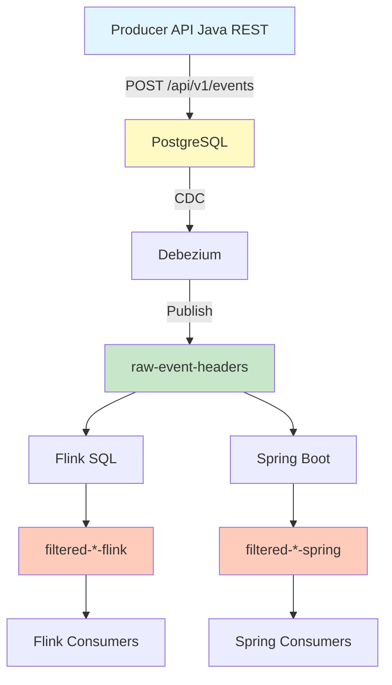

# End-to-End Test Pipeline Guide

## Overview

The `test-e2e-pipeline.sh` script is a comprehensive end-to-end functional test that validates the entire CDC streaming pipeline from event submission through database persistence, CDC capture, Kafka streaming, stream processing, and consumer consumption.

**Purpose**: Verify that both Flink SQL and Spring Boot Kafka Streams implementations correctly filter and route events through the complete data flow.

## Pipeline Flow



## Test Scope

The pipeline validates:

1. **Event Submission**: Events successfully submitted to Producer API Java REST
2. **Database Persistence**: Events stored in PostgreSQL `event_headers` table
3. **CDC Capture**: Debezium connector captures changes and publishes to Kafka
4. **Kafka Topics**: Events appear in `raw-event-headers` topic
5. **Stream Processing**: Both Flink and Spring Boot processors filter and route events
6. **Filtered Topics**: Events appear in processor-specific filtered topics
7. **Consumer Consumption**: All 8 consumers (4 Spring + 4 Flink) receive filtered events

## Prerequisites

### Required Tools

- **Terraform**: For infrastructure outputs (Aurora endpoint)
- **Confluent CLI**: For Kafka topic validation (optional but recommended)
- **Docker & Docker Compose**: For running producer API, stream processor, and consumers
- **jq**: For JSON parsing
- **Python 3**: For database validation scripts
- **AWS CLI**: For Aurora cluster management

### Required Infrastructure

- **Aurora PostgreSQL Cluster**: Running and accessible
- **Producer API Java REST**: Running on EC2 (port 8081) for event submission
- **Confluent Cloud**: Kafka cluster with topics configured
- **CDC Connector**: Debezium connector running and capturing changes
- **Flink Statements**: Deployed in Confluent Cloud (optional, for Flink validation)

### Required Configuration

- **Terraform State**: `terraform/terraform.tfstate` must exist

- **Environment Variables**:
  - `KAFKA_BOOTSTRAP_SERVERS`
  - `KAFKA_API_KEY`
  - `KAFKA_API_SECRET`
  - Database credentials (in `.env.aurora` or `terraform.tfvars`)

## Usage

### Basic Usage

```bash
# Run full pipeline with default wait time (15 seconds)
# Wait time allows CDC to propagate events: Database → CDC Connector → Kafka → Stream Processors
./cdc-streaming/scripts/test-e2e-pipeline.sh

# Run with custom wait time (in seconds)
# Use longer wait times if CDC connector has slower polling or high latency
./cdc-streaming/scripts/test-e2e-pipeline.sh 90

# Fast mode (skip prerequisites and builds)
./cdc-streaming/scripts/test-e2e-pipeline.sh --fast
```

**Wait Time Explanation**:

The wait time (default: 15 seconds) is used in **Step 7: Wait for CDC Propagation**. It allows time for the complete event flow to occur:

1. **Database → CDC Connector**: Debezium connector polls database and captures changes
2. **CDC Connector → Kafka**: Connector publishes events to `raw-event-headers` topic
3. **Kafka → Stream Processors**: Flink/Spring Boot processors consume and filter events
4. **Stream Processors → Filtered Topics**: Processors route filtered events to output topics

**When to Increase Wait Time**:

- CDC connector has slow polling interval (e.g., > 10 seconds)
- High network latency between components
- Large number of events to process
- Stream processors are slow to start or process events
- Events not appearing in filtered topics (increase wait time and retry)

**Typical Wait Times**:

- **15 seconds** (default): Sufficient for most scenarios with normal latency
- **30-60 seconds**: Recommended for first-time setup or when troubleshooting
- **90+ seconds**: Use when CDC connector polling is slow or processing large batches

### Command-Line Flags

| Flag | Description |
|------|-------------|
| `--fast` | Skip prerequisites check and Docker builds (fastest iteration) |
| `--skip-prereqs` | Skip dependency and login checks |
| `--skip-aurora` | Skip Aurora cluster status check |
| `--skip-build` | Skip Docker image builds |
| `--skip-clear-logs` | Skip clearing consumer logs before validation |
| `--skip-to-step N` | Resume from step N (1-10) |
| `--debug` | Enable verbose output with timing information |

### Examples

```bash
# Fast iteration (skip builds, use existing containers)
./cdc-streaming/scripts/test-e2e-pipeline.sh --fast

# Resume from step 5 (database validation)
./cdc-streaming/scripts/test-e2e-pipeline.sh --skip-to-step 5

# Skip Aurora check and use longer wait time
./cdc-streaming/scripts/test-e2e-pipeline.sh --skip-aurora 60

# Debug mode with timing information
./cdc-streaming/scripts/test-e2e-pipeline.sh --debug 30
```

## Step-by-Step Breakdown

### Step 1: Prerequisites Check

**Purpose**: Verify all required tools and dependencies are available.

**Checks**:

- Terraform installed
- Confluent CLI installed
- Docker and Docker Compose available
- jq installed
- Python 3 installed
- Confluent Cloud authentication (optional)

**Output**:

- ✓ or ✗ for each dependency
- Current Confluent Cloud environment (if logged in)

**Skip**: `--skip-prereqs` or `--fast`

### Step 2: Start Aurora Cluster

**Purpose**: Ensure Aurora PostgreSQL cluster is running and accessible.

**Actions**:

1. Check Aurora cluster status via AWS CLI
2. Start cluster if stopped
3. Wait for cluster to become available (max 10 minutes)
4. Extract cluster endpoint, database name, user, and password

**Password Resolution Order**:

1. `terraform/terraform.tfvars` → `database_password`
2. `.env.aurora` → `AURORA_PASSWORD`, `DB_PASSWORD`, or `DATABASE_PASSWORD`
3. `cdc-streaming/.env.aurora` → Same variables
4. Terraform output → `database_password`
5. Environment variables → `DATABASE_PASSWORD`, `DB_PASSWORD`, or `AURORA_PASSWORD`

**Output**:

- ✓ Aurora cluster status
- Aurora endpoint URL

**Skip**: `--skip-aurora`

### Step 3: Get Lambda API URL

**Purpose**: Retrieve Lambda API endpoint URL from Terraform outputs.

**Actions**:

1. Try `terraform output -raw lambda_api_url`
2. Fallback to `terraform output -raw python_rest_pg_api_url`
3. Fallback to JSON output parsing

**Output**:

- ✓ Lambda API URL

**Example Output**:

```text
✓ Lambda API URL: https://xxxxx.lambda-url.us-east-1.on.aws/
```

### Step 4: Submit Events

**Purpose**: Submit test events to Lambda API for processing.

**Actions**:

1. Clear consumer logs (if `--skip-clear-logs` not set)
2. Call `submit-test-events.sh` with Lambda API URL
3. Submit 10 events of each type (40 total):
   - 10 × CarCreated
   - 10 × LoanCreated
   - 10 × LoanPaymentSubmitted
   - 10 × CarServiceDone

**Output**:

- ✓ Events submitted successfully
- Number of events submitted (expected: 40)

**Event File**: Events saved to `/tmp/e2e-test-events-<timestamp>.json`

**Skip**: `--skip-clear-logs` (only skips log clearing, not event submission)

### Step 5: Validate Database

**Purpose**: Verify events were successfully persisted in PostgreSQL.

**Actions**:

1. Connect to Aurora PostgreSQL database
2. Query `event_headers` table
3. Match submitted events with database records
4. Validate event structure and fields

**Script**: `validate-database-events.sh`

**Output**:

- ✓ Database validation successful
- Event count matches
- All events found in database

**Failure Handling**: Continues to next steps even if validation fails (logs error)

### Step 6: Start Stream Processor

**Purpose**: Ensure Spring Boot stream processor is running and healthy.

**Actions**:

1. Check if stream processor container is already running
2. If not running:
   - Build Docker image (unless `--skip-build` or `--fast`)
   - Start container with `docker-compose up -d`
   - Poll health endpoint (`/actuator/health`) until healthy (max 30s)
3. Verify container is running

**Health Check**: `http://localhost:8083/actuator/health`

**Output**:

- ✓ Stream processor started and healthy
- Or warning if health check times out

**Skip**: `--skip-build` or `--fast` (skips build, attempts to start existing image)

### Step 7: Wait for CDC Propagation

**Purpose**: Allow time for CDC to capture database changes and publish to Kafka.

**Actions**:

- Sleep for specified wait time (default: 15 seconds)

**Wait Time**:

- Default: 15 seconds
- Custom: First numeric argument (e.g., `./script.sh 90`)
- Events flow: Database → CDC Connector → Kafka → Stream Processors → Filtered Topics

**Output**:

- ✓ Wait complete

**Note**: This is a simple sleep - actual propagation time depends on:

- CDC connector polling interval
- Kafka broker latency
- Stream processor processing time

### Step 8: Validate Kafka Topics

**Purpose**: Verify events appear in Kafka topics (raw and filtered).

**Actions**:

1. Check Confluent Cloud login status
2. Determine which processor to validate:
   - If Spring Boot running → validate `-spring` topics
   - If only Flink → validate `-flink` topics
   - Default: validate both
3. Call `validate-kafka-topics.sh` with events file and processor type
4. Validate:
   - Events in `raw-event-headers` topic
   - Events in filtered topics (processor-specific)

**Script**: `validate-kafka-topics.sh`

**Topics Validated**:

- **Raw**: `raw-event-headers`

- **Spring Boot**:
  - `filtered-car-created-events-spring`
  - `filtered-loan-created-events-spring`
  - `filtered-loan-payment-submitted-events-spring`
  - `filtered-service-events-spring`

- **Flink**:
  - `filtered-car-created-events-flink`
  - `filtered-loan-created-events-flink`
  - `filtered-loan-payment-submitted-events-flink`
  - `filtered-service-events-flink`

**Output**:

- ✓ Kafka topic validation successful
- Or ✗ if validation fails
- Or ⚠ if Confluent Cloud not logged in (skipped)

**Skip**: Automatically skipped if Confluent Cloud not logged in

### Step 9: Validate Consumers

**Purpose**: Verify all 8 consumers receive filtered events.

**Actions**:

1. Start all 8 consumers (if not running):
   - 4 Spring consumers (from `-spring` topics)
   - 4 Flink consumers (from `-flink` topics)
2. Call `validate-consumers.sh` with events file
3. For each submitted event:
   - Check if event ID appears in consumer logs
   - Validate both Spring and Flink consumers received the event
4. Report validation results

**Script**: `validate-consumers.sh`

**Consumers Validated**:

- **Spring**:
  - `car-consumer-spring`
  - `loan-consumer-spring`
  - `loan-payment-consumer-spring`
  - `service-consumer-spring`

- **Flink**:
  - `car-consumer-flink`
  - `loan-consumer-flink`
  - `loan-payment-consumer-flink`
  - `service-consumer-flink`

**Output**:

- ✓ All 8 consumers validated successfully
- Or ✗ if validation fails

### Step 10: Generate Report

**Purpose**: Summarize test results and provide troubleshooting guidance.

**Actions**:

1. Read results from JSON file
2. Display summary:
   - Events submitted count
   - Database validation status
   - Kafka validation status
   - Consumer validation status
3. Provide success message or troubleshooting tips

**Output**:

```text
Test Results Summary:
  Events Submitted: 40
  Database Validated: true
  Kafka Topics Validated: true
  Consumers Validated: true

✓ All validations passed!

Pipeline flow verified:
  Lambda API → PostgreSQL → CDC → raw-event-headers → Stream Processor → Filtered Topics → Consumers
```

**Exit Codes**:

- `0`: All validations passed
- `1`: One or more validations failed

## Checkpoint System

The script supports checkpointing to resume from a specific step:

**Checkpoint File**: `/tmp/e2e-test-checkpoint-<date>.json`

**Usage**:

```bash
# Resume from step 5
./cdc-streaming/scripts/test-e2e-pipeline.sh --skip-to-step 5
```

**Checkpoint Data**:

- `last_completed_step`: Last successfully completed step number

## Results File

**Location**: `/tmp/e2e-test-results-<timestamp>.json`

**Contents**:

```json
{
  "aurora_started": true,
  "lambda_api_url": "https://xxxxx.lambda-url.us-east-1.on.aws/",
  "events_submitted": true,
  "database_validated": true,
  "kafka_validated": true,
  "consumers_validated": true
}
```

## Event File

**Location**: `/tmp/e2e-test-events-<timestamp>.json`

**Contents**: Array of submitted events with:

- Event ID
- Event type
- Event data
- Timestamp

## Common Use Cases

### 1. Full Pipeline Test

```bash
# Run complete pipeline with 30 second wait
./cdc-streaming/scripts/test-e2e-pipeline.sh 30
```

**Use Case**: Initial validation after deployment or configuration changes.

### 2. Fast Iteration

```bash
# Skip builds and prerequisites for quick testing
./cdc-streaming/scripts/test-e2e-pipeline.sh --fast
```

**Use Case**: Quick validation during development when infrastructure is already running.

### 3. Resume After Failure

```bash
# Resume from database validation step
./cdc-streaming/scripts/test-e2e-pipeline.sh --skip-to-step 5
```

**Use Case**: Continue testing after fixing an issue in earlier steps.

### 4. Validate Specific Processor

```bash
# Only validate Spring Boot (skip Aurora if already running)
./cdc-streaming/scripts/test-e2e-pipeline.sh --skip-aurora --skip-build
```

**Use Case**: Test only Spring Boot processor when Flink is not deployed.

## Troubleshooting

### Issue: Prerequisites Check Fails

**Symptoms**: Missing dependencies reported

**Solutions**:

- Install missing tools (terraform, confluent CLI, docker, jq, python3)
- Verify tools are in PATH
- Check tool versions meet requirements

### Issue: Aurora Cluster Not Starting

**Symptoms**: Cluster stuck in transitional state

**Solutions**:

- Check AWS credentials: `aws sts get-caller-identity`
- Verify cluster exists: `aws rds describe-db-clusters --db-cluster-identifier <id>`
- Check cluster status manually
- Wait longer (script waits up to 10 minutes)

### Issue: Database Password Not Found

**Symptoms**: "Database password not found" error

**Solutions**:

- Ensure `terraform/terraform.tfvars` contains `database_password`
- Or create `.env.aurora` with `AURORA_PASSWORD=...`
- Or set environment variable: `export AURORA_PASSWORD=...`

### Issue: Events Not Submitted

**Symptoms**: Lambda API returns error or timeout

**Solutions**:

- Verify Lambda API URL is correct
- Check Lambda function is deployed and accessible
- Test API manually: `curl -X POST $LAMBDA_API_URL/events -d '...'`
- Check Lambda logs in CloudWatch

### Issue: Database Validation Fails

**Symptoms**: Events not found in database

**Solutions**:

- Verify database connection: `psql -h $AURORA_ENDPOINT -U $DB_USER -d $DB_NAME`
- Check `event_headers` table exists
- Verify events were actually inserted
- Check database logs for errors

### Issue: Stream Processor Not Starting

**Symptoms**: Container fails to start or health check times out

**Solutions**:

- Check logs: `docker-compose -f cdc-streaming/docker-compose.yml logs stream-processor`
- Verify Kafka credentials are set
- Check port 8083 is not in use
- Verify Docker image built successfully
- Check health endpoint manually: `curl http://localhost:8083/actuator/health`

### Issue: Kafka Validation Fails

**Symptoms**: Events not found in Kafka topics

**Solutions**:

- Verify Confluent Cloud login: `confluent environment list`
- Check CDC connector status: `confluent connect list`
- Verify connector is running and capturing changes
- Check `raw-event-headers` topic has messages: `confluent kafka topic consume raw-event-headers --max-messages 5`
- Verify Flink statements are running: `confluent flink statement list`
- Check Spring Boot processor logs for errors

### Issue: Consumer Validation Fails

**Symptoms**: Events not found in consumer logs

**Solutions**:

- Check consumers are running: `docker-compose -f cdc-streaming/docker-compose.yml ps`
- View consumer logs: `docker-compose -f cdc-streaming/docker-compose.yml logs <consumer-name>`
- Verify filtered topics have messages
- Check consumer group offsets
- Restart consumers: `docker-compose -f cdc-streaming/docker-compose.yml restart`

### Issue: Wait Time Too Short

**Symptoms**: Events not propagated before validation

**Solutions**:

- Increase wait time: `./script.sh 90` (90 seconds)
- Check CDC connector polling interval
- Monitor Kafka topics manually to determine actual propagation time
- Use `--debug` flag to see timing information

## Debug Mode

Enable debug mode for detailed timing information:

```bash
./cdc-streaming/scripts/test-e2e-pipeline.sh --debug
```

**Output**:

- Step start/end times
- Elapsed time per step
- Detailed progress information

## Best Practices

1. **Run Full Pipeline First**: Always run complete pipeline after deployment
2. **Use Fast Mode for Iteration**: Use `--fast` during development
3. **Monitor Wait Times**: Adjust wait time based on actual propagation delays
4. **Check Logs on Failure**: Review logs for each component on validation failure
5. **Verify Infrastructure**: Ensure all infrastructure is running before testing
6. **Use Checkpoints**: Resume from last successful step after fixing issues
7. **Validate Both Processors**: Test both Flink and Spring Boot when both are deployed

## Integration with CI/CD

The script can be integrated into Jenkins CI/CD pipelines:

```groovy
pipeline {
    agent any
    environment {
        KAFKA_BOOTSTRAP_SERVERS = credentials('kafka-bootstrap-servers')
        KAFKA_API_KEY = credentials('kafka-api-key')
        KAFKA_API_SECRET = credentials('kafka-api-secret')
        AURORA_PASSWORD = credentials('aurora-password')
    }
    stages {
        stage('Run E2E Test Pipeline') {
            steps {
                sh './cdc-streaming/scripts/test-e2e-pipeline.sh 60'
            }
        }
    }
}
```

## Database Management Scripts

The E2E test pipeline includes utility scripts for managing the Aurora PostgreSQL database during testing and troubleshooting.

### Show Table Counts

**Script**: `show-table-counts.sh`

Displays row counts for all tables or a specific table in the database. Useful for verifying data state before and after tests.

**Usage**:

```bash
# Show counts for all tables
./cdc-streaming/scripts/show-table-counts.sh

# Show count for a specific table
./cdc-streaming/scripts/show-table-counts.sh event_headers
```

**Example Output**:

```text
========================================
Database Table Row Counts
========================================

ℹ Database: car_entities
ℹ Endpoint: cluster.xxxxx.us-east-1.rds.amazonaws.com
ℹ User: postgres

✓ Database connection successful

ℹ Showing row counts for all tables

TABLE_NAME                               ROW_COUNT
---------------------------------------- ----------
business_events                              1250
car_entities                                  450
event_headers                                 1250
loan_entities                                 320
loan_payment_entities                         180
service_record_entities                        90
---------------------------------------- ----------
TOTAL                                        3540

✓ Query completed
```

**Features**:

- Lists all tables with row counts
- Shows total row count across all tables
- Supports querying a single table
- Uses same password resolution logic as E2E pipeline
- Tests database connection before querying

**Use Cases**:

- Verify database state before running tests
- Check if events were persisted correctly
- Monitor table growth over time
- Troubleshoot data inconsistencies

### Clear Database

**Script**: `clear-database.sh`

Clears specified tables or all tables with safety checks and confirmations. Useful for resetting database state between test runs.

**Usage**:

```bash
# Clear all tables (with confirmation)
./cdc-streaming/scripts/clear-database.sh --all

# Clear specific tables
./cdc-streaming/scripts/clear-database.sh event_headers business_events

# Clear all tables without confirmation (use with caution)
./cdc-streaming/scripts/clear-database.sh --all --confirm

# Dry run (see what would be cleared)
./cdc-streaming/scripts/clear-database.sh --all --dry-run

# Clear specific tables with counts shown
./cdc-streaming/scripts/clear-database.sh --tables event_headers business_events --show-counts
```

**Options**:

- `--all`: Clear all tables
- `--tables TABLE...`: Clear specific tables (space-separated)
- `--confirm`: Skip confirmation prompt (use with caution)
- `--dry-run`: Show what would be cleared without actually clearing
- `--show-counts`: Show row counts before/after (default)
- `--no-counts`: Don't show row counts

**Example Output**:

```text
========================================
Database Table Clearing
========================================

ℹ Database: car_entities
ℹ Endpoint: cluster.xxxxx.us-east-1.rds.amazonaws.com
ℹ User: postgres

ℹ Tables to clear (2):
  - event_headers
  - business_events

ℹ Row counts before clearing:

TABLE_NAME                               ROW_COUNT
---------------------------------------- ----------
event_headers                                1250
business_events                              1250

⚠ WARNING: This will DELETE ALL DATA from the specified tables!

Are you sure you want to continue? (type 'yes' to confirm): yes

========================================
Clearing Tables
========================================

ℹ Clearing table: event_headers
✓ Cleared: event_headers
ℹ Clearing table: business_events
✓ Cleared: business_events

ℹ Row counts after clearing:

TABLE_NAME                               ROW_COUNT
---------------------------------------- ----------
event_headers                                   0 (was 1250)
business_events                                 0 (was 1250)

========================================
Summary
========================================

✓ Successfully cleared 2 table(s)
```

**Safety Features**:

- **Confirmation Required**: Prompts for confirmation unless `--confirm` is used
- **Dry Run Mode**: Preview changes without actually clearing
- **Row Count Display**: Shows before/after counts by default
- **Table Listing**: Lists all tables that will be cleared
- **Error Handling**: Reports failures for individual tables

**Use Cases**:

- Reset database state between test runs
- Clear test data after E2E pipeline execution
- Prepare clean database for new test scenarios
- Troubleshoot data issues by starting fresh

**Best Practices**:

1. **Always Use Dry Run First**: Run with `--dry-run` to preview changes
2. **Show Counts**: Use `--show-counts` (default) to verify what's being cleared
3. **Specific Tables**: Clear only necessary tables rather than `--all` when possible
4. **Backup First**: Consider backing up important data before clearing
5. **Use in CI/CD**: Combine with `--confirm` for automated test cleanup

**Integration with E2E Pipeline**:

The E2E pipeline automatically clears the `business_events` table before submitting new events (Step 4). You can manually clear additional tables before running the pipeline:

```bash
# Clear all event-related tables before E2E test
./cdc-streaming/scripts/clear-database.sh event_headers business_events --confirm

# Run E2E pipeline
./cdc-streaming/scripts/test-e2e-pipeline.sh 30
```

## Consumer Management Scripts

The E2E test pipeline includes utility scripts for managing Docker consumer containers and their logs.

### Clear Consumer Logs

**Script**: `clear-consumer-logs.sh`

Clears Docker logs for CDC streaming consumers. Essential for accurate event validation timing in E2E tests, as it ensures only new events appear in consumer logs after event submission.

**Usage**:

```bash
# Clear all consumer logs (truncate method - default)
./cdc-streaming/scripts/clear-consumer-logs.sh

# Clear only Spring consumer logs
./cdc-streaming/scripts/clear-consumer-logs.sh --spring

# Clear only Flink consumer logs
./cdc-streaming/scripts/clear-consumer-logs.sh --flink

# Recreate all consumers (fully clears logs - recommended)
./cdc-streaming/scripts/clear-consumer-logs.sh --restart

# Recreate only Flink consumers
./cdc-streaming/scripts/clear-consumer-logs.sh --restart --flink

# Soft restart (logs may persist in Docker)
./cdc-streaming/scripts/clear-consumer-logs.sh --soft
```

**Options**:

- `--all`: Clear logs for all CDC consumers (default)
- `--spring`: Clear logs for Spring consumers only
- `--flink`: Clear logs for Flink consumers only
- `--restart` or `--recreate`: Recreate containers to fully clear logs (recommended)
- `--soft`: Soft restart only (logs may persist in Docker)
- `--quiet`: Suppress detailed output

**Consumers Managed**:

- **Spring Consumers** (4):
  - `cdc-car-consumer-spring`
  - `cdc-loan-consumer-spring`
  - `cdc-loan-payment-consumer-spring`
  - `cdc-service-consumer-spring`

- **Flink Consumers** (4):
  - `cdc-car-consumer-flink`
  - `cdc-loan-consumer-flink`
  - `cdc-loan-payment-consumer-flink`
  - `cdc-service-consumer-flink`

**Methods**:

1. **Truncate Method** (default): Attempts to truncate Docker log files directly
   - Works on Linux with sudo access
   - On macOS, uses Docker VM access via `nsenter`
   - May not fully clear logs if Docker Desktop has log rotation enabled

2. **Recreate Method** (`--restart`): Stops and recreates containers
   - **Recommended**: Fully clears logs by creating new containers
   - Waits 10 seconds for containers to reconnect to Kafka
   - Most reliable method for complete log clearing

3. **Soft Restart** (`--soft`): Restarts containers without recreating
   - Faster than recreate
   - Logs may persist in Docker's log files
   - Use when you just need to reset consumer state

**Example Output**:

```text
==============================================
Recreating CDC Consumers (fully clears logs)
==============================================

[STOP] Stopping and removing containers...
[OK] Containers removed

[CREATE] Recreating containers...
[OK] Containers recreated

==============================================
Results: 8 recreated, 0 failed
==============================================

ℹ Waiting 10s for containers to connect to Kafka...
```

**Platform-Specific Behavior**:

- **Linux**: Direct access to `/var/lib/docker/containers/` log files (requires sudo)
- **macOS (Docker Desktop)**: Uses `nsenter` to access Docker VM filesystem
- **Both**: Recreate method works reliably on all platforms

**Use Cases**:

- **Before E2E Tests**: Clear logs before submitting events for accurate timing
- **After Test Runs**: Clean up logs to reduce disk usage
- **Troubleshooting**: Reset consumer state when debugging issues
- **Performance Testing**: Start with clean logs for accurate measurements

**Best Practices**:

1. **Use `--restart` for E2E Tests**: Most reliable method for complete log clearing
2. **Clear Before Event Submission**: Ensures only new events appear in logs
3. **Wait After Recreate**: Allow 10-15 seconds for consumers to reconnect to Kafka
4. **Check Consumer Status**: Verify consumers are running after clearing: `docker-compose ps`

**Integration with E2E Pipeline**:

The E2E pipeline automatically calls `clear-consumer-logs.sh --restart` before submitting events (Step 4, Pre-Test Cleanup). This ensures:

- Clean consumer logs for accurate event validation
- Fresh consumer state for each test run
- No interference from previous test events

You can also manually clear logs before running the pipeline:

```bash
# Clear all consumer logs and restart
./cdc-streaming/scripts/clear-consumer-logs.sh --restart

# Run E2E pipeline
./cdc-streaming/scripts/test-e2e-pipeline.sh 30
```

**Troubleshooting**:

- **Logs Not Clearing**: Use `--restart` instead of truncate method
- **Consumers Not Starting**: Check Docker Compose configuration and Kafka connectivity
- **Permission Errors**: On Linux, ensure sudo access for truncate method
- **macOS Issues**: Recreate method works more reliably than truncate on macOS

## Related Scripts

- **`submit-test-events.sh`**: Submits test events to Lambda API
- **`validate-database-events.sh`**: Validates events in PostgreSQL database
- **`validate-kafka-topics.sh`**: Validates events in Kafka topics
- **`validate-consumers.sh`**: Validates consumer consumption
- **`clear-consumer-logs.sh`**: Clears consumer logs before testing
- **`show-table-counts.sh`**: Shows row counts for database tables
- **`clear-database.sh`**: Clears database tables (with safety checks)

## Summary

The E2E test pipeline provides comprehensive validation of the entire CDC streaming system:

- **End-to-End Coverage**: Tests complete flow from API to consumers
- **Multi-Processor Support**: Validates both Flink and Spring Boot implementations
- **Flexible Execution**: Supports skipping steps, resuming, and fast iteration
- **Detailed Reporting**: Provides clear success/failure indicators and troubleshooting guidance
- **Production Ready**: Suitable for CI/CD integration and automated testing

Use this script to ensure the entire pipeline is working correctly after deployments, configuration changes, or infrastructure updates.

---

**Document Version:** 1.0  
**Last Updated:** December 30, 2025  
**Maintained By:** Platform Engineering Team

**Recent Updates:**
- Updated to support Confluent Cloud integration testing
- Enhanced test coverage documentation (154 total integration tests)
- Added support for Spring Boot YAML-based filter testing
