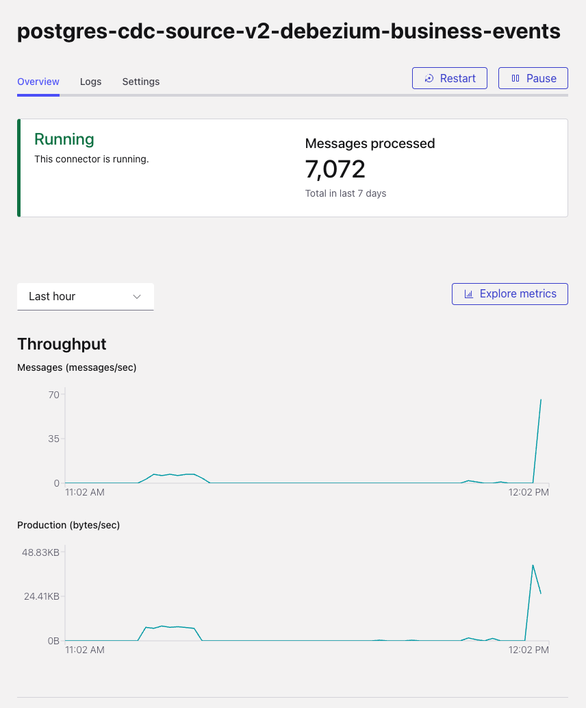
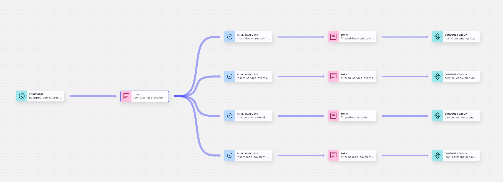
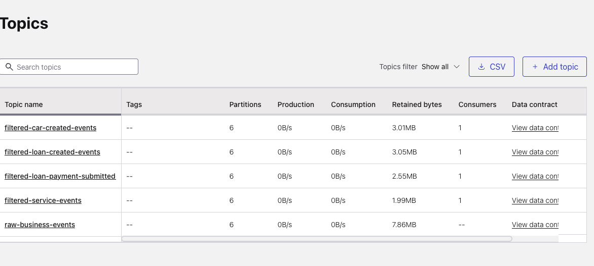
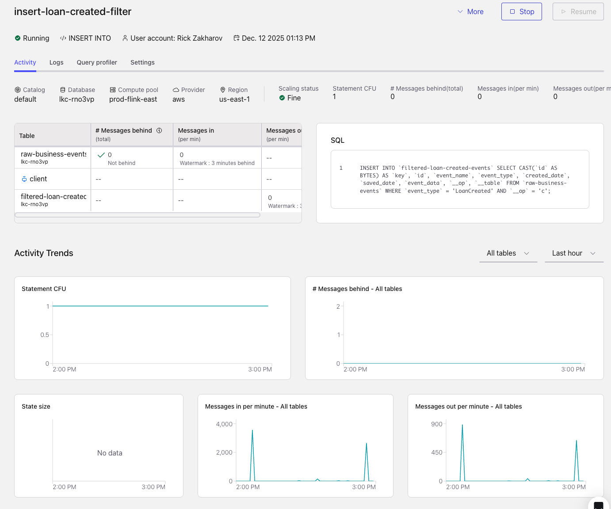

# CDC Streaming System

> Real-time database change capture and event streaming with intelligent filtering and routing

A configurable streaming architecture that captures PostgreSQL database changes and routes filtered events to consumer-specific Kafka topics using Confluent Cloud and Flink SQL.

## 🎯 What It Does

```text
PostgreSQL → CDC Connector → Kafka → Flink SQL → Filtered Topics → Consumers
```

The system automatically:
- **Captures** database changes via CDC
- **Streams** events to Kafka
- **Filters** events by type using Flink SQL
- **Routes** filtered events to consumer-specific topics

## 📸 Visual Overview



*PostgreSQL CDC Source Connector configuration in Confluent Cloud*



*Data lineage showing the flow from PostgreSQL CDC connector through Kafka topics*



*Overview of all Kafka topics in the system*



*Flink SQL insert statement for filtering and routing events*


*Example consumer application logs showing event processing*

## 🚀 Quick Start

### Prerequisites

- **Confluent Cloud account** ([sign up](https://confluent.cloud))
- **Confluent CLI** (`brew install confluentinc/tap/cli`)
- **PostgreSQL database** (Aurora PostgreSQL or self-managed)
- **Network connectivity** between Confluent Cloud and PostgreSQL

### Setup Steps

1. **Follow the [Confluent Cloud Setup Guide](CONFLUENT_CLOUD_SETUP_GUIDE.md)**
   - Create environment and Kafka cluster
   - Set up Schema Registry
   - Create Flink compute pool
   - Deploy CDC connector
   - Deploy Flink SQL statements

2. **Verify the Pipeline**

   ```bash
   # Check connector status
   confluent connector describe postgres-source-connector
   
   # Check Flink statements
   confluent flink statement list --compute-pool <compute-pool-id>
   
   # Verify topics have messages
   confluent kafka topic consume raw-business-events --max-messages 5
   ```

3. **Monitor in Confluent Cloud Console**
   - Navigate to https://confluent.cloud
   - View connectors, topics, and Flink statements
   - Monitor metrics and throughput

## 📋 Key Features

- ✅ **Real-time CDC** from PostgreSQL to Kafka
- ✅ **Intelligent Filtering** via Flink SQL
- ✅ **Auto-scaling** with Confluent Cloud Flink
- ✅ **Schema Management** with Schema Registry
- ✅ **Multi-topic Routing** to consumer-specific topics
- ✅ **Fully Managed** infrastructure (Confluent Cloud)

## 📚 Documentation

| Document | Description |
|----------|-------------|
| [ARCHITECTURE.md](ARCHITECTURE.md) | System architecture, data flow, and component details |
| [CONFLUENT_CLOUD_SETUP_GUIDE.md](CONFLUENT_CLOUD_SETUP_GUIDE.md) | Complete step-by-step setup guide |
| [BACKEND_IMPLEMENTATION.md](BACKEND_IMPLEMENTATION.md) | Back-end infrastructure (Lambda, Aurora, RDS Proxy) |
| [ADVANCED_USE_CASES.md](ADVANCED_USE_CASES.md) | Advanced monitoring, testing, and configuration |
| [DISASTER_RECOVERY.md](DISASTER_RECOVERY.md) | Disaster recovery procedures |

## 🔧 Configuration

### Filter Configuration

Filtering rules are defined in Flink SQL files:
- `flink-jobs/business-events-routing-confluent-cloud.sql` - Main routing job
- Edit SQL files to modify filtering rules

### Connector Configuration

Connector configuration files:
- `connectors/postgres-cdc-source-v2-debezium-business-events-confluent-cloud.json` - Recommended connector

For detailed configuration, see [ARCHITECTURE.md](ARCHITECTURE.md).

## 📊 Data Model

The system uses a **hybrid data model** combining:
- **Relational columns** for efficient filtering (`id`, `event_type`, `event_name`)
- **JSONB column** (`event_data`) for full nested event structure

**Example Event Structure:**

See [`data/schemas/event/samples/loan-created-event.json`](../data/schemas/event/samples/loan-created-event.json) for a complete example.

**Schema Definitions:**
- Event schema: [`data/schemas/event/event.json`](../data/schemas/event/event.json)
- Entity schemas: [`data/schemas/entity/car.json`](../data/schemas/entity/car.json), [`data/schemas/entity/loan.json`](../data/schemas/entity/loan.json)
- Sample data: [`data/entities/car/car-large.json`](../data/entities/car/car-large.json)

For complete schema definitions, see the [data folder README](../data/README.md).

## 🧪 Testing

### Basic Test Event Generation

```bash
cd cdc-streaming/scripts
./generate-test-data-from-examples.sh
```

### Load Testing with k6

```bash
# Send 100 events of each type
k6 run --env HOST=producer-api-java-rest --env PORT=8081 \
  --env EVENTS_PER_TYPE=100 \
  ../../load-test/k6/send-batch-events.js
```

For advanced testing scenarios including parallel execution and high-throughput testing, see [ADVANCED_USE_CASES.md](ADVANCED_USE_CASES.md).

## 📈 Monitoring

### Confluent Cloud Console

Monitor everything via the web console:
- **Connectors**: Status, throughput, errors
- **Topics**: Message counts, throughput, consumer lag
- **Flink Statements**: Processing metrics, latency, backpressure
- **Consumer Groups**: Lag, offsets, throughput

Access at: https://confluent.cloud → Your Environment

### Quick CLI Checks

```bash
# Check connector
confluent connector describe postgres-source-connector

# Check topics
confluent kafka topic list

# Check Flink statements
confluent flink statement list --compute-pool <compute-pool-id>
```

For detailed monitoring commands and REST API integration, see [ADVANCED_USE_CASES.md](ADVANCED_USE_CASES.md).

## 🏗️ Architecture

```text
┌─────────────┐
│ PostgreSQL  │
│ business_   │
│ events      │
└──────┬──────┘
       │ CDC
       ▼
┌─────────────┐
│   Kafka     │
│ raw-business│
│  -events    │
└──────┬──────┘
       │
       ▼
┌─────────────┐
│ Flink SQL   │
│  Filtering  │
└──────┬──────┘
       │
       ▼
┌─────────────────────────────┐
│   Filtered Topics           │
│ • filtered-loan-created-    │
│   events                    │
│ • filtered-car-created-     │
│   events                    │
│ • filtered-service-events   │
└──────┬──────────────────────┘
       │
       ▼
┌─────────────┐
│  Consumers  │
└─────────────┘
```

For detailed architecture documentation, see [ARCHITECTURE.md](ARCHITECTURE.md).

## 🔗 Related Documentation

- **[ARCHITECTURE.md](ARCHITECTURE.md)**: Complete system architecture and data flow
- **[CONFLUENT_CLOUD_SETUP_GUIDE.md](CONFLUENT_CLOUD_SETUP_GUIDE.md)**: Step-by-step setup instructions
- **[BACKEND_IMPLEMENTATION.md](BACKEND_IMPLEMENTATION.md)**: Back-end infrastructure details
- **[ADVANCED_USE_CASES.md](ADVANCED_USE_CASES.md)**: Advanced monitoring, testing, and configuration
- **[DISASTER_RECOVERY.md](DISASTER_RECOVERY.md)**: Disaster recovery procedures
