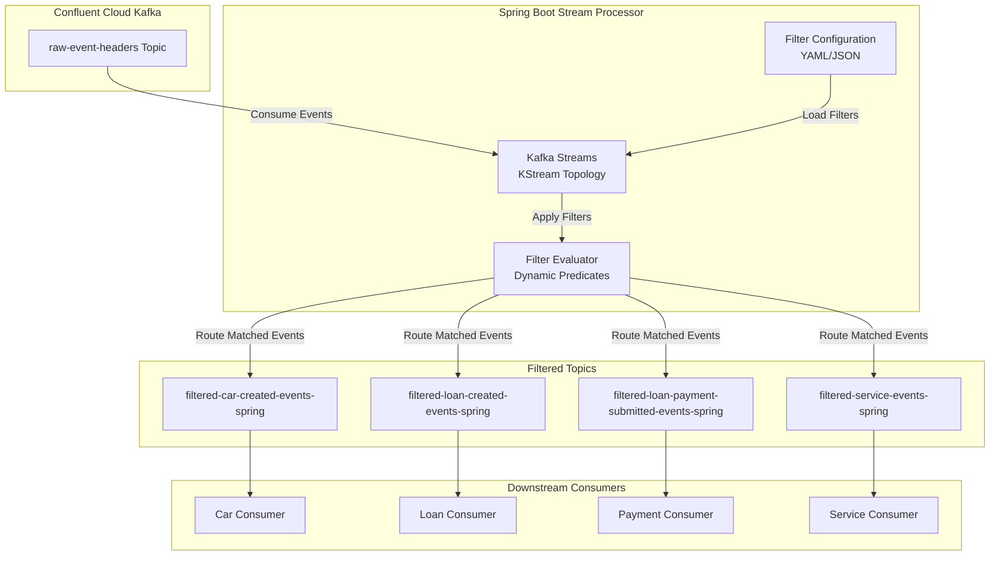
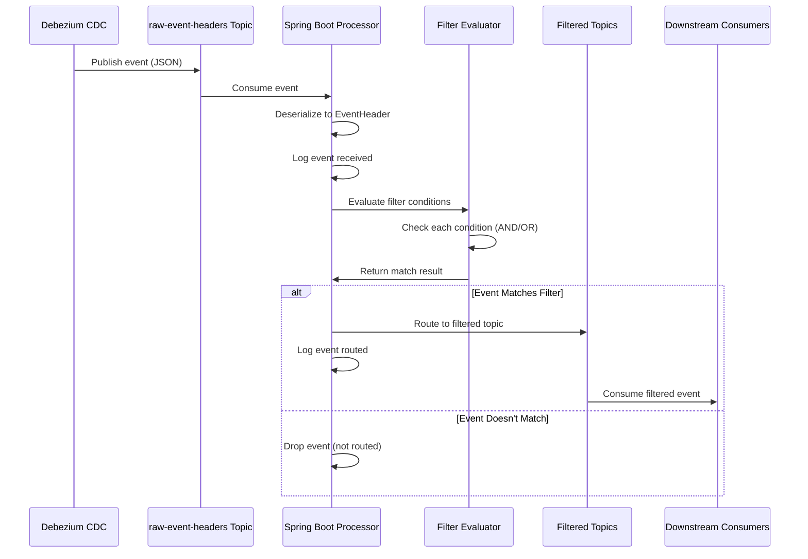

# Spring Boot Stream Processor - Architecture, Deployment & Operations Guide

## Table of Contents
1. [Architecture Overview](#architecture-overview)
2. [Component Details](#component-details)
3. [Data Flow](#data-flow)
4. [Configuration System](#configuration-system)
5. [Deployment](#deployment)
6. [Operations](#operations)
7. [Monitoring & Observability](#monitoring--observability)
8. [Troubleshooting](#troubleshooting)

---

## Architecture Overview

### High-Level Architecture



### Technology Stack

- **Framework**: Spring Boot 3.2.0
- **Stream Processing**: Apache Kafka Streams (via Spring Kafka)
- **Language**: Java 17
- **Build Tool**: Gradle
- **Serialization**: Jackson JSON
- **Configuration**: YAML (Spring Boot configuration properties)
- **Health Checks**: Spring Boot Actuator
- **Container**: Docker (multi-stage build)
- **Orchestration**: Kubernetes/Helm (for production)

### Key Design Principles

1. **Dynamic Filter Configuration**: Filters are loaded from YAML configuration at startup, enabling changes without code modifications
2. **Exactly-Once Semantics**: Uses Kafka Streams EOS (exactly-once semantics) for data integrity
3. **Stateless Filtering**: No state stores required for simple filtering operations
4. **Type-Safe Event Model**: Strongly-typed `EventHeader` model matching Kafka topic schema
5. **Observability First**: Comprehensive logging, metrics, and health checks

---

## Component Details

### 1. EventHeader Model

**Location**: `com.example.streamprocessor.model.EventHeader`

Represents the event structure from the `raw-event-headers` Kafka topic:

```java
public class EventHeader {
    private String id;              // Event unique identifier
    private String eventName;      // Event name (e.g., "CarServiceDone")
    private String eventType;       // Event type (e.g., "CarCreated", "LoanCreated")
    private String createdDate;     // Event creation timestamp
    private String savedDate;       // Event save timestamp
    private String headerData;      // JSON string with additional event data
    private String op;              // CDC operation: 'c'=create, 'u'=update, 'd'=delete
    private String table;           // Source database table name
    private Long tsMs;             // CDC timestamp in milliseconds
}
```

**Key Features**:
- Uses `@JsonIgnoreProperties(ignoreUnknown = true)` to handle schema evolution
- Maps snake_case JSON fields to camelCase Java properties
- Preserves all fields during filtering and routing

### 2. EventHeaderSerde

**Location**: `com.example.streamprocessor.serde.EventHeaderSerde`

Custom Kafka Streams Serde for JSON serialization/deserialization:

- **Serializer**: Converts `EventHeader` objects to JSON bytes
- **Deserializer**: Converts JSON bytes to `EventHeader` objects
- **Error Handling**: Throws `RuntimeException` on serialization errors
- **Configuration**: Ignores unknown properties for schema compatibility

### 3. Filter Configuration System

#### FilterConfig

**Location**: `com.example.streamprocessor.config.FilterConfig`

Represents a complete filter definition:

```java
public class FilterConfig {
    private String id;                    // Unique filter identifier
    private String name;                 // Human-readable filter name
    private String description;           // Filter description
    private String outputTopic;           // Target Kafka topic
    private String conditionLogic;        // "AND" or "OR" (default: "AND")
    private List<FilterCondition> conditions;  // List of filter conditions
    private Boolean enabled;              // Whether filter is enabled
    private String status;                // Filter lifecycle status
    private Integer version;              // Filter version number
}
```

#### FilterCondition

**Location**: `com.example.streamprocessor.config.FilterCondition`

Represents a single filter condition:

```java
public class FilterCondition {
    private String field;        // Field name (e.g., "event_type", "__op")
    private String operator;     // Operator (equals, in, greaterThan, etc.)
    private String value;        // Single value for comparison
    private List<String> values; // Multiple values (for "in" operator)
    private String min;          // Minimum value (for "between" operator)
    private String max;          // Maximum value (for "between" operator)
    private String valueType;    // Value type hint (string, number, etc.)
}
```

**Supported Operators**:
- `equals`: Exact match
- `in`: Value in list
- `notIn`: Value not in list
- `greaterThan`: Numeric or string comparison
- `lessThan`: Numeric or string comparison
- `greaterThanOrEqual`: Numeric or string comparison
- `lessThanOrEqual`: Numeric or string comparison
- `between`: Range check (min ≤ value ≤ max)
- `matches`: Pattern matching (SQL LIKE syntax: `%` = any, `_` = single char)
- `isNull`: Field is null
- `isNotNull`: Field is not null

### 4. FilterConditionEvaluator

**Location**: `com.example.streamprocessor.config.FilterConditionEvaluator`

Core filtering logic that evaluates conditions against events:

**Key Methods**:

1. **`createPredicate(FilterConfig)`**: Creates a Java `Predicate<EventHeader>` from filter configuration
   - Combines multiple conditions using `conditionLogic` (AND/OR)
   - Returns `false` for null events or invalid configurations

2. **`evaluateCondition(FilterCondition, EventHeader)`**: Evaluates a single condition
   - Extracts field value using reflection
   - Applies operator-specific comparison logic
   - Handles type coercion (numeric vs string comparisons)

3. **Field Value Extraction**: Maps field names to `EventHeader` properties:
   - `id` → `getId()`
   - `event_name` → `getEventName()`
   - `event_type` → `getEventType()`
   - `created_date` → `getCreatedDate()`
   - `saved_date` → `getSavedDate()`
   - `header_data` → `getHeaderData()`
   - `__op` → `getOp()`
   - `__table` → `getTable()`
   - `__ts_ms` → `getTsMs()`

**Condition Logic**:
- **AND** (default): All conditions must be true
- **OR**: At least one condition must be true

### 5. KafkaStreamsConfig

**Location**: `com.example.streamprocessor.config.KafkaStreamsConfig`

Main Kafka Streams topology configuration:

**Key Responsibilities**:

1. **Source Stream Creation**:
   - Consumes from `raw-event-headers` topic
   - Uses `EventHeaderSerde` for deserialization
   - Logs all incoming events for observability

2. **Dynamic Filter Application**:
   - Loads filters from `FiltersConfig` (injected via Spring)
   - Skips disabled/deleted/pending_deletion filters
   - Logs warnings for deprecated filters
   - Applies each filter as a separate KStream branch

3. **Event Routing**:
   - Filters events using `FilterConditionEvaluator`
   - Routes matched events to output topics (with `-spring` suffix)
   - Logs all routed events

**Filter Status Handling**:
- `enabled: false` → Filter skipped
- `status: "deleted"` → Filter skipped
- `status: "pending_deletion"` → Filter skipped
- `status: "deprecated"` → Filter processed with warning
- All other statuses → Filter processed normally

### 6. FiltersConfig

**Location**: `com.example.streamprocessor.config.FiltersConfig`

Container for multiple `FilterConfig` objects, loaded from YAML:

```yaml
filters:
  - id: "car-created-filter"
    name: "Car Created Events"
    outputTopic: "filtered-car-created-events"
    enabled: true
    status: "deployed"
    conditions:
      - field: "event_type"
        operator: "equals"
        value: "CarCreated"
      - field: "__op"
        operator: "equals"
        value: "c"
    conditionLogic: "AND"
```

---

## Data Flow

### Event Processing Pipeline



### Step-by-Step Processing

1. **Event Consumption**:
   - Kafka Streams consumer reads from `raw-event-headers` topic
   - JSON bytes deserialized to `EventHeader` object
   - Event logged with all key fields

2. **Filter Evaluation**:
   - For each active filter in configuration:
     - Extract field values from `EventHeader`
     - Evaluate each condition using operator logic
     - Combine conditions using `conditionLogic` (AND/OR)
     - If all conditions match → route to output topic

3. **Event Routing**:
   - Matched events serialized to JSON
   - Published to filtered topic (e.g., `filtered-car-created-events-spring`)
   - Event logged with routing information

4. **Exactly-Once Semantics**:
   - Kafka Streams EOS ensures no duplicate processing
   - Producer idempotence enabled
   - Transactional commits for state consistency

---

## Configuration System

### Application Configuration (`application.yml`)

**Key Settings**:

```yaml
spring:
  kafka:
    streams:
      application-id: event-stream-processor  # Consumer group ID
      bootstrap-servers: ${KAFKA_BOOTSTRAP_SERVERS}
      source-topic: ${SPRING_KAFKA_STREAMS_SOURCE_TOPIC:raw-event-headers}
      properties:
        # Exactly-once semantics
        processing.guarantee: exactly_once_v2
        # Producer settings
        acks: all
        retries: 2147483647
        enable.idempotence: true
        # State store (for future use)
        state.dir: /tmp/kafka-streams
        # Replication
        replication.factor: 3
        min.insync.replicas: 2
```

### Filter Configuration (`filters.yml`)

Loaded from `src/main/resources/filters.yml` or external file:

```yaml
filters:
  - id: "car-created-filter"
    name: "Car Created Events"
    description: "Filters CarCreated events by event_type"
    consumerId: "car-consumer"
    outputTopic: "filtered-car-created-events"
    enabled: true
    status: "deployed"
    version: 1
    conditions:
      - field: "event_type"
        operator: "equals"
        value: "CarCreated"
        valueType: "string"
      - field: "__op"
        operator: "equals"
        value: "c"
        valueType: "string"
    conditionLogic: "AND"
```

### Environment Variables

**Required**:
- `KAFKA_BOOTSTRAP_SERVERS`: Kafka broker endpoints
- `KAFKA_API_KEY`: Confluent Cloud API key
- `KAFKA_API_SECRET`: Confluent Cloud API secret

**Optional**:
- `SPRING_KAFKA_STREAMS_SOURCE_TOPIC`: Source topic (default: `raw-event-headers`)
- `KAFKA_SECURITY_PROTOCOL`: Security protocol (default: `SASL_SSL`)
- `KAFKA_SASL_MECHANISM`: SASL mechanism (default: `PLAIN`)

---

## Deployment

### 1. Local Development

**Prerequisites**:
- Java 17+
- Gradle 7+
- Confluent Cloud Kafka cluster (or local Kafka)

**Run with Gradle**:
```bash
cd cdc-streaming/stream-processor-spring
./gradlew bootRun
```

**Run with Docker Compose**:
```bash
cd cdc-streaming
docker-compose up stream-processor
```

### 2. Docker Deployment

**Build Image**:
```bash
cd cdc-streaming/stream-processor-spring
docker build -t stream-processor-spring:1.0.0 .
```

**Run Container**:
```bash
docker run -d \
  --name stream-processor \
  -e KAFKA_BOOTSTRAP_SERVERS=pkc-xxxxx.us-east-1.aws.confluent.cloud:9092 \
  -e KAFKA_API_KEY=your-api-key \
  -e KAFKA_API_SECRET=your-api-secret \
  -p 8080:8080 \
  stream-processor-spring:1.0.0
```

**Multi-Stage Build**:
- **Build Stage**: JDK 17, compiles application, runs Gradle build
- **Runtime Stage**: JRE 17, minimal image with only JAR file
- **Security**: Runs as non-root user (`spring:spring`)
- **Health Check**: Built-in HTTP health check on port 8080

### 3. Kubernetes Deployment (EKS)

**Prerequisites**:
- Kubernetes cluster (EKS)
- Helm 3+
- Container registry (ECR) with image pushed

**Create Secrets**:
```bash
kubectl create secret generic stream-processor-secrets \
  --from-literal=kafka-api-key=YOUR_KEY \
  --from-literal=kafka-api-secret=YOUR_SECRET
```

**Deploy with Helm**:
```bash
cd cdc-streaming/stream-processor-spring/helm
helm install stream-processor ./stream-processor \
  --set image.tag=1.0.0 \
  --set kafka.bootstrapServers=pkc-xxxxx.us-east-1.aws.confluent.cloud:9092 \
  --set kafka.sourceTopic=raw-event-headers \
  --set replicaCount=2 \
  --set autoscaling.enabled=true \
  --set autoscaling.minReplicas=2 \
  --set autoscaling.maxReplicas=5
```

**Helm Chart Structure**:
```
helm/stream-processor/
├── Chart.yaml              # Chart metadata
├── values.yaml             # Default values
└── templates/
    ├── deployment.yaml     # Kubernetes Deployment
    ├── service.yaml       # Kubernetes Service
    ├── configmap.yaml     # Application configuration
    ├── hpa.yaml           # Horizontal Pod Autoscaler
    └── serviceaccount.yaml # Service account
```

**Key Kubernetes Features**:
- **Liveness Probe**: `/actuator/health` (60s initial delay)
- **Readiness Probe**: `/actuator/health/readiness` (30s initial delay)
- **Resource Limits**: CPU/Memory limits and requests
- **Autoscaling**: HPA based on CPU/memory utilization
- **Security**: Non-root user, security contexts

### 4. CI/CD Deployment

**Pipeline Stages**:
1. **Validate**: `./scripts/filters/validate-filters.sh`
2. **Generate**: `./scripts/filters/generate-filters.sh --spring-only`
3. **Build**: `./gradlew clean build`
4. **Test**: `./gradlew test integrationTest`
5. **Docker Build**: `docker build -t stream-processor-spring:$VERSION .`
6. **Push to ECR**: `docker push $ECR_REGISTRY/stream-processor-spring:$VERSION`
7. **Helm Deploy**: `helm upgrade --install stream-processor ./helm/stream-processor`

**Deployment Time**: ~10-20 minutes (including tests)

---

## Operations

### Starting the Service

**Local**:
```bash
./gradlew bootRun
```

**Docker**:
```bash
docker-compose up -d stream-processor
```

**Kubernetes**:
```bash
kubectl rollout restart deployment/stream-processor
```

### Stopping the Service

**Local**: `Ctrl+C`

**Docker**:
```bash
docker-compose stop stream-processor
```

**Kubernetes**:
```bash
kubectl scale deployment stream-processor --replicas=0
```

### Updating Filter Configuration

1. **Update `filters.json`**:
   ```json
   {
     "filters": [
       {
         "id": "car-created-filter",
         "conditions": [ /* updated conditions */ ]
       }
     ]
   }
   ```

2. **Generate YAML**:
   ```bash
   ./cdc-streaming/scripts/filters/generate-filters.sh --spring-only
   ```

3. **Rebuild and Redeploy**:
   ```bash
   # Local
   ./gradlew bootRun
   
   # Kubernetes
   kubectl rollout restart deployment/stream-processor
   ```

### Scaling

**Horizontal Scaling (Kubernetes)**:
```bash
# Manual scaling
kubectl scale deployment stream-processor --replicas=5

# Autoscaling (HPA)
# Configured in Helm values.yaml:
autoscaling:
  enabled: true
  minReplicas: 2
  maxReplicas: 10
  targetCPUUtilizationPercentage: 70
  targetMemoryUtilizationPercentage: 80
```

**Scaling Considerations**:
- Each instance processes a subset of partitions
- Kafka Streams automatically distributes partitions across instances
- Consumer group coordination handles partition assignment
- State stores (if added) require careful coordination

### Rolling Updates

**Kubernetes Rolling Update**:
```bash
# Update image
kubectl set image deployment/stream-processor \
  stream-processor=stream-processor-spring:1.1.0

# Monitor rollout
kubectl rollout status deployment/stream-processor

# Rollback if needed
kubectl rollout undo deployment/stream-processor
```

**Helm Upgrade**:
```bash
helm upgrade stream-processor ./helm/stream-processor \
  --set image.tag=1.1.0
```

---

## Monitoring & Observability

### Health Checks

**Endpoints**:
- **Liveness**: `GET /actuator/health/liveness`
- **Readiness**: `GET /actuator/health/readiness`
- **General Health**: `GET /actuator/health`

**Health Check Response**:
```json
{
  "status": "UP",
  "components": {
    "kafka": {
      "status": "UP"
    },
    "kafkaStreams": {
      "status": "UP"
    }
  }
}
```

### Metrics

**Prometheus Metrics** (`/actuator/prometheus`):

**Kafka Streams Metrics**:
- `kafka_streams_*`: Stream processing metrics
- `kafka_consumer_*`: Consumer metrics (throughput, lag)
- `kafka_producer_*`: Producer metrics

**JVM Metrics**:
- `jvm_memory_*`: Memory usage
- `jvm_gc_*`: Garbage collection
- `jvm_threads_*`: Thread metrics

**Application Metrics**:
- `events_processed_total`: Total events processed
- `events_routed_total{filter_id="car-created-filter"}`: Events routed per filter
- `processing_latency_seconds`: Processing latency histogram

### Logging

**Log Format**: Structured JSON (configurable)

**Key Log Messages**:
- `[STREAM-PROCESSOR] Event received from raw-event-headers` - Incoming event
- `[STREAM-PROCESSOR] Loading X filter(s) from configuration` - Filter loading
- `[STREAM-PROCESSOR] Configuring filter: <id> -> <topic>` - Filter configuration
- `[STREAM-PROCESSOR] Event sent to <topic>` - Event routing
- `[STREAM-PROCESSOR] Filter <id> is deprecated` - Deprecated filter warning

**Log Levels**:
- `INFO`: Normal operation, event processing
- `WARN`: Deprecated filters, invalid configurations
- `ERROR`: Serialization errors, processing failures

### Monitoring Dashboards

**Recommended Metrics to Monitor**:
1. **Throughput**: Events processed per second
2. **Latency**: P50, P95, P99 processing latency
3. **Error Rate**: Failed event processing rate
4. **Consumer Lag**: Kafka consumer lag per partition
5. **Resource Usage**: CPU, memory, network
6. **Filter Performance**: Events routed per filter

**Grafana Dashboard Example**:
```yaml
panels:
  - title: "Events Processed per Second"
    query: 'rate(events_processed_total[5m])'
  - title: "Processing Latency (P95)"
    query: 'histogram_quantile(0.95, processing_latency_seconds_bucket)'
  - title: "Consumer Lag"
    query: 'kafka_consumer_lag_sum'
```

---

## Troubleshooting

### Common Issues

#### 1. No Events Being Processed

**Symptoms**: Service running but no events in filtered topics

**Diagnosis**:
```bash
# Check logs
kubectl logs -f deployment/stream-processor

# Check Kafka consumer lag
# Via Confluent Cloud UI or CLI
confluent kafka consumer-group describe event-stream-processor
```

**Possible Causes**:
- Source topic has no messages
- Consumer group offset at latest (no new messages)
- Filter conditions too restrictive
- Kafka connectivity issues

**Solutions**:
- Verify events in `raw-event-headers` topic
- Reset consumer group offset if needed
- Check filter configuration
- Verify Kafka credentials and connectivity

#### 2. Events Not Matching Filters

**Symptoms**: Events in source topic but not in filtered topics

**Diagnosis**:
```bash
# Check filter configuration
kubectl exec -it deployment/stream-processor -- cat /app/config/filters.yml

# Check logs for filter evaluation
kubectl logs -f deployment/stream-processor | grep "Configuring filter"
```

**Possible Causes**:
- Filter conditions incorrect
- Field names mismatch
- Operator logic incorrect
- Filter disabled or deleted

**Solutions**:
- Review filter configuration
- Check event structure matches filter fields
- Verify filter status is "deployed" and enabled
- Test filter conditions manually

#### 3. Serialization Errors

**Symptoms**: `RuntimeException: Error deserializing EventHeader`

**Diagnosis**:
```bash
# Check error logs
kubectl logs -f deployment/stream-processor | grep -i "error\|exception"
```

**Possible Causes**:
- Event schema changed
- Invalid JSON in Kafka topic
- Missing required fields

**Solutions**:
- Verify event schema matches `EventHeader` model
- Check for malformed JSON in source topic
- Update `EventHeader` model if schema evolved
- Use `@JsonIgnoreProperties(ignoreUnknown = true)` for backward compatibility

#### 4. High Consumer Lag

**Symptoms**: Consumer lag increasing, events not processed fast enough

**Diagnosis**:
```bash
# Check consumer lag
confluent kafka consumer-group describe event-stream-processor

# Check resource usage
kubectl top pods -l app=stream-processor
```

**Possible Causes**:
- Insufficient CPU/memory
- Too few replicas
- Network bottlenecks
- Slow filter evaluation

**Solutions**:
- Scale up replicas
- Increase resource limits
- Optimize filter conditions
- Check network latency to Kafka

#### 5. Service Not Starting

**Symptoms**: Pods in CrashLoopBackOff or not ready

**Diagnosis**:
```bash
# Check pod status
kubectl get pods -l app=stream-processor

# Check pod logs
kubectl logs <pod-name>

# Check events
kubectl describe pod <pod-name>
```

**Possible Causes**:
- Missing environment variables
- Invalid Kafka credentials
- Health check failures
- Resource constraints

**Solutions**:
- Verify all required environment variables set
- Check Kafka API key/secret in secrets
- Review health check configuration
- Increase resource requests/limits

### Debugging Commands

**View Logs**:
```bash
# All logs
kubectl logs -f deployment/stream-processor

# Last 100 lines
kubectl logs --tail=100 deployment/stream-processor

# Specific container (if multi-container)
kubectl logs -f deployment/stream-processor -c stream-processor
```

**Check Configuration**:
```bash
# Environment variables
kubectl exec deployment/stream-processor -- env | grep KAFKA

# Filter configuration
kubectl exec deployment/stream-processor -- cat /app/config/filters.yml
```

**Test Connectivity**:
```bash
# Test Kafka connectivity from pod
kubectl exec -it deployment/stream-processor -- \
  sh -c 'echo "Testing Kafka connectivity..." && \
  java -cp /app/app.jar org.springframework.boot.loader.JarLauncher --help'
```

**Monitor Resources**:
```bash
# CPU/Memory usage
kubectl top pods -l app=stream-processor

# Detailed resource metrics
kubectl describe pod <pod-name>
```

---

## Performance Characteristics

### Throughput
- **Target**: >= 10,000 events/second per instance
- **Scaling**: Linear with number of instances and partitions
- **Bottlenecks**: Network I/O, Kafka broker capacity

### Latency
- **P50**: < 50ms (event received to filtered topic)
- **P95**: < 200ms
- **P99**: < 500ms
- **Factors**: Network latency, processing time, Kafka broker latency

### Resource Usage
- **CPU**: 20-40% under normal load
- **Memory**: 512MB-1GB per instance
- **Network**: Depends on event size and throughput

---

## Best Practices

1. **Filter Configuration**:
   - Use specific field names matching `EventHeader` model
   - Test filters with sample events before deployment
   - Use `enabled: false` to disable filters instead of deleting
   - Mark deprecated filters with `status: "deprecated"`

2. **Deployment**:
   - Always validate filters before deployment
   - Use rolling updates for zero-downtime deployments
   - Monitor consumer lag during deployments
   - Keep previous image versions for rollback

3. **Operations**:
   - Monitor consumer lag regularly
   - Set up alerts for error rates and latency
   - Use structured logging for easier analysis
   - Keep filter configuration in version control

4. **Scaling**:
   - Scale based on consumer lag, not CPU/memory alone
   - Ensure sufficient partitions for horizontal scaling
   - Monitor partition distribution across instances
   - Test scaling behavior under load

---

## Summary

The Spring Boot Stream Processor is a dynamic, configurable event filtering and routing service that:

- **Consumes** events from `raw-event-headers` Kafka topic
- **Filters** events using dynamic YAML-based filter configuration
- **Routes** matched events to filtered topics
- **Provides** comprehensive observability via metrics, logs, and health checks
- **Scales** horizontally with Kubernetes
- **Ensures** data integrity with exactly-once semantics

The service is designed for operational simplicity while providing the flexibility to adapt to changing business requirements through configuration changes rather than code modifications.

---

**Document Version:** 1.0  
**Last Updated:** December 30, 2025  
**Maintained By:** Platform Engineering Team

**Recent Updates:**
- Added automatic YAML generation via Metadata Service API
- Enhanced filter configuration loading from `filters.yml`
- Updated deployment procedures for CI/CD integration

