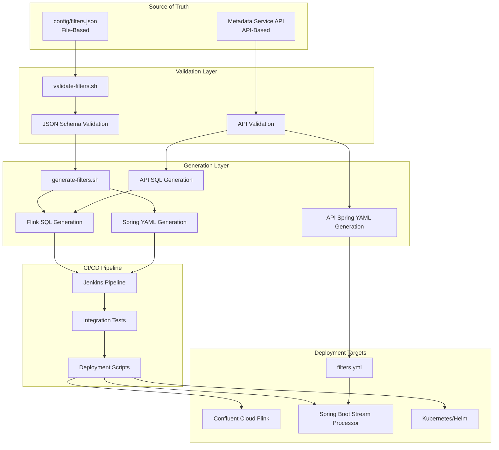
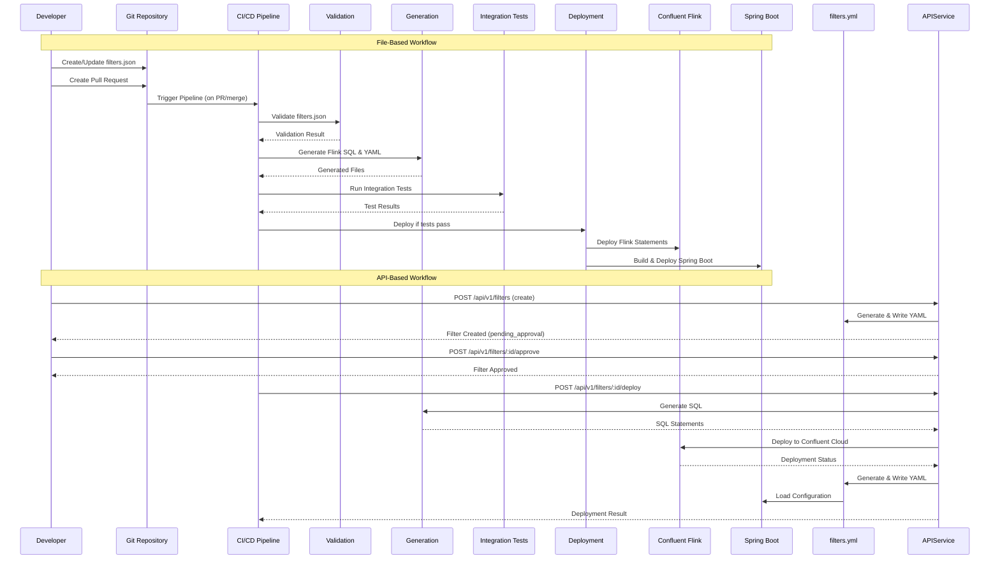
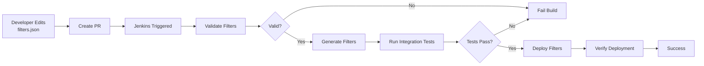
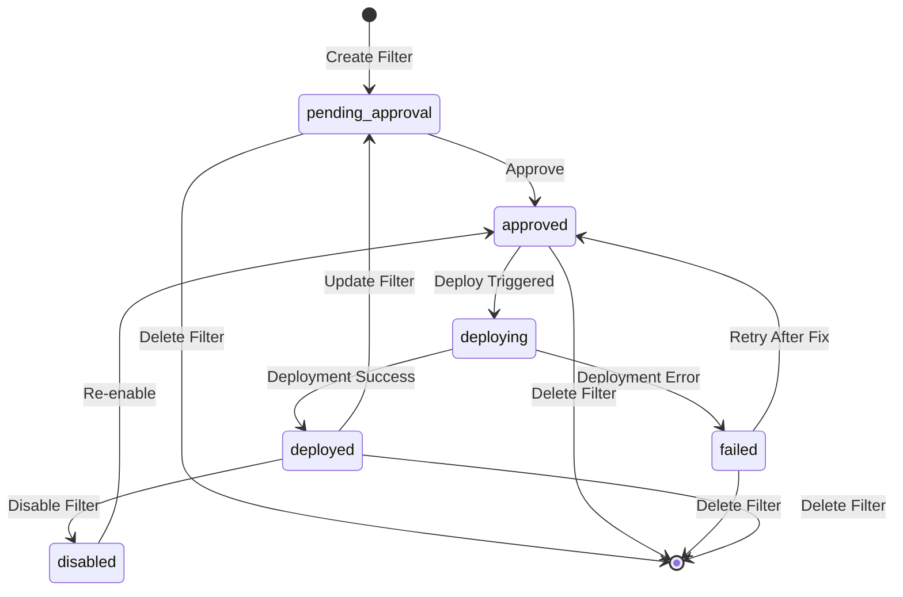
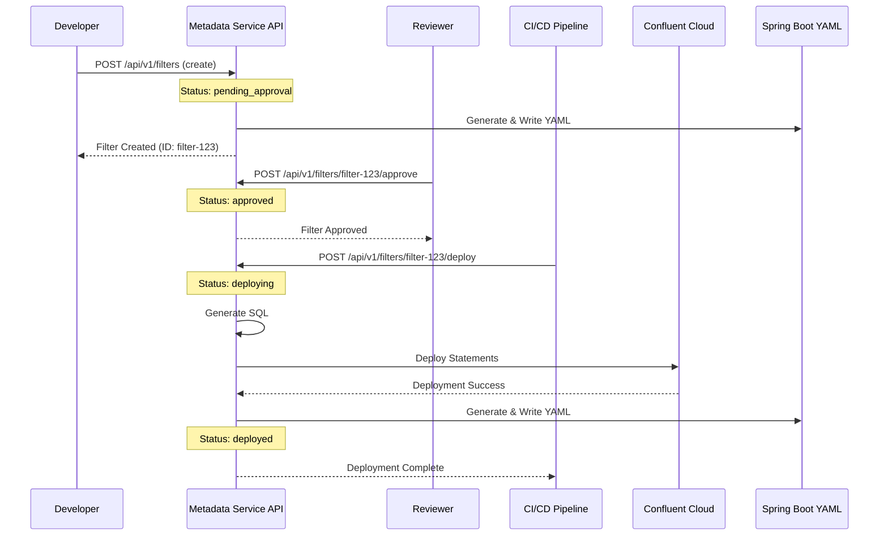
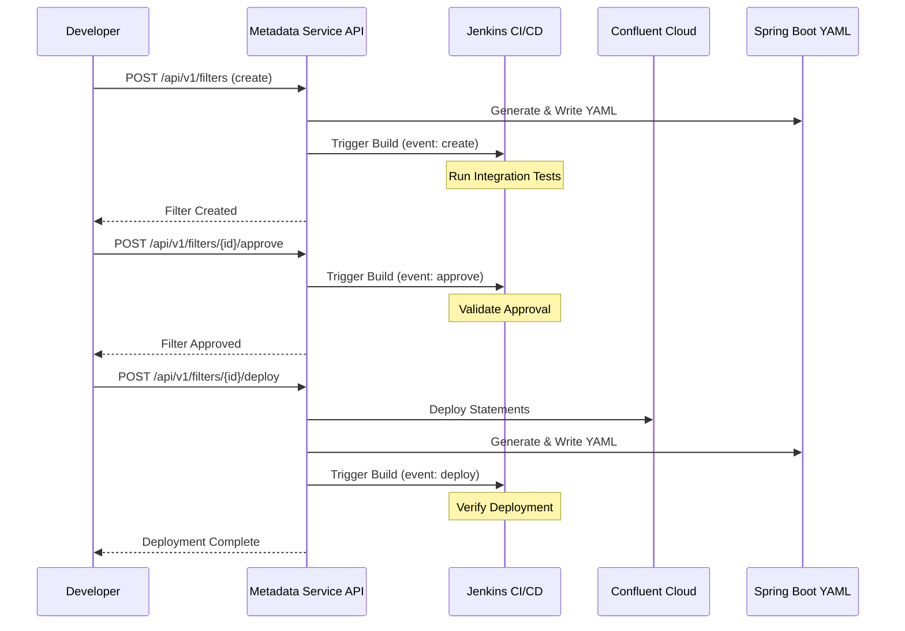
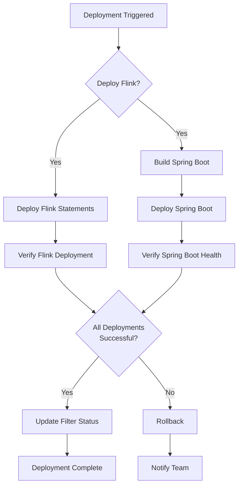
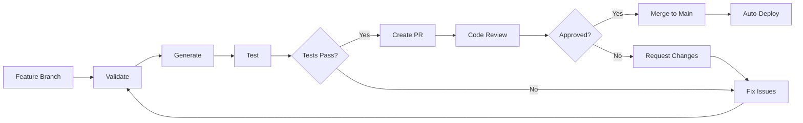
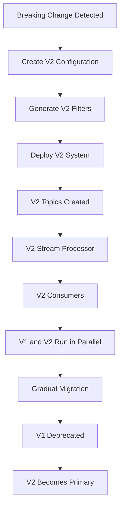

# Filter Changes Driven by CI/CD - Comprehensive Guide

## Table of Contents

1. [Introduction](#introduction)
2. [Architecture Overview](#architecture-overview)
3. [File-Based Filter Changes](#file-based-filter-changes)
4. [API-Based Filter Changes](#api-based-filter-changes)
5. [CI/CD Pipeline Integration](#cicd-pipeline-integration)
6. [Schema Evolution and Filter Changes](#schema-evolution-and-filter-changes)
7. [Troubleshooting and Operations](#troubleshooting-and-operations)
8. [Rollback Procedures](#rollback-procedures)
9. [Best Practices and Guidelines](#best-practices-and-guidelines)
10. [Appendix](#appendix)

---

## Introduction

This guide provides comprehensive documentation for managing filter changes through CI/CD pipelines. The system supports two primary approaches for filter management:

1. **File-Based Approach**: Filters defined in `config/filters.json`, managed through version control, and deployed via automated scripts
2. **API-Based Approach**: Filters managed through the Metadata Service API with approval workflows and automated deployment

Both approaches integrate seamlessly with Jenkins CI/CD pipelines and support automated testing, validation, and deployment to both Apache Flink (Confluent Cloud) and Spring Boot Kafka Streams processors.

**Key Feature**: When filters are created, updated, deleted, or deployed via the Metadata Service API, the system automatically generates and updates the Spring Boot `filters.yml` file, ensuring both Flink and Spring Boot stream processors stay synchronized.

### When to Use Which Approach

**File-Based Approach** is recommended for:
- Infrastructure-as-Code workflows
- Version-controlled filter configurations
- Batch filter updates
- Team collaboration through Git pull requests
- Auditable change history

**API-Based Approach** is recommended for:
- Dynamic filter creation and updates
- Programmatic filter management
- Integration with external systems
- Real-time filter updates without code deployments
- Approval workflows with manual review steps

---

## Architecture Overview

### System Components



### Filter Change Workflow



---

## File-Based Filter Changes

### Configuration File Structure

Filters are defined in `cdc-streaming/config/filters.json` with the following structure:

```json
{
  "version": 1,
  "filters": [
    {
      "id": "filter-id",
      "name": "Filter Name",
      "description": "Filter description",
      "consumerId": "consumer-id",
      "outputTopic": "filtered-topic-name",
      "enabled": true,
      "conditions": [
        {
          "field": "event_type",
          "operator": "equals",
          "value": "EventType",
          "valueType": "string"
        }
      ],
      "conditionLogic": "AND",
      "status": "deployed",
      "version": 1
    }
  ]
}
```

**Field Descriptions**:

| Field | Type | Required | Description |
|-------|------|----------|-------------|
| `version` | number | Yes | Configuration file version |
| `filters` | array | Yes | Array of filter definitions |
| `id` | string | Yes | Unique filter identifier (lowercase, hyphens) |
| `name` | string | Yes | Human-readable filter name |
| `description` | string | No | Optional description |
| `consumerId` | string | Yes | Consumer identifier |
| `outputTopic` | string | Yes | Output topic name (without -flink/-spring suffix) |
| `enabled` | boolean | Yes | Whether filter is active |
| `conditions` | array | Yes | Array of filter conditions (min 1) |
| `conditionLogic` | string | No | How to combine conditions: "AND" or "OR" (default: "AND") |
| `status` | string | No | Filter status: "pending_approval", "approved", "deployed", "failed", "disabled" |
| `version` | number | No | Filter version number for tracking changes |

**Condition Operators**:

| Operator | Description | Supported Value Types |
|----------|-------------|----------------------|
| `equals` | Exact match | string, number, boolean |
| `not_equals` | Not equal | string, number, boolean |
| `greater_than` | Greater than | number |
| `less_than` | Less than | number |
| `greater_than_or_equal` | Greater than or equal | number |
| `less_than_or_equal` | Less than or equal | number |
| `in` | Value in list | string, number (use `values` array) |
| `not_in` | Value not in list | string, number (use `values` array) |
| `contains` | String contains substring | string |
| `starts_with` | String starts with prefix | string |
| `ends_with` | String ends with suffix | string |

**Example: Complex Filter with Multiple Conditions**:

```json
{
  "id": "premium-loan-filter",
  "name": "Premium Loan Events",
  "description": "Filters premium loans with amount > 100000",
  "consumerId": "premium-loan-consumer",
  "outputTopic": "filtered-premium-loan-events",
  "enabled": true,
  "conditions": [
    {
      "field": "event_type",
      "operator": "equals",
      "value": "LoanCreated",
      "valueType": "string"
    },
    {
      "field": "header_data.loanAmount",
      "operator": "greater_than",
      "value": 100000,
      "valueType": "number"
    },
    {
      "field": "__op",
      "operator": "equals",
      "value": "c",
      "valueType": "string"
    }
  ],
  "conditionLogic": "AND",
  "status": "deployed",
  "version": 1
}
```

### Filter Schema Validation

Before making changes, validate the configuration:

```bash
./cdc-streaming/scripts/filters/validate-filters.sh
```

This script:
- Validates JSON syntax
- Checks against JSON Schema (`schemas/filter-schema.json`)
- Performs dry-run generation to catch errors early
- Reports validation errors with line numbers

### Generation Process

Generate Flink SQL and Spring YAML from the configuration:

```bash
# Generate both Flink SQL and Spring YAML
./cdc-streaming/scripts/filters/generate-filters.sh

# Generate only Flink SQL
./cdc-streaming/scripts/filters/generate-filters.sh --flink-only

# Generate only Spring YAML
./cdc-streaming/scripts/filters/generate-filters.sh --spring-only
```

**Generated Files:**
- Flink SQL: `cdc-streaming/flink-jobs/generated/business-events-routing-confluent-cloud-generated.sql`
- Spring YAML: `cdc-streaming/stream-processor-spring/src/main/resources/filters.yml`

### Deployment Scripts

#### Deploy Flink Filters

Deploys generated Flink SQL statements to Confluent Cloud:

```bash
./cdc-streaming/scripts/filters/deploy-flink-filters.sh
```

**What it does:**
1. Checks for generated SQL file
2. Generates filters if SQL file doesn't exist
3. Extracts source table SQL and deploys
4. Extracts and deploys sink table definitions
5. Extracts and deploys INSERT statements
6. Validates deployment by listing statements

**Environment Variables:**
- `FLINK_COMPUTE_POOL_ID`: Confluent Flink compute pool ID
- `KAFKA_CLUSTER_ID`: Confluent Kafka cluster ID

#### Deploy Spring Boot Filters

Builds and deploys Spring Boot application with updated filters:

```bash
# Deploy via Docker
DEPLOY_METHOD=docker ./cdc-streaming/scripts/filters/deploy-spring-filters.sh

# Deploy via Kubernetes/Helm
DEPLOY_METHOD=kubernetes ./cdc-streaming/scripts/filters/deploy-spring-filters.sh

# Local deployment
DEPLOY_METHOD=local ./cdc-streaming/scripts/filters/deploy-spring-filters.sh
```

**What it does:**
1. Checks for generated filters.yml
2. Generates filters if YAML file doesn't exist
3. Builds Spring Boot application with Gradle
4. Creates Docker image (if `DEPLOY_METHOD=docker`)
5. Provides deployment instructions

### CI/CD Integration

File-based filters integrate with Jenkins through the following workflow:



**Jenkins Pipeline Stages for File-Based Filters:**

```groovy
stage('Validate Filters') {
    steps {
        sh './cdc-streaming/scripts/filters/validate-filters.sh'
    }
}

stage('Generate Filters') {
    steps {
        sh './cdc-streaming/scripts/filters/generate-filters.sh'
    }
}

stage('Run Integration Tests') {
    steps {
        sh './cdc-streaming/scripts/run-all-integration-tests.sh'
    }
}

stage('Deploy Filters') {
    when {
        branch 'main'  // Only deploy on main branch
    }
    steps {
        sh './cdc-streaming/scripts/filters/deploy-flink-filters.sh'
        sh './cdc-streaming/scripts/filters/deploy-spring-filters.sh'
    }
}
```

### Version Control and Change Tracking

All filter changes are tracked through Git:

1. **Create Feature Branch**: `git checkout -b feature/add-new-filter`
2. **Edit filters.json**: Make your changes
3. **Validate**: Run validation script
4. **Commit**: `git commit -m "Add new filter for X events"`
5. **Push and Create PR**: `git push origin feature/add-new-filter`
6. **Review**: Team reviews changes in PR
7. **Merge**: After approval, merge to main branch
8. **Auto-Deploy**: CI/CD pipeline automatically deploys on merge

---

## API-Based Filter Changes

### Metadata Service API Endpoints

The Metadata Service provides RESTful API endpoints for filter management:

| Method | Endpoint | Description |
|--------|----------|-------------|
| POST | `/api/v1/filters?version=v1` | Create a new filter |
| GET | `/api/v1/filters?version=v1` | List all filters |
| GET | `/api/v1/filters/{id}?version=v1` | Get filter by ID |
| PUT | `/api/v1/filters/{id}?version=v1` | Update filter |
| DELETE | `/api/v1/filters/{id}?version=v1` | Delete filter |
| POST | `/api/v1/filters/{id}/generate?version=v1` | Generate Flink SQL |
| POST | `/api/v1/filters/{id}/validate?version=v1` | Validate SQL syntax |
| POST | `/api/v1/filters/{id}/approve?version=v1` | Approve filter for deployment |
| POST | `/api/v1/filters/{id}/deploy?version=v1` | Deploy to Confluent Cloud |
| GET | `/api/v1/filters/{id}/status?version=v1` | Get deployment status |

### Filter Lifecycle States



**State Descriptions:**

| State | Description | Next Actions |
|-------|-------------|--------------|
| `pending_approval` | Filter created, awaiting review | Approve or reject |
| `approved` | Approved for deployment | Deploy or update |
| `deploying` | Deployment in progress | Wait for completion |
| `deployed` | Successfully deployed and active | Update, disable, or delete |
| `failed` | Deployment failed | Fix and retry |
| `disabled` | Filter disabled (not deployed) | Re-enable or delete |

### Approval Workflow

The API-based approach includes a mandatory approval step:



**Example: Create and Approve Filter**

```bash
# 1. Create filter
curl -X POST http://localhost:8080/api/v1/filters?version=v1 \
  -H "Content-Type: application/json" \
  -d '{
    "name": "New Event Filter",
    "description": "Filters new event types",
    "consumerId": "new-consumer",
    "outputTopic": "filtered-new-events",
    "enabled": true,
    "conditions": [
      {
        "field": "event_type",
        "operator": "equals",
        "value": "NewEvent",
        "valueType": "string"
      }
    ],
    "conditionLogic": "AND"
  }'

# Response:
# {
#   "id": "new-event-filter-123",
#   "status": "pending_approval",
#   ...
# }

# 2. Approve filter
curl -X POST http://localhost:8080/api/v1/filters/new-event-filter-123/approve?version=v1

# Response:
# {
#   "id": "new-event-filter-123",
#   "status": "approved",
#   "approvedBy": "reviewer@example.com",
#   "approvedAt": "2025-12-28T20:00:00Z",
#   ...
# }

# 3. Deploy filter (via CI/CD or manually)
curl -X POST http://localhost:8080/api/v1/filters/new-event-filter-123/deploy?version=v1

# Response:
# {
#   "filterId": "new-event-filter-123",
#   "status": "deployed",
#   "flinkStatementIds": ["stmt-1", "stmt-2"],
#   "message": "Filter deployed successfully"
# }

# Note: After create, update, delete, or deploy operations, the Spring Boot filters.yml
# file is automatically updated. Check the file to verify:
# cat cdc-streaming/stream-processor-spring/src/main/resources/filters.yml
```

### Spring Boot YAML Generation

When filters are created, updated, deleted, or deployed via the Metadata Service API, the system automatically generates and updates the Spring Boot `filters.yml` file. This ensures that both Flink (Confluent Cloud) and Spring Boot stream processors stay synchronized.

**Automatic YAML Updates**:
- **Create Filter**: YAML is generated and written after filter creation
- **Update Filter**: YAML is regenerated and written after filter update
- **Delete Filter**: YAML is regenerated (excluding deleted filter) after deletion
- **Deploy Filter**: YAML is regenerated after successful Flink deployment

**Configuration**:

The YAML file path is configurable via `application.yml`:

```yaml
spring-boot:
  filters-yaml-path: ${SPRING_BOOT_FILTERS_YAML_PATH:../cdc-streaming/stream-processor-spring/src/main/resources/filters.yml}
  backup-enabled: ${SPRING_BOOT_YAML_BACKUP_ENABLED:true}
  backup-dir: ${SPRING_BOOT_YAML_BACKUP_DIR:/tmp/filters-yaml-backups}
```

**YAML Format**:

The generated YAML matches the format expected by Spring Boot:

```yaml
# Generated Spring Boot Filter Configuration
# Generated at: 2025-12-28T20:00:00Z
# Source: Metadata Service API
# DO NOT EDIT MANUALLY - This file is auto-generated

filters:
  - id: filter-id
    name: Filter Name
    description: Filter description
    outputTopic: filtered-topic-name-spring
    conditionLogic: AND
    enabled: true
    conditions:
      - field: event_type
        operator: equals
        value: "EventType"
        valueType: string
```

**Features**:
- Automatic backup before each write (if enabled)
- Atomic write operations (temp file + rename)
- Filters out disabled, deleted, and pending_deletion filters
- Adds `-spring` suffix to output topics automatically
- Warns about deprecated filters in comments

**Error Handling**:
- YAML generation/writing errors are logged but do not fail the API operation
- This ensures API calls succeed even if YAML update fails
- Check logs for YAML-related warnings

### API Integration with CI/CD

CI/CD pipelines can integrate with the Metadata Service API for automated deployments:

**Complete Jenkins Stage Example**:

```groovy
stage('Deploy Approved Filters') {
    environment {
        METADATA_SERVICE_URL = 'http://metadata-service:8080'
        API_VERSION = 'v1'
    }
    steps {
        script {
            // Get all approved filters
            def response = sh(
                script: """
                    curl -s ${METADATA_SERVICE_URL}/api/v1/filters?version=${API_VERSION}
                """,
                returnStdout: true
            )
            
            def filters = readJSON text: response
            def approvedFilters = filters.findAll { it.status == 'approved' }
            
            if (approvedFilters.isEmpty()) {
                echo 'No approved filters to deploy'
                return
            }
            
            echo "Found ${approvedFilters.size()} approved filter(s) to deploy"
            
            // Deploy each approved filter
            approvedFilters.each { filter ->
                def filterId = filter.id
                echo "Deploying filter: ${filterId}"
                
                def deployResponse = sh(
                    script: """
                        curl -X POST \
                          -H 'Content-Type: application/json' \
                          ${METADATA_SERVICE_URL}/api/v1/filters/${filterId}/deploy?version=${API_VERSION}
                    """,
                    returnStdout: true
                )
                
                def deployResult = readJSON text: deployResponse
                
                if (deployResult.status == 'deployed') {
                    echo "✓ Filter ${filterId} deployed successfully"
                    echo "  Statement IDs: ${deployResult.flinkStatementIds.join(', ')}"
                    echo "  Note: Spring Boot filters.yml has been automatically updated"
                } else {
                    error "✗ Filter ${filterId} deployment failed: ${deployResult.error}"
                }
            }
            
            // Verify Spring Boot YAML was updated
            sh '''
                if [ -f cdc-streaming/stream-processor-spring/src/main/resources/filters.yml ]; then
                    echo "✓ Spring Boot filters.yml updated"
                    echo "  File size: $(wc -l < cdc-streaming/stream-processor-spring/src/main/resources/filters.yml) lines"
                else
                    echo "⚠ Spring Boot filters.yml not found (may not be configured)"
                fi
            '''
        }
    }
}
```

**Error Handling**:

```groovy
stage('Deploy with Retry') {
    steps {
        script {
            def maxRetries = 3
            def retryCount = 0
            def success = false
            
            while (retryCount < maxRetries && !success) {
                try {
                    sh '''
                        curl -X POST \
                          http://metadata-service:8080/api/v1/filters/filter-id/deploy?version=v1
                    '''
                    success = true
                } catch (Exception e) {
                    retryCount++
                    if (retryCount >= maxRetries) {
                        error "Deployment failed after ${maxRetries} attempts: ${e.message}"
                    } else {
                        echo "Deployment attempt ${retryCount} failed, retrying..."
                        sleep(time: 10, unit: 'SECONDS')
                    }
                }
            }
        }
    }
}
```

### CI/CD Trigger Integration

The Metadata Service **automatically triggers Jenkins CI/CD builds** when filters are changed via API. This enables change management and automated testing for API-driven filter changes.

**Automatic CI/CD Triggering:**

When filters are created, updated, deleted, approved, or deployed via the API, the Metadata Service automatically triggers a Jenkins build to:
- Validate filter changes
- Run integration tests
- Verify deployment
- Ensure system consistency

**Configuration:**

Enable Jenkins triggering in `application.yml`:

```yaml
jenkins:
  enabled: ${JENKINS_ENABLED:false}
  base-url: ${JENKINS_BASE_URL:http://localhost:8080}
  job-name: ${JENKINS_JOB_NAME:filter-integration-tests}
  username: ${JENKINS_USERNAME:}
  api-token: ${JENKINS_API_TOKEN:}
  build-token: ${JENKINS_BUILD_TOKEN:}
  trigger-on-create: ${JENKINS_TRIGGER_ON_CREATE:true}
  trigger-on-update: ${JENKINS_TRIGGER_ON_UPDATE:true}
  trigger-on-delete: ${JENKINS_TRIGGER_ON_DELETE:true}
  trigger-on-deploy: ${JENKINS_TRIGGER_ON_DEPLOY:true}
  trigger-on-approve: ${JENKINS_TRIGGER_ON_APPROVE:true}
  timeout-seconds: ${JENKINS_TIMEOUT_SECONDS:30}
```

**Environment Variables:**

```bash
# Enable Jenkins triggering
export JENKINS_ENABLED=true

# Jenkins server URL
export JENKINS_BASE_URL=http://jenkins.example.com:8080

# Jenkins job name
export JENKINS_JOB_NAME=filter-integration-tests

# Authentication (choose one method)
# Method 1: Username + API Token
export JENKINS_USERNAME=admin
export JENKINS_API_TOKEN=your-api-token-here

# Method 2: Build Token (if configured in Jenkins job)
export JENKINS_BUILD_TOKEN=your-build-token-here

# Configure which events trigger builds
export JENKINS_TRIGGER_ON_CREATE=true
export JENKINS_TRIGGER_ON_UPDATE=true
export JENKINS_TRIGGER_ON_DELETE=true
export JENKINS_TRIGGER_ON_DEPLOY=true
export JENKINS_TRIGGER_ON_APPROVE=true
```

**Jenkins Job Configuration:**

Your Jenkins job should accept build parameters to receive filter change information:

```groovy
pipeline {
    agent any
    
    parameters {
        string(name: 'FILTER_EVENT_TYPE', defaultValue: '', description: 'Event type: create, update, delete, deploy, approve')
        string(name: 'FILTER_ID', defaultValue: '', description: 'Filter ID that changed')
        string(name: 'FILTER_VERSION', defaultValue: 'v1', description: 'Filter version')
        string(name: 'APPROVED_BY', defaultValue: '', description: 'User who approved (for approve events)')
        string(name: 'DEPLOYMENT_STATUS', defaultValue: '', description: 'Deployment status (for deploy events)')
        string(name: 'FLINK_STATEMENT_IDS', defaultValue: '', description: 'Flink statement IDs (for deploy events)')
    }
    
    stages {
        stage('Validate Filter Changes') {
            steps {
                script {
                    echo "Filter Event: ${params.FILTER_EVENT_TYPE}"
                    echo "Filter ID: ${params.FILTER_ID}"
                    echo "Filter Version: ${params.FILTER_VERSION}"
                    
                    if (params.FILTER_EVENT_TYPE == 'approve') {
                        echo "Approved by: ${params.APPROVED_BY}"
                    }
                    
                    if (params.FILTER_EVENT_TYPE == 'deploy') {
                        echo "Deployment Status: ${params.DEPLOYMENT_STATUS}"
                        echo "Flink Statement IDs: ${params.FLINK_STATEMENT_IDS}"
                    }
                }
            }
        }
        
        stage('Run Integration Tests') {
            steps {
                sh './cdc-streaming/scripts/run-all-integration-tests.sh'
            }
        }
        
        stage('Verify Filter Changes') {
            steps {
                script {
                    // Verify the filter change was applied correctly
                    sh '''
                        curl -s http://metadata-service:8080/api/v1/filters/${FILTER_ID}?version=${FILTER_VERSION} | jq .
                    '''
                }
            }
        }
    }
}
```

**Trigger Events:**

| Event Type | When Triggered | Build Parameters |
|------------|----------------|------------------|
| `create` | Filter created via API | `FILTER_ID`, `FILTER_VERSION` |
| `update` | Filter updated via API | `FILTER_ID`, `FILTER_VERSION` |
| `delete` | Filter deleted via API | `FILTER_ID`, `FILTER_VERSION` |
| `approve` | Filter approved for deployment | `FILTER_ID`, `FILTER_VERSION`, `APPROVED_BY` |
| `deploy` | Filter deployed to Confluent Cloud | `FILTER_ID`, `FILTER_VERSION`, `DEPLOYMENT_STATUS`, `FLINK_STATEMENT_IDS` |

**Jenkins Authentication Methods:**

**Method 1: Username + API Token (Recommended)**

1. In Jenkins, go to **Manage Jenkins** → **Manage Users** → Select user → **Configure**
2. Generate an API token: **API Token** → **Add new Token**
3. Copy the token and set `JENKINS_USERNAME` and `JENKINS_API_TOKEN`

**Method 2: Build Token**

1. In Jenkins job configuration, enable **"Trigger builds remotely (e.g., from scripts)"**
2. Set a build token
3. Set `JENKINS_BUILD_TOKEN` environment variable

**Error Handling:**

- If Jenkins triggering fails, the error is **logged but does not fail the API operation**
- This ensures filter operations succeed even if Jenkins is unavailable
- Check Metadata Service logs for Jenkins-related warnings
- Failed triggers can be manually retried by triggering the Jenkins job directly

**Example: Complete API Workflow with CI/CD**



**Benefits:**

1. **Change Management**: All filter changes trigger automated validation
2. **Consistency**: Ensures filters are tested before and after deployment
3. **Audit Trail**: Jenkins build history provides a complete audit log
4. **Early Detection**: Integration tests catch issues before production
5. **Automated Verification**: Deployment verification happens automatically

---

## CI/CD Pipeline Integration

### Jenkins Pipeline Configuration

The complete Jenkins pipeline for filter changes includes validation, testing, and deployment stages:

```groovy
pipeline {
    agent any
    
    environment {
        CONFLUENT_API_KEY = credentials('confluent-api-key')
        CONFLUENT_API_SECRET = credentials('confluent-api-secret')
        FLINK_COMPUTE_POOL_ID = credentials('flink-compute-pool-id')
        KAFKA_CLUSTER_ID = credentials('kafka-cluster-id')
    }
    
    stages {
        stage('Checkout') {
            steps {
                checkout scm
            }
        }
        
        stage('Validate Filters') {
            steps {
                sh './cdc-streaming/scripts/filters/validate-filters.sh'
            }
        }
        
        stage('Generate Filters') {
            steps {
                sh './cdc-streaming/scripts/filters/generate-filters.sh'
            }
        }
        
        stage('Run Integration Tests') {
            steps {
                sh './cdc-streaming/scripts/run-all-integration-tests.sh'
            }
            post {
                always {
                    publishTestResults(
                        testResultsPattern: 'cdc-streaming/e2e-tests/build/test-results/test/*.xml'
                    )
                }
            }
        }
        
        stage('Deploy Filters') {
            when {
                branch 'main'  // Only deploy on main branch
            }
            steps {
                sh './cdc-streaming/scripts/filters/deploy-flink-filters.sh'
                sh './cdc-streaming/scripts/filters/deploy-spring-filters.sh'
            }
        }
        
        stage('Verify Deployment') {
            steps {
                sh '''
                    # Verify Flink statements
                    confluent flink statement list --compute-pool ${FLINK_COMPUTE_POOL_ID}
                    
                    # Verify Spring Boot health
                    curl -f http://spring-boot-service:8080/actuator/health
                '''
            }
        }
    }
    
    post {
        always {
            publishHTML([
                reportDir: 'cdc-streaming/e2e-tests/build/reports/tests/test',
                reportFiles: 'index.html',
                reportName: 'Integration Test Report'
            ])
        }
    }
}
```

### Pipeline Stages Detail

#### 1. Validation Stage

**Purpose**: Ensure filter configuration is valid before processing

**Actions**:
- Validate JSON syntax
- Check against JSON Schema
- Perform dry-run generation
- Report validation errors

**Failure Handling**: Build fails immediately if validation fails

**Jenkins Stage Example**:
```groovy
stage('Validate Filters') {
    steps {
        script {
            try {
                sh './cdc-streaming/scripts/filters/validate-filters.sh'
                echo '✓ Filter validation passed'
            } catch (Exception e) {
                error "✗ Filter validation failed: ${e.message}"
            }
        }
    }
    post {
        failure {
            emailext(
                subject: "Filter Validation Failed - ${env.JOB_NAME}",
                body: "Filter validation failed in build ${env.BUILD_NUMBER}",
                to: "${env.CHANGE_AUTHOR_EMAIL}"
            )
        }
    }
}
```

#### 2. Generation Stage

**Purpose**: Generate Flink SQL and Spring YAML from filter configuration

**Actions**:
- Run `generate-filters.sh`
- Generate Flink SQL statements
- Generate Spring YAML configuration
- Store generated files as artifacts

**Artifacts**:
- `flink-jobs/generated/*.sql`
- `stream-processor-spring/src/main/resources/filters.yml`

**Jenkins Stage Example**:
```groovy
stage('Generate Filters') {
    steps {
        sh './cdc-streaming/scripts/filters/generate-filters.sh'
    }
    post {
        success {
            archiveArtifacts artifacts: 'cdc-streaming/flink-jobs/generated/*.sql'
            archiveArtifacts artifacts: 'cdc-streaming/stream-processor-spring/src/main/resources/filters.yml'
        }
    }
}
```

#### 3. Testing Stage

**Purpose**: Validate filter changes through integration tests

**Test Suites**:

**E2E Integration Tests** (cdc-streaming/e2e-tests) - **94 tests total**:

*Filter Change Scenarios* (26 tests):
- `LocalKafkaIntegrationTest`: Tests event routing and filtering (6 tests)
- `FilterLifecycleLocalTest`: Tests filter CRUD operations and Spring YAML updates (6 tests)
- `StreamProcessorLocalTest`: Tests stream processor functionality (5 tests)
- `NonBreakingSchemaTest`: Tests backward compatibility (5 tests)
- `BreakingSchemaChangeTest`: Tests V2 parallel deployment (4 tests)

*Full Pipeline Tests* (68 tests):
- `FullPipelineTest`: End-to-end flow validation (8 tests)
- `FunctionalParityTest`: Flink/Spring Boot output parity (9 tests)
- `SchemaEvolutionTest`: Schema compatibility testing (6 tests)
- `EdgeCaseTest`: Boundary conditions and edge cases (9 tests)
- `ErrorHandlingTest`: Error scenarios and recovery (4 tests)
- `PerformanceComparisonTest`: Throughput and latency comparison (5 tests)
- `LatencyBenchmarkTest`: Latency percentile testing (5 tests)
- `LoadTest`: Sustained load testing (6 tests)
- `ResilienceTest`: Recovery and resilience scenarios (6 tests)
- `MetricsValidationTest`: Metrics and observability validation (10 tests)

**Metadata Service Integration Tests** (metadata-service-java) - **60 tests total**:
- `FilterE2EIntegrationTest`: Complete filter lifecycle via API (9 tests)
- `JenkinsTriggerIntegrationTest`: CI/CD triggering validation (9 tests)
- `SpringYamlUpdateIntegrationTest`: Spring YAML generation and updates (5 tests)
- `ValidationIntegrationTest`: Schema validation via API (7 tests)
- `ApiErrorHandlingIntegrationTest`: API error handling (18 tests)
- `MultiVersionValidationIntegrationTest`: Multi-version schema validation (4 tests)
- `GitSyncIntegrationTest`: Git repository synchronization (4 tests)
- `GitSyncEdgeCasesIntegrationTest`: Git sync edge cases (4 tests)

**Total Test Coverage**:
- **E2E Tests**: **94 tests** covering full pipeline, performance, resilience, and edge cases
- **Metadata Service Integration Tests**: **60 tests** covering API functionality and CI/CD integration
- **Grand Total**: **154 integration tests** covering all filter change scenarios, API operations, and system behavior

> **Note**: For detailed test coverage analysis, see [INTEGRATION_TEST_COVERAGE_REPORT.md](../../../archive/2026-01-06/INTEGRATION_TEST_COVERAGE_REPORT.md) (archived)

**Test Execution**:
```bash
./cdc-streaming/scripts/run-all-integration-tests.sh
```

**Success Criteria**: All tests must pass before deployment

**Jenkins Stage Example**:
```groovy
stage('Run Integration Tests') {
    steps {
        script {
            sh './cdc-streaming/scripts/run-all-integration-tests.sh'
        }
    }
    post {
        always {
            publishTestResults(
                testResultsPattern: 'cdc-streaming/e2e-tests/build/test-results/test/*.xml',
                allowEmptyResults: true
            )
            publishHTML([
                reportDir: 'cdc-streaming/e2e-tests/build/reports/tests/test',
                reportFiles: 'index.html',
                reportName: 'Integration Test Report',
                keepAll: true
            ])
        }
        failure {
            echo 'Integration tests failed - deployment blocked'
        }
    }
}
```

**Test Coverage Areas**:

**Filter Change Scenarios**:
- ✅ Event publishing and consumption
- ✅ Filter matching and routing
- ✅ Multiple event types
- ✅ Filter lifecycle (create, update, delete, approve, deploy)
- ✅ Schema evolution scenarios (non-breaking and breaking)
- ✅ V2 parallel deployment isolation
- ✅ Spring Boot YAML generation and updates
- ✅ API-driven filter management

**Full Pipeline Testing**:
- ✅ End-to-end flow from Producer API → CDC → Kafka → Stream Processor → Filtered Topics
- ✅ Functional parity between Flink and Spring Boot processors
- ✅ Bulk event processing
- ✅ Event ordering and idempotency
- ✅ Complete event structure preservation

**Performance and Load**:
- ✅ Throughput comparison (Flink vs Spring Boot)
- ✅ Latency percentiles (P50, P95, P99)
- ✅ Concurrent processing
- ✅ Backpressure handling
- ✅ Sustained load testing
- ✅ Spike load scenarios
- ✅ Endurance testing

**Resilience and Error Handling**:
- ✅ Service restart and recovery
- ✅ State recovery after failures
- ✅ Network partition scenarios
- ✅ Recovery time objectives (RTO)
- ✅ Dead letter queue handling
- ✅ Malformed event handling
- ✅ Offset management
- ✅ Error propagation

**Edge Cases and Boundary Conditions**:
- ✅ Null and empty values
- ✅ Large payloads
- ✅ Special characters
- ✅ Unknown fields
- ✅ Missing required fields
- ✅ Invalid data types
- ✅ Boundary value testing

**CI/CD Integration**:
- ✅ Jenkins build triggering on filter changes
- ✅ Build parameter passing
- ✅ Authentication methods
- ✅ Error handling and graceful degradation
- ✅ Event-specific triggering configuration

**Observability**:
- ✅ Metrics validation
- ✅ Health check endpoints
- ✅ Logging verification
- ✅ Trace correlation

### Test Coverage for Jenkins CI/CD Triggering

The Metadata Service includes comprehensive test coverage for Jenkins CI/CD triggering functionality:

#### Unit Tests

**JenkinsTriggerServiceTest** (10 test cases):
- ✅ Enabled/disabled configuration validation
- ✅ Event type filtering (create, update, delete, approve, deploy)
- ✅ Authentication methods (username/API token, build token)
- ✅ Build parameter generation
- ✅ Error handling and graceful degradation
- ✅ Timeout configuration

**Location**: `metadata-service-java/src/test/java/com/example/metadata/service/JenkinsTriggerServiceTest.java`

#### Integration Tests

**JenkinsTriggerIntegrationTest** (9 test cases):
- ✅ Jenkins triggering enabled/disabled configuration
- ✅ Filter create triggers Jenkins build
- ✅ Filter update triggers Jenkins build
- ✅ Filter delete triggers Jenkins build
- ✅ Filter approve triggers Jenkins build with approver info
- ✅ Filter operations succeed even when Jenkins fails
- ✅ Event-specific triggering can be disabled
- ✅ Configuration validation
- ✅ Complete filter lifecycle with Jenkins integration

**Location**: `metadata-service-java/src/test/java/com/example/metadata/integration/JenkinsTriggerIntegrationTest.java`

#### Test Coverage Metrics

**Coverage Requirements**:
- Overall code coverage: **70% minimum**
- Class-level coverage: **60% minimum** (excluding config, models, exceptions)
- Service layer coverage: **80% minimum**

**Running Coverage Reports**:

```bash
cd metadata-service-java

# Run tests with coverage
./gradlew test jacocoTestReport

# View HTML report
open build/reports/jacoco/test/html/index.html

# Verify coverage thresholds
./gradlew jacocoTestCoverageVerification
```

**Coverage Exclusions**:
- Configuration classes (`com.example.metadata.config.*`)
- Model classes (`com.example.metadata.model.*`)
- Exception classes (`com.example.metadata.exception.*`)
- Application main class

**Current Coverage Areas**:

| Component | Coverage | Test Types |
|-----------|----------|------------|
| `JenkinsTriggerService` | ✅ High | Unit + Integration |
| `FilterController` (Jenkins integration) | ✅ High | Integration |
| `AppConfig.JenkinsConfig` | ✅ High | Unit |
| Error handling | ✅ High | Unit + Integration |
| Authentication | ✅ High | Unit |
| Build parameter generation | ✅ High | Unit |

#### Test Execution

**Run all tests**:
```bash
cd metadata-service-java
./gradlew test
```

**Run specific test suites**:
```bash
# Unit tests only
./gradlew test --tests "*ServiceTest"

# Integration tests only
./gradlew test --tests "*IntegrationTest"

# Jenkins-specific tests
./gradlew test --tests "*Jenkins*"
```

**Run with coverage**:
```bash
./gradlew test jacocoTestReport
```

**View coverage report**:
```bash
# HTML report
open build/reports/jacoco/test/html/index.html

# XML report (for CI/CD)
cat build/reports/jacoco/test/jacocoTestReport.xml
```

#### 4. Deployment Stage

**Purpose**: Deploy filters to production systems

**Deployment Targets**:
1. **Confluent Cloud Flink**: Deploy Flink SQL statements
2. **Spring Boot**: Build and deploy updated application

**Deployment Process**:


**Jenkins Stage Example**:
```groovy
stage('Deploy Filters') {
    when {
        branch 'main'  // Only deploy on main branch
    }
    steps {
        script {
            try {
                // Deploy Flink filters
                echo 'Deploying Flink filters...'
                sh './cdc-streaming/scripts/filters/deploy-flink-filters.sh'
                
                // Deploy Spring Boot filters
                echo 'Deploying Spring Boot filters...'
                sh 'DEPLOY_METHOD=kubernetes ./cdc-streaming/scripts/filters/deploy-spring-filters.sh'
                
                echo '✓ All filters deployed successfully'
            } catch (Exception e) {
                error "✗ Deployment failed: ${e.message}"
            }
        }
    }
    post {
        failure {
            emailext(
                subject: "Filter Deployment Failed - ${env.JOB_NAME}",
                body: "Filter deployment failed in build ${env.BUILD_NUMBER}",
                to: "${env.CHANGE_AUTHOR_EMAIL}"
            )
        }
    }
}
```

**Deployment Verification**:
```groovy
stage('Verify Deployment') {
    steps {
        script {
            // Verify Flink statements
            def statements = sh(
                script: """
                    confluent flink statement list \
                      --compute-pool ${env.FLINK_COMPUTE_POOL_ID} \
                      --output json | jq -r '.[].name'
                """,
                returnStdout: true
            ).trim().split('\n')
            
            echo "Deployed ${statements.size()} Flink statement(s)"
            statements.each { stmt ->
                echo "  - ${stmt}"
            }
            
            // Verify Spring Boot health
            sh 'curl -f http://spring-boot-service:8080/actuator/health'
            echo '✓ Spring Boot service is healthy'
        }
    }
}
```

#### 5. Verification Stage

**Purpose**: Verify successful deployment

**Verification Steps**:
1. List Flink statements to confirm deployment
2. Check Spring Boot health endpoint
3. Verify topics exist in Kafka
4. Monitor initial event processing

### Environment-Specific Deployments

Different deployment strategies for different environments:

```groovy
stage('Deploy to Environment') {
    steps {
        script {
            if (env.BRANCH_NAME == 'main') {
                // Production deployment
                sh './cdc-streaming/scripts/filters/deploy-flink-filters.sh'
                sh 'DEPLOY_METHOD=kubernetes ./cdc-streaming/scripts/filters/deploy-spring-filters.sh'
            } else if (env.BRANCH_NAME == 'staging') {
                // Staging deployment
                sh './cdc-streaming/scripts/filters/deploy-flink-filters.sh --staging'
                sh 'DEPLOY_METHOD=docker ./cdc-streaming/scripts/filters/deploy-spring-filters.sh'
            } else {
                // Development - skip deployment
                echo 'Skipping deployment for feature branch'
            }
        }
    }
}
```

### Branching Strategies

**Main Branch**:
- All tests must pass
- Automatic deployment to production
- Full integration test suite
- Requires pull request approval

**Staging Branch**:
- All tests must pass
- Automatic deployment to staging
- Full integration test suite
- Used for pre-production validation

**Feature Branches**:
- Validation and generation only
- Integration tests run
- No automatic deployment
- Manual deployment option available
- Used for development and testing

**Branch Protection Rules** (Recommended):

```groovy
// Example branch protection in Jenkinsfile
when {
    anyOf {
        branch 'main'
        branch 'staging'
    }
}
```

**Feature Branch Workflow**:


### Pipeline Triggers

**Automatic Triggers**:
- Push to main/staging branches
- Pull request creation/updates
- Scheduled builds (nightly)

**Manual Triggers**:
- Manual build with parameters
- Deployment approval gates

---

## Schema Evolution and Filter Changes

### Non-Breaking Schema Changes

Non-breaking changes allow filters to be updated without deploying a new system version:

**Examples of Non-Breaking Changes**:
- Adding optional fields to events
- Adding new event types
- Widening field types (int → long)
- Adding new filter conditions

**Process**:
1. Update filter configuration
2. Validate changes
3. Run integration tests
4. Deploy updated filters
5. Verify backward compatibility

**Integration Test**: `NonBreakingSchemaTest` validates backward compatibility

### Breaking Schema Changes

Breaking changes require deploying a parallel V2 system:

**Examples of Breaking Changes**:
- Removing required fields
- Narrowing field types (long → int)
- Changing field names
- Changing data structures

**V2 Parallel Deployment Process**:



**V2 Configuration**:
- Separate filter configuration: `config/filters-v2.json`
- Separate topics: `raw-event-headers-v2`, `filtered-*-v2-spring`
- Separate stream processor: `stream-processor-v2`
- Separate consumer groups

**Integration Test**: `BreakingSchemaChangeTest` validates V2 isolation

### Filter Versioning Strategy

**Version Numbering**:
- Increment version number for each filter change
- Track version in filter configuration
- Maintain version history in Git

**Example**:
```json
{
  "id": "car-created-filter",
  "version": 2,  // Incremented from version 1
  "conditions": [
    // Updated conditions
  ]
}
```

**Version Tracking in Git**:
```bash
# View filter version history
git log --oneline --follow cdc-streaming/config/filters.json

# Compare versions
git diff HEAD~1 cdc-streaming/config/filters.json

# View specific version
git show <commit-hash>:cdc-streaming/config/filters.json
```

**Best Practices for Versioning**:
1. Always increment version when making changes
2. Document changes in commit messages
3. Use semantic versioning if applicable (major.minor.patch)
4. Tag releases with filter versions
5. Maintain changelog for significant changes

### Backward Compatibility Considerations

**Best Practices**:
1. Always test backward compatibility
2. Use optional fields when possible
3. Support multiple schema versions simultaneously
4. Document breaking changes clearly
5. Provide migration guides for consumers

---

## Troubleshooting and Operations

### Common Issues and Solutions

#### Issue: Validation Fails

**Symptoms**: `validate-filters.sh` reports errors

**Common Causes**:
- JSON syntax errors
- Schema validation failures
- Missing required fields

**Solutions**:
```bash
# Check JSON syntax
python3 -m json.tool cdc-streaming/config/filters.json

# Validate against schema
./cdc-streaming/scripts/filters/validate-filters.sh

# Review schema definition
cat cdc-streaming/schemas/filter-schema.json
```

#### Issue: Generation Fails

**Symptoms**: `generate-filters.sh` produces errors

**Common Causes**:
- Invalid filter conditions
- Missing dependencies
- Python script errors

**Solutions**:
```bash
# Check Python dependencies
pip3 install jsonschema

# Run with verbose output
./cdc-streaming/scripts/filters/generate-filters.sh --verbose

# Check generated files
ls -la cdc-streaming/flink-jobs/generated/
ls -la cdc-streaming/stream-processor-spring/src/main/resources/filters.yml
```

#### Issue: Deployment Fails

**Symptoms**: Deployment script fails or statements not created

**Common Causes**:
- Confluent Cloud authentication issues
- Missing environment variables
- Statement name conflicts
- Network connectivity issues

**Solutions**:
```bash
# Verify Confluent Cloud authentication
confluent environment list

# Check environment variables
echo $FLINK_COMPUTE_POOL_ID
echo $KAFKA_CLUSTER_ID

# Check existing statements
confluent flink statement list --compute-pool $FLINK_COMPUTE_POOL_ID

# Verify network connectivity
curl -I https://api.confluent.cloud
```

#### Issue: Spring YAML Not Updated

**Symptoms**: Filters created/updated via API but filters.yml not updated

**Common Causes**:
- YAML path not configured
- File permission issues
- Path resolution failures
- YAML generation errors

**Solutions**:
```bash
# Check if YAML path is configured
# In metadata-service logs, look for: "Spring Boot filters YAML path not configured"

# Verify path is correct
echo $SPRING_BOOT_FILTERS_YAML_PATH

# Check file permissions
ls -la cdc-streaming/stream-processor-spring/src/main/resources/filters.yml

# Check metadata service logs for YAML-related errors
docker logs metadata-service | grep -i yaml

# Verify YAML file was updated
cat cdc-streaming/stream-processor-spring/src/main/resources/filters.yml
```

#### Issue: YAML Write Failures

**Symptoms**: API calls succeed but YAML file not updated, warnings in logs

**Common Causes**:
- Insufficient file permissions
- Disk space issues
- Path does not exist
- Backup directory issues

**Solutions**:
```bash
# Check metadata service logs
docker logs metadata-service | grep -i "failed to update Spring Boot filters.yml"

# Verify directory exists
ls -la cdc-streaming/stream-processor-spring/src/main/resources/

# Check disk space
df -h

# Verify write permissions
touch cdc-streaming/stream-processor-spring/src/main/resources/filters.yml.test
rm cdc-streaming/stream-processor-spring/src/main/resources/filters.yml.test

# Check backup directory
ls -la /tmp/filters-yaml-backups
```

#### Issue: Integration Tests Fail

**Symptoms**: Tests fail with timeout or assertion errors

**Common Causes**:
- Services not healthy
- Kafka connectivity issues
- Consumer timing issues
- Test data problems

**Solutions**:
```bash
# Check service health
curl http://localhost:8080/api/v1/health
curl http://localhost:8083/actuator/health

# Check Kafka connectivity
confluent kafka topic list

# Review test logs
tail -f cdc-streaming/e2e-tests/build/reports/tests/test/index.html

# Run tests with increased timeouts
export TEST_TIMEOUT=60
./cdc-streaming/scripts/run-all-integration-tests.sh
```

### Deployment Failure Recovery

**Immediate Actions**:
1. Check deployment logs
2. Verify service health
3. Check Confluent Cloud status
4. Review error messages

**Recovery Steps**:
1. Identify failed component (Flink or Spring Boot)
2. Check deployment status
3. Review error logs
4. Fix underlying issue
5. Retry deployment

**Automated Recovery**:
```bash
# Check deployment status
confluent flink statement list --compute-pool $FLINK_COMPUTE_POOL_ID

# Retry failed deployments
./cdc-streaming/scripts/filters/deploy-flink-filters.sh --retry

# Verify Spring Boot deployment
docker ps | grep stream-processor
docker logs stream-processor-spring
```

### Filter Validation Errors

**Common Validation Errors**:

1. **Missing Required Fields**:
   ```
   Error: Field 'outputTopic' is required
   ```
   **Fix**: Add missing required field to filter configuration

2. **Invalid Operator**:
   ```
   Error: Operator 'contains' is not supported
   ```
   **Fix**: Use supported operators: equals, not_equals, greater_than, less_than, in, not_in

3. **Invalid Value Type**:
   ```
   Error: Value type 'date' is not supported
   ```
   **Fix**: Use supported types: string, number, boolean

### Monitoring and Observability

**Key Metrics to Monitor**:
- Filter deployment success rate
- Event processing throughput
- Filter match rate
- Deployment duration
- Test execution time
- Consumer lag
- Error rates

**Monitoring Tools**:
- Jenkins build history
- Confluent Cloud metrics
- Spring Boot Actuator
- Integration test reports
- Kafka topic metrics

**Monitoring Commands**:

```bash
# Monitor Flink statement status
confluent flink statement list --compute-pool $FLINK_COMPUTE_POOL_ID

# Check Spring Boot health
curl http://spring-boot-service:8080/actuator/health

# Monitor Kafka topics
confluent kafka topic describe filtered-car-created-events-spring

# Check consumer lag
confluent kafka consumer-group describe <consumer-group-id>
```

**Alerting**:
- Failed deployments
- Test failures
- Service health issues
- High error rates
- Consumer lag thresholds
- Deployment timeouts

**Jenkins Monitoring**:
```groovy
stage('Monitor Deployment') {
    steps {
        script {
            // Check deployment status
            def status = sh(
                script: '''
                    confluent flink statement list \
                      --compute-pool ${FLINK_COMPUTE_POOL_ID} \
                      --output json | jq -r '.[] | select(.name | startswith("insert-")) | .status'
                ''',
                returnStdout: true
            ).trim()
            
            if (status.contains('FAILED')) {
                error 'Some Flink statements are in FAILED state'
            }
        }
    }
}
```

---

## Rollback Procedures

### Git-Based Rollback

**Scenario**: Rollback to previous filter configuration

**Steps**:
```bash
# 1. Identify commit to rollback to
git log --oneline cdc-streaming/config/filters.json

# 2. Checkout previous version
git checkout <commit-hash> -- cdc-streaming/config/filters.json

# 3. Validate rolled-back configuration
./cdc-streaming/scripts/filters/validate-filters.sh

# 4. Generate filters
./cdc-streaming/scripts/filters/generate-filters.sh

# 5. Deploy rolled-back filters
./cdc-streaming/scripts/filters/deploy-flink-filters.sh
./cdc-streaming/scripts/filters/deploy-spring-filters.sh

# 6. Commit rollback
git commit -m "Rollback filters to previous version"
```

### Backup Restoration

**Scenario**: Restore from backup files

**Steps**:
```bash
# 1. List available backups
ls -la cdc-streaming/config/filters.json.backup.*

# 2. Restore from backup
cp cdc-streaming/config/filters.json.backup.20251228 \
   cdc-streaming/config/filters.json

# 3. Validate and deploy
./cdc-streaming/scripts/filters/validate-filters.sh
./cdc-streaming/scripts/filters/generate-filters.sh
./cdc-streaming/scripts/filters/deploy-flink-filters.sh
```

### Manual Rollback

**Scenario**: Manual rollback of deployed filters

**Steps**:

1. **Rollback Flink Statements**:
   ```bash
   # List current statements
   confluent flink statement list --compute-pool $FLINK_COMPUTE_POOL_ID
   
   # Delete problematic statements
   confluent flink statement delete <statement-name> --force
   
   # Redeploy previous version
   ./cdc-streaming/scripts/filters/deploy-flink-filters.sh
   ```

2. **Rollback Spring Boot**:
   ```bash
   # Stop current deployment
   docker stop stream-processor-spring
   # or
   kubectl scale deployment stream-processor --replicas=0
   
   # Deploy previous version
   git checkout <previous-commit> -- cdc-streaming/stream-processor-spring/
   ./cdc-streaming/scripts/filters/deploy-spring-filters.sh
   ```

### Rollback Verification

After rollback, verify:
1. Previous filters are active
2. Events are being processed correctly
3. No errors in logs
4. Integration tests pass

---

## Best Practices and Guidelines

### Filter Design Patterns

**1. Single Responsibility**: Each filter should have a clear, single purpose

**Good**:
```json
{
  "id": "car-created-filter",
  "name": "Car Created Events",
  "description": "Routes CarCreated events to car consumer"
}
```

**Bad**:
```json
{
  "id": "all-events-filter",
  "name": "All Events",
  "description": "Routes all events to multiple consumers"
}
```

**2. Descriptive Naming**: Use clear, descriptive names

**Good**: `car-created-filter`, `loan-payment-submitted-filter`
**Bad**: `filter1`, `test-filter`, `new-filter`

**3. Condition Clarity**: Keep conditions simple and readable

**Good**:
```json
"conditions": [
  {
    "field": "event_type",
    "operator": "equals",
    "value": "CarCreated",
    "valueType": "string"
  }
]
```

**Bad**:
```json
"conditions": [
  {
    "field": "event_type",
    "operator": "equals",
    "value": "CarCreated",
    "valueType": "string",
    "logicalOperator": "AND",
    "nestedConditions": [...]
  }
]
```

### Naming Conventions

**Filter IDs**:
- Use lowercase with hyphens: `car-created-filter`
- Include event type: `loan-payment-submitted-filter`
- Be descriptive: `service-events-dealer-001-filter`

**Output Topics**:
- Prefix with `filtered-`: `filtered-car-created-events`
- Include platform suffix: `filtered-car-created-events-spring`
- Match filter purpose: `filtered-loan-payment-submitted-events`

**Consumer IDs**:
- Match consumer purpose: `car-consumer`, `loan-consumer`
- Include environment if needed: `car-consumer-prod`

### Testing Strategies

**1. Unit Testing**: Test filter conditions in isolation

**2. Integration Testing**: Test full pipeline (publish → filter → consume)

**3. Schema Evolution Testing**: Test backward compatibility

**4. Load Testing**: Test filter performance under load

**Test Execution**:
```bash
# Run all tests
./cdc-streaming/scripts/run-all-integration-tests.sh

# Run specific test suite
cd cdc-streaming/e2e-tests
./gradlew test --tests "com.example.e2e.local.LocalKafkaIntegrationTest"
```

### Change Management Process

**1. Planning**:
- Document filter requirements
- Identify affected systems
- Plan testing strategy

**2. Development**:
- Create feature branch
- Implement filter changes
- Write tests
- Validate locally

**3. Review**:
- Create pull request
- Code review
- Test review
- Approval

**4. Deployment**:
- Merge to main
- CI/CD pipeline runs
- Automated testing
- Automated deployment

**5. Verification**:
- Monitor deployment
- Verify functionality
- Check metrics
- Document changes

### Security Considerations

**1. Access Control**:
- Restrict filter modification permissions
- Use API authentication
- Implement approval workflows

**2. Validation**:
- Validate all filter inputs
- Sanitize filter conditions
- Prevent injection attacks

**3. Audit Trail**:
- Log all filter changes
- Track who made changes
- Maintain change history

**4. Secrets Management**:
- Store API keys securely
- Use Jenkins credentials
- Rotate credentials regularly

---

## Appendix

### A. Filter Configuration Schema

The complete JSON Schema is defined in `cdc-streaming/schemas/filter-schema.json`. Key schema rules:

**Required Fields**:
- `version` (number): Configuration version
- `filters` (array): Array of filter objects
- Each filter must have: `id`, `name`, `consumerId`, `outputTopic`, `enabled`, `conditions`

**Validation Rules**:
- Filter ID: lowercase, alphanumeric, hyphens allowed, no spaces
- Output topic: valid Kafka topic name format
- Conditions: minimum 1 condition required
- Condition operators: must be from supported list
- Value types: must be "string", "number", or "boolean"

**Schema Location**: `cdc-streaming/schemas/filter-schema.json`

**Validate Against Schema**:
```bash
# Using jsonschema library
python3 -m jsonschema \
  -i cdc-streaming/config/filters.json \
  cdc-streaming/schemas/filter-schema.json
```

### B. API Request/Response Examples

**Create Filter Request**:
```json
POST /api/v1/filters?version=v1
Content-Type: application/json

{
  "name": "Test Filter",
  "description": "Test filter description",
  "consumerId": "test-consumer",
  "outputTopic": "filtered-test-events",
  "enabled": true,
  "conditions": [
    {
      "field": "event_type",
      "operator": "equals",
      "value": "TestEvent",
      "valueType": "string"
    }
  ],
  "conditionLogic": "AND"
}
```

**Create Filter Response**:
```json
{
  "id": "test-filter-1234567890",
  "name": "Test Filter",
  "description": "Test filter description",
  "consumerId": "test-consumer",
  "outputTopic": "filtered-test-events",
  "enabled": true,
  "conditions": [...],
  "conditionLogic": "AND",
  "status": "pending_approval",
  "createdAt": "2025-12-28T20:00:00Z",
  "updatedAt": "2025-12-28T20:00:00Z",
  "version": 1
}
```

### C. Script Reference

#### validate-filters.sh

**Purpose**: Validates filter configuration against JSON Schema

**Usage**:
```bash
./cdc-streaming/scripts/filters/validate-filters.sh
```

**What it does**:
- Validates JSON syntax
- Checks against `schemas/filter-schema.json`
- Performs dry-run generation
- Reports validation errors with line numbers

**Exit Codes**:
- `0`: Validation successful
- `1`: Validation failed

#### generate-filters.sh

**Purpose**: Generates Flink SQL and Spring YAML from filter configuration

**Usage**:
```bash
# Generate both
./cdc-streaming/scripts/filters/generate-filters.sh

# Generate only Flink SQL
./cdc-streaming/scripts/filters/generate-filters.sh --flink-only

# Generate only Spring YAML
./cdc-streaming/scripts/filters/generate-filters.sh --spring-only
```

**Output Files**:
- Flink SQL: `flink-jobs/generated/business-events-routing-confluent-cloud-generated.sql`
- Spring YAML: `stream-processor-spring/src/main/resources/filters.yml`

**Dependencies**: Python 3, jsonschema library

#### deploy-flink-filters.sh

**Purpose**: Deploys Flink SQL statements to Confluent Cloud

**Usage**:
```bash
./cdc-streaming/scripts/filters/deploy-flink-filters.sh
```

**Environment Variables**:
- `FLINK_COMPUTE_POOL_ID`: Confluent Flink compute pool ID
- `KAFKA_CLUSTER_ID`: Confluent Kafka cluster ID

**What it does**:
1. Checks for generated SQL file
2. Generates filters if SQL file doesn't exist
3. Extracts and deploys source table SQL
4. Extracts and deploys sink table definitions
5. Extracts and deploys INSERT statements
6. Validates deployment

**Dependencies**: Confluent CLI, jq

#### deploy-spring-filters.sh

**Purpose**: Builds and deploys Spring Boot application with updated filters

**Usage**:
```bash
# Docker deployment
DEPLOY_METHOD=docker ./cdc-streaming/scripts/filters/deploy-spring-filters.sh

# Kubernetes/Helm deployment
DEPLOY_METHOD=kubernetes ./cdc-streaming/scripts/filters/deploy-spring-filters.sh

# Local deployment
DEPLOY_METHOD=local ./cdc-streaming/scripts/filters/deploy-spring-filters.sh
```

**What it does**:
1. Checks for generated filters.yml
2. Generates filters if YAML file doesn't exist
3. Builds Spring Boot application
4. Creates Docker image (if docker method)
5. Provides deployment instructions

#### run-all-integration-tests.sh

**Purpose**: Runs complete integration test suite

**Usage**:
```bash
./cdc-streaming/scripts/run-all-integration-tests.sh
```

**What it does**:
1. Authenticates with Confluent Cloud
2. Ensures topics exist
3. Starts test infrastructure (Docker containers)
4. Runs integration tests:
   - `LocalKafkaIntegrationTest`
   - `FilterLifecycleLocalTest`
   - `StreamProcessorLocalTest`
   - `NonBreakingSchemaTest`
   - `BreakingSchemaChangeTest`
5. Generates test reports

**Environment Variables**:
- `KAFKA_BOOTSTRAP_SERVERS`: Confluent Cloud bootstrap servers
- `KAFKA_API_KEY`: Kafka API key
- `KAFKA_API_SECRET`: Kafka API secret

**Dependencies**: Docker, Confluent CLI, Gradle

### D. Environment Variables

**Confluent Cloud**:
- `KAFKA_BOOTSTRAP_SERVERS`: Kafka bootstrap servers
- `KAFKA_API_KEY`: Kafka API key
- `KAFKA_API_SECRET`: Kafka API secret
- `FLINK_COMPUTE_POOL_ID`: Flink compute pool ID
- `KAFKA_CLUSTER_ID`: Kafka cluster ID

**Metadata Service**:
- `GIT_REPOSITORY`: Git repository URL for schemas
- `CONFLUENT_CLOUD_API_ENDPOINT`: Confluent Cloud API endpoint
- `CONFLUENT_CLOUD_API_KEY`: Confluent Cloud API key
- `CONFLUENT_CLOUD_API_SECRET`: Confluent Cloud API secret

**Jenkins CI/CD Triggering**:
- `JENKINS_ENABLED`: Enable Jenkins triggering (default: `false`)
- `JENKINS_BASE_URL`: Jenkins server URL (default: `http://localhost:8080`)
- `JENKINS_JOB_NAME`: Jenkins job name to trigger (default: `filter-integration-tests`)
- `JENKINS_USERNAME`: Jenkins username for authentication
- `JENKINS_API_TOKEN`: Jenkins API token for authentication
- `JENKINS_BUILD_TOKEN`: Jenkins build token (alternative to username/token)
- `JENKINS_TRIGGER_ON_CREATE`: Trigger on filter create (default: `true`)
- `JENKINS_TRIGGER_ON_UPDATE`: Trigger on filter update (default: `true`)
- `JENKINS_TRIGGER_ON_DELETE`: Trigger on filter delete (default: `true`)
- `JENKINS_TRIGGER_ON_DEPLOY`: Trigger on filter deploy (default: `true`)
- `JENKINS_TRIGGER_ON_APPROVE`: Trigger on filter approve (default: `true`)
- `JENKINS_TIMEOUT_SECONDS`: Request timeout in seconds (default: `30`)

**Spring Boot YAML Generation**:
- `SPRING_BOOT_FILTERS_YAML_PATH`: Path to filters.yml file (default: `../cdc-streaming/stream-processor-spring/src/main/resources/filters.yml`)
- `SPRING_BOOT_YAML_BACKUP_ENABLED`: Enable backup before writing (default: `true`)
- `SPRING_BOOT_YAML_BACKUP_DIR`: Directory for YAML backups (default: `/tmp/filters-yaml-backups`)

### E. Related Documentation

- [Filter Configuration Guide](FILTER_CONFIGURATION.md) - Detailed filter configuration reference
- [Metadata Service Documentation](../../metadata-service-java/METADATA_SERVICE_DOCUMENTATION.md) - API reference
- [Jenkins Setup Guide](../../JENKINS_SETUP.md) - Jenkins configuration
- [Integration Test Guide](../e2e-tests/README.md) - Test execution guide
- [Integration Test Coverage Report](../../../archive/2026-01-06/INTEGRATION_TEST_COVERAGE_REPORT.md) - Comprehensive test coverage analysis (archived)
- [Test Coverage Report](../../metadata-service-java/TEST_COVERAGE.md) - Metadata Service test coverage details
- [Spring Boot Stream Processor Guide](../SPRING_BOOT_STREAM_PROCESSOR_GUIDE.md) - Stream processor details
- [Confluent Cloud Setup Guide](../CONFLUENT_CLOUD_SETUP_GUIDE.md) - Confluent Cloud configuration

### F. Quick Reference Commands

**File-Based Workflow**:
```bash
# Complete workflow
./cdc-streaming/scripts/filters/validate-filters.sh
./cdc-streaming/scripts/filters/generate-filters.sh
./cdc-streaming/scripts/run-all-integration-tests.sh
./cdc-streaming/scripts/filters/deploy-flink-filters.sh
./cdc-streaming/scripts/filters/deploy-spring-filters.sh
```

**API-Based Workflow**:
```bash
# Create filter
curl -X POST http://localhost:8080/api/v1/filters?version=v1 \
  -H "Content-Type: application/json" \
  -d @filter-request.json

# Approve filter
curl -X POST http://localhost:8080/api/v1/filters/{id}/approve?version=v1

# Deploy filter
curl -X POST http://localhost:8080/api/v1/filters/{id}/deploy?version=v1

# Check status
curl http://localhost:8080/api/v1/filters/{id}/status?version=v1
```

**Troubleshooting Commands**:
```bash
# Check filter configuration
cat cdc-streaming/config/filters.json | jq .

# Validate configuration
./cdc-streaming/scripts/filters/validate-filters.sh

# Check deployed Flink statements
confluent flink statement list --compute-pool $FLINK_COMPUTE_POOL_ID

# Check Spring Boot logs
docker logs stream-processor-spring | grep -i filter

# Run specific test
cd cdc-streaming/e2e-tests
./gradlew test --tests "com.example.e2e.local.LocalKafkaIntegrationTest"
```

### G. Glossary

- **Filter**: Configuration that defines which events to route to which topics
- **Condition**: A rule that evaluates event properties (e.g., `event_type = 'CarCreated'`)
- **Output Topic**: Kafka topic where filtered events are published
- **Consumer ID**: Identifier for the consumer that will process filtered events
- **Flink Statement**: A SQL statement deployed to Confluent Cloud Flink
- **Schema Evolution**: Changes to event structure over time
- **Non-Breaking Change**: Schema change that maintains backward compatibility
- **Breaking Change**: Schema change that requires new system version
- **V2 System**: Parallel deployment for breaking schema changes
- **Integration Test**: End-to-end test validating the complete pipeline

---

## Revision History

| Date | Version | Changes | Author |
|------|---------|---------|--------|
| 2025-12-28 | 1.0 | Initial comprehensive documentation | CI/CD Team |
| 2025-12-30 | 1.1 | Updated test coverage counts (154 total tests), added Jenkins CI/CD triggering details, added Spring Boot YAML generation section, created comprehensive test coverage report | CI/CD Team |

---

**Document Version:** 1.1  
**Last Updated:** December 30, 2025  
**Maintained By:** Platform Engineering Team

**Recent Updates:**
- Added comprehensive Spring Boot YAML generation documentation
- Added Jenkins CI/CD triggering integration details
- Updated test coverage information (154 total integration tests)
- Enhanced API-based workflow documentation
- Added complete CI/CD trigger integration section

