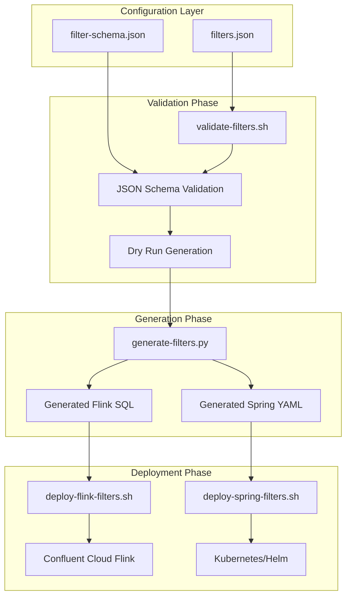
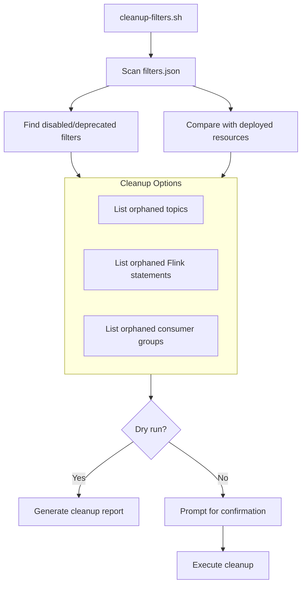
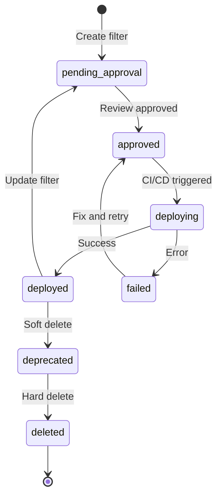

# Filter Configuration Guide

This guide explains how to add, modify, and delete filters using the unified filter configuration system with CI/CD support.

## Overview

The filter configuration system provides a unified way to manage event filters for both Flink SQL and Spring Boot Kafka Streams processors. Filters are defined in a single JSON configuration file and automatically generated for both platforms.

### Architecture



```text
config/filters.json (Source of Truth)
    ↓
    ├─→ generate-filters.py
    │       ├─→ flink-jobs/generated/*.sql (Flink SQL)
    │       └─→ stream-processor-spring/src/main/resources/filters.yml (Spring YAML)
    │
    └─→ Deployment Scripts
            ├─→ deploy-flink-filters.sh (Confluent Cloud)
            └─→ deploy-spring-filters.sh (Kubernetes/Docker)
```

## Quick Start

### 1. Validate Configuration

Before making changes, validate your configuration:

```bash
./cdc-streaming/scripts/filters/validate-filters.sh
```

### 2. Add or Modify a Filter

Edit `cdc-streaming/config/filters.json`:

```json
{
  "version": 1,
  "filters": [
    {
      "id": "my-new-filter",
      "name": "My New Filter",
      "description": "Filters events for my use case",
      "consumerId": "my-consumer",
      "outputTopic": "filtered-my-events",
      "enabled": true,
      "conditions": [
        {
          "field": "event_type",
          "operator": "equals",
          "value": "MyEventType",
          "valueType": "string"
        },
        {
          "field": "__op",
          "operator": "equals",
          "value": "c",
          "valueType": "string"
        }
      ],
      "conditionLogic": "AND",
      "status": "pending_approval",
      "version": 1
    }
  ]
}
```

### 3. Generate Filter Files

Generate Flink SQL and Spring YAML from the configuration:

```bash
./cdc-streaming/scripts/filters/generate-filters.sh
```

### 4. Review Changes

Check what will be deployed:

```bash
./cdc-streaming/scripts/filters/diff-filters.sh
```

### 5. Deploy

Deploy to Flink and Spring Boot:

```bash
# Deploy Flink filters
./cdc-streaming/scripts/filters/deploy-flink-filters.sh

# Deploy Spring Boot filters
./cdc-streaming/scripts/filters/deploy-spring-filters.sh
```

## Filter Configuration Schema

### Filter Object

| Field | Type | Required | Description |
|-------|------|----------|-------------|
| `id` | string | Yes | Unique identifier (lowercase, hyphens allowed) |
| `name` | string | Yes | Human-readable name |
| `description` | string | No | Optional description |
| `consumerId` | string | Yes | Consumer identifier |
| `outputTopic` | string | Yes | Kafka topic name (without -flink/-spring suffix) |
| `enabled` | boolean | Yes | Whether filter is active |
| `conditions` | array | Yes | Array of filter conditions |
| `conditionLogic` | string | No | How to combine conditions: "AND" or "OR" (default: "AND") |
| `status` | string | No | Deployment status (pending_approval, approved, deployed, etc.) |
| `version` | integer | No | Filter version number |

### Condition Object

| Field | Type | Required | Description |
|-------|------|----------|-------------|
| `field` | string | Yes | Field path (e.g., "event_type", "__op") |
| `operator` | string | Yes | Comparison operator (see below) |
| `value` | any | Conditional | Single value (for equals, greaterThan, etc.) |
| `values` | array | Conditional | Array of values (for in, notIn) |
| `min` | any | Conditional | Minimum value (for between) |
| `max` | any | Conditional | Maximum value (for between) |
| `valueType` | string | No | Type hint: "string", "number", "boolean", "timestamp" |

### Supported Operators

| Operator | Description | Required Fields |
|----------|-------------|-----------------|
| `equals` | Exact match | `value` |
| `in` | Value in list | `values` |
| `notIn` | Value not in list | `values` |
| `greaterThan` | Numeric/string comparison | `value` |
| `lessThan` | Numeric/string comparison | `value` |
| `greaterThanOrEqual` | Numeric/string comparison | `value` |
| `lessThanOrEqual` | Numeric/string comparison | `value` |
| `between` | Range check | `min`, `max` |
| `matches` | Pattern match (SQL LIKE) | `value` |
| `isNull` | Field is null | None |
| `isNotNull` | Field is not null | None |

### Available Fields

The following fields are available for filtering:

- `id` - Event ID
- `event_name` - Event name
- `event_type` - Event type (e.g., "CarCreated", "LoanCreated")
- `created_date` - Creation timestamp
- `saved_date` - Save timestamp
- `header_data` - JSON string containing event header
- `__op` - CDC operation: "c" (create), "u" (update), "d" (delete)
- `__table` - Source table name
- `__ts_ms` - CDC timestamp in milliseconds

## Examples

### Example 1: Simple Event Type Filter

Filter for "CarCreated" events:

```json
{
  "id": "car-created-filter",
  "name": "Car Created Events",
  "consumerId": "car-consumer",
  "outputTopic": "filtered-car-created-events",
  "enabled": true,
  "conditions": [
    {
      "field": "event_type",
      "operator": "equals",
      "value": "CarCreated"
    },
    {
      "field": "__op",
      "operator": "equals",
      "value": "c"
    }
  ],
  "conditionLogic": "AND"
}
```

### Example 2: Multiple Event Types

Filter for multiple event types using "in" operator:

```json
{
  "id": "loan-events-filter",
  "name": "All Loan Events",
  "consumerId": "loan-consumer",
  "outputTopic": "filtered-loan-events",
  "enabled": true,
  "conditions": [
    {
      "field": "event_type",
      "operator": "in",
      "values": ["LoanCreated", "LoanUpdated", "LoanCancelled"]
    },
    {
      "field": "__op",
      "operator": "equals",
      "value": "c"
    }
  ],
  "conditionLogic": "AND"
}
```

### Example 3: Dealership Sales Events Filter

Filter for multiple sales-related event types that are relevant to dealership operations. This routes all sales events to a dedicated topic for real-time analytics and reporting:

```json
{
  "id": "dealership-sales-filter",
  "name": "Dealership Sales Events",
  "description": "Filters all sales-related events for dealership operations",
  "consumerId": "sales-analytics-consumer",
  "outputTopic": "filtered-dealership-sales-events",
  "enabled": true,
  "conditions": [
    {
      "field": "event_type",
      "operator": "in",
      "values": ["CarCreated", "LoanCreated", "LoanPaymentSubmitted"],
      "valueType": "string"
    },
    {
      "field": "__op",
      "operator": "equals",
      "value": "c"
    }
  ],
  "conditionLogic": "AND"
}
```

This filter captures all new car sales, loan creation, and payment events, routing them to a single topic for real-time sales analytics, inventory management, or financial reporting systems.

## CI/CD Integration

The filter configuration system is designed to work with Jenkins CI/CD. Here is an example Jenkins pipeline:

### Jenkins

```groovy
pipeline {
    agent any
    
    stages {
        stage('Validate') {
            steps {
                sh './cdc-streaming/scripts/filters/validate-filters.sh'
            }
        }
        
        stage('Generate') {
            steps {
                sh './cdc-streaming/scripts/filters/generate-filters.sh'
            }
        }
        
        stage('Deploy') {
            steps {
                sh './cdc-streaming/scripts/filters/deploy-flink-filters.sh'
                sh './cdc-streaming/scripts/filters/deploy-spring-filters.sh'
            }
        }
    }
}
```

## Approval Workflow

The filter configuration supports an approval workflow through the `status` field:

1. **pending_approval** - Initial state when filter is created
2. **approved** - Filter has been approved for deployment
3. **deploying** - Filter is currently being deployed
4. **deployed** - Filter is successfully deployed
5. **failed** - Deployment failed
6. **disabled** - Filter is disabled

### Manual Approval Process

1. Create or modify filter with `status: "pending_approval"`
2. Submit PR with filter changes
3. Review and approve PR
4. Update filter status to `approved` in PR
5. Merge PR triggers deployment
6. Deployment script updates status to `deployed`

## Update and Delete Operations

### Updating a Filter

To update an existing filter:

1. **Edit the filter** in `config/filters.json`
2. **Increment the version** number for tracking
3. **Validate**: `./cdc-streaming/scripts/filters/validate-filters.sh`
4. **Preview changes**: `./cdc-streaming/scripts/filters/diff-filters.sh`
5. **Generate and deploy** using the standard workflow

```json
{
  "id": "car-created-filter",
  "version": 2,  // Increment version
  "conditions": [
    // Updated conditions
  ]
}
```

### Deleting a Filter

There are two approaches to removing a filter:

#### Soft Delete (Recommended)

Set the filter to disabled and mark for deprecation. This preserves audit history and allows easy rollback:

```json
{
  "id": "old-filter",
  "enabled": false,
  "status": "deprecated"
}
```

#### Hard Delete

Remove the filter entry entirely from `filters.json`. This stops the filter immediately but requires cleanup of orphaned resources.

### Cleanup Workflow

After deleting filters, orphaned resources may remain. Use the cleanup workflow to identify and remove them:



**Cleanup script options:**

```bash
# List orphaned resources without deleting
./cdc-streaming/scripts/filters/cleanup-filters.sh --list-orphaned

# Preview what would be cleaned up
./cdc-streaming/scripts/filters/cleanup-filters.sh --dry-run

# Clean up orphaned Kafka topics (with confirmation)
./cdc-streaming/scripts/filters/cleanup-filters.sh --cleanup-topics

# Clean up orphaned Flink statements
./cdc-streaming/scripts/filters/cleanup-filters.sh --cleanup-flink
```

### Filter Lifecycle States

Filters progress through the following states:



| Status | Description |
|--------|-------------|
| `pending_approval` | Filter created, awaiting review |
| `approved` | Approved for deployment |
| `deploying` | Currently being deployed |
| `deployed` | Successfully deployed and active |
| `failed` | Deployment failed |
| `active` | Filter is enabled and deployed (lifecycle state) |
| `deprecated` | Disabled, pending removal (soft delete) |
| `pending_deletion` | Awaiting cleanup of associated resources |
| `deleted` | Marked for removal, kept for audit trail |
| `disabled` | Filter is disabled |

## Rollback Procedures

### Rollback Using Git

If filters are version controlled:

```bash
./cdc-streaming/scripts/filters/rollback-filters.sh
# Select option 1: Rollback using Git
# Enter commit hash or 'HEAD~1' for previous commit
```

### Rollback Using Backup Files

Backups are created automatically before deployments:

```bash
./cdc-streaming/scripts/filters/rollback-filters.sh
# Select option 2: Rollback from backup files
# Select backup file to restore
```

### Manual Rollback

1. Restore `config/filters.json` from backup or git
2. Regenerate filters: `./cdc-streaming/scripts/filters/generate-filters.sh`
3. Redeploy: `./cdc-streaming/scripts/filters/deploy-flink-filters.sh` and `./cdc-streaming/scripts/filters/deploy-spring-filters.sh`

## Troubleshooting

### Validation Fails

**Problem**: Schema validation fails

**Solution**:

- Check JSON syntax: `python3 -m json.tool config/filters.json`
- Install jsonschema: `pip3 install jsonschema`
- Review schema: `cdc-streaming/schemas/filter-schema.json`

### Generation Fails

**Problem**: Filter generation produces errors

**Solution**:

- Check filter conditions are valid
- Ensure all required fields are present
- Review operator and value combinations

### Deployment Fails

**Problem**: Flink or Spring deployment fails

**Solution**:

- Check Confluent Cloud credentials and permissions
- Verify compute pool and cluster IDs are correct
- Check Spring Boot build succeeds: `./gradlew build`
- Review deployment logs

### Filters Not Applied

**Problem**: Filters are configured but not processing events

**Solution**:

- Verify filters are enabled: `"enabled": true`
- Check Spring Boot logs for filter loading messages
- Verify Flink statements are running: `confluent flink statement list`
- Check topic names match between config and consumers

## Best Practices

1. **Version Control**: Always commit filter changes to version control
2. **Validation**: Always validate before deployment
3. **Testing**: Test filters in development environment first
4. **Documentation**: Document complex filter logic in the `description` field
5. **Naming**: Use descriptive filter IDs and names
6. **Backup**: Automatic backups are created, but keep git history
7. **Monitoring**: Monitor filter performance and event throughput
8. **Incremental Changes**: Make small, incremental changes rather than large updates

## Related Documentation

- [ARCHITECTURE.md](../ARCHITECTURE.md) - System architecture overview
- [CONFLUENT_CLOUD_SETUP_GUIDE.md](../CONFLUENT_CLOUD_SETUP_GUIDE.md) - Confluent Cloud setup
- [README.md](../README.md) - CDC Streaming system overview

## Script Reference

| Script | Purpose |
|--------|---------|
| `validate-filters.sh` | Validate filter configuration against schema |
| `generate-filters.sh` | Generate Flink SQL and Spring YAML from config |
| `diff-filters.sh` | Show differences between current and proposed config |
| `deploy-flink-filters.sh` | Deploy filters to Confluent Cloud Flink |
| `deploy-spring-filters.sh` | Rebuild and deploy Spring Boot with filters |
| `rollback-filters.sh` | Rollback to previous filter configuration |
| `cleanup-filters.sh` | Identify and remove orphaned resources (topics, Flink statements) |

All scripts are located in `cdc-streaming/scripts/filters/`.

---

**Document Version:** 1.0  
**Last Updated:** December 30, 2025  
**Maintained By:** Platform Engineering Team

**Recent Updates:**
- Added support for Metadata Service API-based filter management
- Enhanced documentation for Spring Boot YAML generation
- Updated CI/CD integration examples
