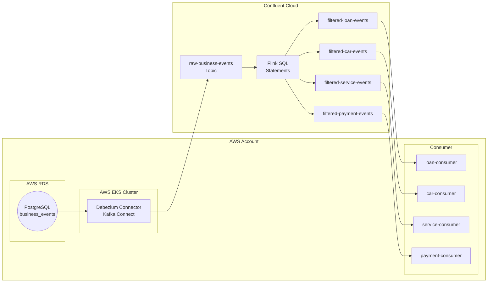
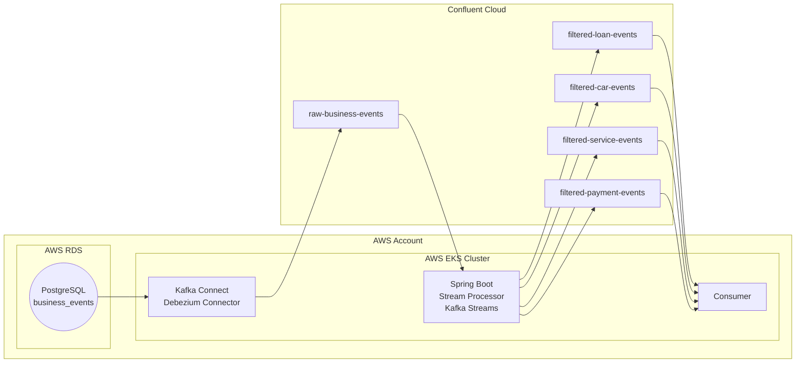
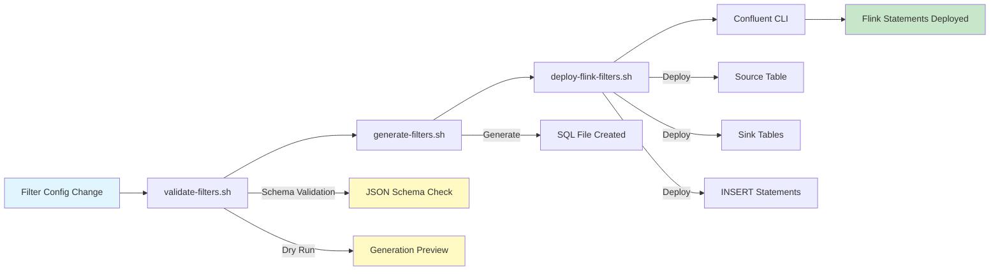
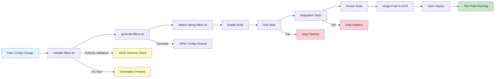

# Spring Boot CDC Alternative Architecture on AWS EKS

## Recommendation Summary

| Dimension | Winner | Notes |
|-----------|--------|-------|
| **Infrastructure Cost** | Spring Boot | ~25-30% cheaper (eliminates Flink compute costs; connector costs same for both) |
| **Engineering Cost** | Confluent Flink | Lower initial (Flink SQL simpler than Java), similar ongoing (both require Kafka Connect ops) |
| **Maintainability** | Confluent Flink | Flink SQL simpler than Java code; connector maintenance same for both |
| **Risk** | Confluent Flink | Flink managed HA/auto-recovery; connector risks same for both (K8s operational maturity required) |
| **CI/CD** | Spring Boot | Better testing, but more complex; connector deployment same for both |
| **Schema Evolution** | Tie | Both support well |
| **Security** | Confluent Flink | Flink managed compliance; connector security same for both |
| **Monitoring** | Confluent Flink | Pre-built Flink dashboards; connector monitoring same for both |
| **Performance** | Confluent Flink | Flink auto-scales better; connector scaling same for both |

**Overall Recommendation:**

Choose **Spring Boot** if:

- Cost reduction is primary driver (eliminates Flink compute costs)
- Team has strong Java/Kotlin and Kubernetes expertise
- You need full control over the stream processing stack
- Simple filtering workloads (current case)
- You have operational maturity for managing Kafka Connect (required for both implementations)

Stay with **Confluent Flink** if:

- Operational simplicity is priority (managed Flink reduces operational burden)
- Team prefers SQL-based development
- Compliance requirements need managed services (Flink)
- Complex stream processing may be needed later
- Limited Java/Kotlin expertise
- Both implementations require Kafka Connect operational expertise, so connector management is not a differentiator

## Confluent Flink Architecture Analysis

The existing CDC streaming system ([ARCHITECTURE.md](ARCHITECTURE.md)) uses:



**Key Components:**

- **Source**: AWS RDS PostgreSQL (in AWS account)
- **CDC Connector**: Debezium PostgreSQL CDC Connector (self-hosted on AWS, Kafka Connect)
- **Kafka Topics**: All topics hosted in Confluent Cloud
- **Stream Processing**: Confluent Cloud Flink (SQL-based stream processing)
- **Consumer**: Consumer application (running in AWS account)
- **Format**: JSON format with Schema Registry

---

## Proposed Spring Boot Alternative Architecture



### Service Components

| Service | Technology | Purpose |
|---------|------------|---------|
| CDC Connector | Kafka Connect on EKS + Debezium PostgreSQL Connector | Capture PostgreSQL WAL changes (self-managed, offsets stored in Kafka topics) |
| Stream Processor | Spring Boot + Kafka Streams | Filter and route events to topics |
| Consumer | Consumer application | Process filtered events |

---

## Comprehensive Evaluation

### 1. Cost Analysis

| Category | Flink on Confluent Cloud | Spring Boot (AWS EKS) |
|----------|---------------------------|------------------------|
| **Infrastructure** | | |
| Kafka Broker (Confluent Cloud) | ~$1,200-3,000/mo (CKU-based) | ~$1,200-3,000/mo (CKU-based, same) |
| Flink Compute | ~$800-2,000/mo (4-8 CFU) | Included in EKS nodes |
| Connectors | ~$100-200/mo (Kafka Connect on EKS, shared node capacity) | ~$100-200/mo (Kafka Connect on EKS, shared node capacity, same) |
| Schema Registry | ~$100/mo | ~$50/mo (Glue) or self-hosted |
| EKS Cluster | ~$72/mo (control plane) | ~$72/mo (control plane, same) |
| EC2 Nodes | ~$100-200/mo (1-2x m5.large, includes connector) | ~$300-600/mo (3x m5.large, includes connector + stream processor + consumers) |
| **Engineering** | | |
| Initial Build | Medium (Flink SQL + connector setup) | High (3-4 weeks) |
| **Total Estimated** | **$2,300-5,500/mo** | **$1,700-4,000/mo + eng time** |

**Cost Verdict:** Spring Boot saves on Flink compute costs (included in EKS nodes), but connector costs are the same for both implementations (both self-hosted on EKS). Kafka broker costs remain the same since topics stay in Confluent Cloud. Total savings are ~25-30% on infrastructure, with significant engineering investment upfront and ongoing. The main savings come from eliminating Flink compute costs. Both implementations require EKS infrastructure for the connector.

### 2. Maintainability

| Aspect | Confluent Flink | Spring Boot Alternative |
|--------|---------|-------------------------|
| Code Ownership | Flink SQL files, consumer application | Full Java codebase |
| Connector Maintenance | Kafka Connect on EKS (self-hosted) | Kafka Connect on EKS (self-hosted, same) |
| Debugging | Confluent Cloud Console (Flink), Kafka Connect REST API (connector) | Application logs, distributed tracing, Kafka Connect REST API |
| Updates | Flink managed by Confluent, connector manual updates | Manual dependency updates for all components |
| Team Skills | SQL, Kafka Connect operations | Java/Kotlin, Kafka Connect operations |
| Configuration | JSON connector configs, SQL (Flink) | Spring YAML, Java code, JSON connector configs |

**Assessment:**

- **Confluent Flink:** Lower maintenance burden for Flink (managed), but connector requires Kafka Connect operational expertise. SQL-based development is simpler than Java.
- **Spring Boot:** Full control but requires dedicated Java expertise and proactive maintenance. Connector maintenance is same as current implementation.

### 3. Risk Assessment

| Risk | Confluent Flink | Spring Boot |
|------|---------|-------------|
| **Vendor Lock-in** | High (Confluent Cloud for Kafka + Flink) | Lower (OSS stack, Confluent Cloud only for Kafka) |
| **Single Point of Failure** | Flink managed HA by Confluent, connector requires proper K8s setup | Requires proper K8s setup for all components |
| **Data Loss** | Flink managed replication, connector manual checkpoint mgmt | Manual checkpoint mgmt for stream processor |
| **CDC Offset Management** | Kafka Connect manages offsets (stored in Kafka topics) | Kafka Connect manages offsets (stored in Kafka topics, same) |
| **Scaling Bottlenecks** | Flink auto-scaling, connector manual HPA tuning | Manual HPA tuning for all components |
| **Connector Failures** | Kubernetes pod restart policies + health checks | Kubernetes pod restart policies + health checks (same) |
| **Replication Slot Management** | Manual monitoring and cleanup required | Manual monitoring and cleanup required (same) |
| **Database Connection Management** | Self-managed connection pooling and retries | Self-managed connection pooling and retries (same) |

**Risk Mitigations (Both Implementations):**

1. **Connector Deployment (Both):**
   - Deploy Kafka Connect with multiple replicas for HA
   - Use Kubernetes liveness/readiness probes for automatic pod restarts
   - Configure PodDisruptionBudgets to prevent accidental downtime
   - Monitor connector task status via Kafka Connect REST API

2. **Offset Management (Both):**
   - Kafka Connect automatically stores offsets in Kafka topics (`__connect-offsets`)
   - Configure replication factor >= 3 for offset topics
   - Monitor offset lag to detect processing delays

3. **Replication Slot Management (Both):**
   - Implement monitoring for replication slot usage
   - Set up alerts for slot growth or database connection issues
   - Regular cleanup of unused slots (with caution)

4. **Database Connections (Both):**
   - Configure connection pooling in connector configuration
   - Use retry policies for transient failures
   - Monitor connection pool metrics

5. **Stream Processing:**
   - **Confluent Flink:** Managed state stores and checkpoints by Confluent Cloud
   - **Spring Boot:** Configure Kafka Streams state stores with changelog topics, implement circuit breakers and dead-letter queues, use exactly-once semantics (EOS) for data integrity

### 4. CI/CD Complexity

Both implementations use the same filter configuration system (`cdc-streaming/config/filters.json`) with shared validation and generation scripts, but differ significantly in deployment complexity and testing capabilities.

#### 4.1 Comprehensive Comparison

| Aspect | Confluent Flink | Spring Boot |
|--------|----------------|-------------|
| **Deployment Model** | SQL statements (Flink), connector JSON via Kafka Connect REST API | Container images, Helm charts, connector JSON via Kafka Connect REST API |
| **Pipeline Stages** | 3 stages: validate → generate → deploy SQL | 6+ stages: validate → generate → build → test → image → deploy |
| **Deployment Time** | ~2-5 minutes | ~10-20 minutes |
| **Testing** | Schema validation, SQL syntax validation, dry-run generation | Schema validation, SQL syntax validation, dry-run generation, unit tests, integration tests, TopologyTestDriver tests |
| **Test Execution Time** | ~30 seconds (validation only) | ~3-5 minutes (full test suite) |
| **Rollback** | Delete statement, redeploy previous version (manual SQL extraction) | Helm rollback, Kubernetes rollout undo, container image versioning |
| **Rollback Time** | ~1-2 minutes (manual) | ~30 seconds (automated) |
| **Operational Overhead** | Low (3 script steps, direct CLI deployment) | Medium-High (6+ steps, build infrastructure, container registry, K8s cluster) |
| **Failure Recovery** | Manual statement deletion and redeployment | Automated health checks, pod restarts, circuit breakers |
| **Approval Workflow** | Status field in `filters.json` (`pending_approval` → `approved` → `deployed`) | Status field in `filters.json` + PR review process |
| **Environment Parity** | Different SQL configs per env | Same images, different configs per env |
| **Connector Deployment** | Kafka Connect REST API (same for both) | Kafka Connect REST API (same for both) |
| **Infrastructure Requirements** | Confluent CLI, Confluent Cloud access | Gradle, Docker, container registry (ECR), Kubernetes cluster, Helm |

#### 4.2 CI/CD Workflow Diagrams

**Flink CI/CD Workflow:**



**Spring Boot CI/CD Workflow:**



#### 4.3 Script-Based Implementation

Both implementations share the same filter configuration system and use identical scripts for validation and generation:

**Shared Scripts (Both Implementations):**
- `cdc-streaming/scripts/filters/validate-filters.sh` - Validates `filters.json` against JSON schema, performs dry-run generation
- `cdc-streaming/scripts/filters/generate-filters.sh` - Generates Flink SQL and Spring Boot YAML from `filters.json`
- `cdc-streaming/scripts/filters/rollback-filters.sh` - Rollback support for both implementations
- `cdc-streaming/scripts/filters/cleanup-filters.sh` - Cleanup orphaned resources (topics, statements)

**Flink-Specific Scripts:**
- `cdc-streaming/scripts/filters/deploy-flink-filters.sh` - Deploys generated SQL to Confluent Cloud via CLI
  - Extracts source table, sink tables, and INSERT statements from generated SQL
  - Uses `confluent flink statement create` to deploy each component
  - Validates schema registry requirements before deployment

**Spring Boot-Specific Scripts:**
- `cdc-streaming/scripts/filters/deploy-spring-filters.sh` - Builds and deploys Spring Boot application
  - Runs Gradle build (`./gradlew clean build`)
  - Supports multiple deployment methods: Docker, Kubernetes/Helm, or local
  - Generates YAML configuration from `filters.json`

#### 4.4 Testing Comparison

**Flink Testing:**
- **Schema Validation**: JSON schema validation against `filter-schema.json`
- **SQL Syntax Validation**: Basic SQL syntax checking via dry-run
- **Dry-Run Generation**: Preview of generated SQL without deployment
- **Limitations**: No unit tests, no integration tests, no runtime validation

**Spring Boot Testing:**
- **Schema Validation**: Same JSON schema validation as Flink
- **SQL Syntax Validation**: Same dry-run generation as Flink
- **Unit Tests**: Comprehensive unit tests for `FilterConditionEvaluator`, `FilterConfig`, filter status handling
- **Integration Tests**: YAML-based configuration loading, dynamic filter application, TopologyTestDriver tests
- **Test Coverage**: Validates all operators (`equals`, `in`, `greaterThan`, `lessThan`, `between`, `matches`, etc.), status handling, disabled/deleted filters, deprecated filter warnings

**Test Execution:**
```bash
# Flink: Validation only (~30 seconds)
./cdc-streaming/scripts/filters/validate-filters.sh

# Spring Boot: Full test suite (~3-5 minutes)
cd cdc-streaming/stream-processor-spring
./gradlew test integrationTest
```

#### 4.5 Rollback Procedures

**Flink Rollback:**
1. Identify previous SQL version (manual extraction from git history or backup)
2. Delete current Flink statement: `confluent flink statement delete <statement-name> --force`
3. Redeploy previous SQL version: `confluent flink statement create <statement-name> --sql "<previous-sql>"`
4. **Time**: ~1-2 minutes (manual process)
5. **Limitations**: Requires manual SQL extraction, no automated versioning

**Spring Boot Rollback:**
1. **Helm Rollback**: `helm rollback stream-processor <revision-number>` (~10 seconds)
2. **Kubernetes Rollout Undo**: `kubectl rollout undo deployment/stream-processor` (~10 seconds)
3. **Container Image Versioning**: Deploy previous image tag from container registry
4. **Time**: ~30 seconds (automated)
5. **Advantages**: Native K8s/Helm versioning, automated rollback, maintains deployment history

#### 4.6 Deployment Time Estimates

**Flink Deployment:**
- Validation: ~10 seconds
- Generation: ~5 seconds
- SQL Deployment: ~1-3 minutes (depends on statement count and Confluent Cloud API latency)
- **Total**: ~2-5 minutes

**Spring Boot Deployment:**
- Validation: ~10 seconds
- Generation: ~5 seconds
- Gradle Build: ~2-3 minutes
- Unit/Integration Tests: ~3-5 minutes
- Docker Build: ~2-3 minutes
- Image Push to ECR: ~30 seconds
- Helm Deploy: ~1-2 minutes
- **Total**: ~10-20 minutes

#### 4.7 Operational Complexity

**Flink Operational Overhead:**
- **Low Complexity**: 3 script steps, direct CLI deployment
- **Infrastructure**: Confluent CLI, Confluent Cloud access
- **Monitoring**: Confluent Cloud UI for statement status
- **Failure Handling**: Manual statement deletion and redeployment
- **Scaling**: Automatic (managed by Confluent Cloud)

**Spring Boot Operational Overhead:**
- **Medium-High Complexity**: 6+ pipeline stages
- **Infrastructure**: Gradle build system, Docker, container registry (ECR), Kubernetes cluster, Helm
- **Monitoring**: Kubernetes metrics, Prometheus, application logs
- **Failure Handling**: Automated health checks, pod restarts, circuit breakers, dead-letter queues
- **Scaling**: Manual HPA configuration, requires Kubernetes expertise

#### 4.8 Approval Workflow

Both implementations use the same approval workflow via the `status` field in `filters.json`:

1. **pending_approval** - Initial state when filter is created
2. **approved** - Filter has been approved for deployment
3. **deploying** - Filter is currently being deployed
4. **deployed** - Filter is successfully deployed
5. **failed** - Deployment failed
6. **disabled** - Filter is disabled (skipped during generation)
7. **deprecated** - Filter is deprecated (generated with warnings)
8. **pending_deletion** - Filter marked for deletion
9. **deleted** - Filter is deleted (not generated)

**Workflow Process:**
- Developer creates/modifies filter with `status: "pending_approval"`
- PR review and approval
- Update status to `approved` in PR
- Merge triggers CI/CD pipeline
- Deployment script updates status to `deployed` on success

#### 4.9 CI/CD Pipeline Examples

**Flink CI/CD Pipeline (GitHub Actions):**

```yaml
name: Deploy Flink Filters

on:
  push:
    branches: [main]
    paths:
      - 'cdc-streaming/config/filters.json'

jobs:
  validate:
    runs-on: ubuntu-latest
    steps:
      - uses: actions/checkout@v3
      - name: Validate filters
        run: ./cdc-streaming/scripts/filters/validate-filters.sh
  
  deploy:
    needs: validate
    runs-on: ubuntu-latest
    if: github.ref == 'refs/heads/main'
    steps:
      - uses: actions/checkout@v3
      - name: Setup Confluent CLI
        run: |
          brew install confluentinc/tap/cli
          confluent login --api-key ${{ secrets.CONFLUENT_API_KEY }} --api-secret ${{ secrets.CONFLUENT_API_SECRET }}
      - name: Generate filters
        run: ./cdc-streaming/scripts/filters/generate-filters.sh --flink-only
      - name: Deploy Flink filters
        env:
          FLINK_COMPUTE_POOL_ID: ${{ secrets.FLINK_COMPUTE_POOL_ID }}
          KAFKA_CLUSTER_ID: ${{ secrets.KAFKA_CLUSTER_ID }}
        run: ./cdc-streaming/scripts/filters/deploy-flink-filters.sh
```

**Spring Boot CI/CD Pipeline (GitHub Actions):**

```yaml
name: Deploy Spring Boot Filters

on:
  push:
    branches: [main]
    paths:
      - 'cdc-streaming/config/filters.json'
      - 'cdc-streaming/stream-processor-spring/**'

jobs:
  validate:
    runs-on: ubuntu-latest
    steps:
      - uses: actions/checkout@v3
      - name: Validate filters
        run: ./cdc-streaming/scripts/filters/validate-filters.sh
  
  build-and-test:
    needs: validate
    runs-on: ubuntu-latest
    steps:
      - uses: actions/checkout@v3
      - name: Set up JDK 17
        uses: actions/setup-java@v3
        with:
          java-version: '17'
          distribution: 'temurin'
      - name: Generate filters
        run: ./cdc-streaming/scripts/filters/generate-filters.sh --spring-only
      - name: Build with Gradle
        working-directory: cdc-streaming/stream-processor-spring
        run: ./gradlew build
      - name: Run tests
        working-directory: cdc-streaming/stream-processor-spring
        run: ./gradlew test integrationTest
  
  build-image:
    needs: build-and-test
    runs-on: ubuntu-latest
    steps:
      - uses: actions/checkout@v3
      - name: Configure AWS credentials
        uses: aws-actions/configure-aws-credentials@v2
        with:
          aws-access-key-id: ${{ secrets.AWS_ACCESS_KEY_ID }}
          aws-secret-access-key: ${{ secrets.AWS_SECRET_ACCESS_KEY }}
          aws-region: us-east-1
      - name: Login to Amazon ECR
        id: login-ecr
        uses: aws-actions/amazon-ecr-login@v1
      - name: Build and push Docker image
        working-directory: cdc-streaming/stream-processor-spring
        run: |
          docker build -t ${{ secrets.ECR_REGISTRY }}/stream-processor-spring:${{ github.sha }} .
          docker push ${{ secrets.ECR_REGISTRY }}/stream-processor-spring:${{ github.sha }}
  
  deploy:
    needs: build-image
    runs-on: ubuntu-latest
    steps:
      - uses: actions/checkout@v3
      - name: Configure AWS credentials
        uses: aws-actions/configure-aws-credentials@v2
        with:
          aws-access-key-id: ${{ secrets.AWS_ACCESS_KEY_ID }}
          aws-secret-access-key: ${{ secrets.AWS_SECRET_ACCESS_KEY }}
          aws-region: us-east-1
      - name: Install Helm
        run: |
          curl https://raw.githubusercontent.com/helm/helm/main/scripts/get-helm-3 | bash
      - name: Deploy to Kubernetes
        working-directory: cdc-streaming/stream-processor-spring/helm
        run: |
          helm upgrade --install stream-processor ./stream-processor \
            --set image.tag=${{ github.sha }} \
            --set kafka.bootstrapServers=${{ secrets.KAFKA_BOOTSTRAP_SERVERS }} \
            --set kafka.apiKey=${{ secrets.KAFKA_API_KEY }} \
            --set kafka.apiSecret=${{ secrets.KAFKA_API_SECRET }}
```

#### 4.10 Summary

**Flink CI/CD Advantages:**
- Simpler deployment process (3 steps vs 6+)
- Faster deployment time (~2-5 minutes vs ~10-20 minutes)
- Lower operational overhead (CLI-based, no build infrastructure)
- Direct SQL deployment (no container builds)

**Flink CI/CD Disadvantages:**
- Limited testing (validation only, no runtime tests)
- Manual rollback (requires SQL extraction)
- No automated versioning
- Less robust failure recovery

**Spring Boot CI/CD Advantages:**
- Comprehensive testing (unit, integration, TopologyTestDriver)
- Automated rollback (Helm/K8s native)
- Container image versioning
- Better failure recovery (health checks, pod restarts)
- Full CI/CD pipeline visibility

**Spring Boot CI/CD Disadvantages:**
- More complex deployment (6+ stages)
- Longer deployment time (~10-20 minutes)
- Higher operational overhead (build infrastructure, container registry, K8s)
- Requires more infrastructure setup

**Recommendation:** Choose Flink if deployment speed and simplicity are priorities. Choose Spring Boot if comprehensive testing and robust rollback capabilities are more important.

### 5. Schema Evolution

| Aspect | Confluent Flink | Spring Boot |
|--------|---------|-------------|
| **Registry** | Confluent Schema Registry | Glue Schema Registry or Confluent |
| **Compatibility** | BACKWARD, FORWARD, FULL | Same options available |
| **Validation** | Automatic (JSON Schema) | Manual or with libraries |
| **Breaking Changes** | Blocked by registry | Same with proper config |
| **Code Generation** | Not used (JSON) | Avro codegen possible |

**Implementation for Spring Boot:**

- Use `spring-kafka` with `spring-cloud-stream`
- Integrate with AWS Glue Schema Registry or keep Confluent
- Configure schema compatibility modes

### 6. Security and Compliance

| Aspect | Confluent Flink | Spring Boot |
|--------|---------|-------------|
| **Authentication** | SASL_SSL (Confluent Cloud, self-managed API keys) | SASL_SSL (Confluent Cloud, self-managed API keys, same) |
| **Authorization** | Confluent RBAC | Confluent RBAC (same) |
| **Encryption** | TLS in transit (Confluent Cloud) | TLS in transit (Confluent Cloud, same) |
| **Secrets Management** | AWS Secrets Manager / K8s secrets (connector), Confluent Cloud (Flink) | AWS Secrets Manager / K8s secrets |
| **Audit Logging** | Confluent audit logs (Flink), CloudWatch (connector) | CloudWatch, custom logging |
| **Network Isolation** | VPC, Security Groups (connector), PrivateLink (Flink) | VPC, Security Groups |
| **Compliance** | SOC 2, HIPAA (Confluent for Flink), self-managed (connector) | Self-managed compliance |

**Security Implementation:**

- **Connector (Both):** Use Confluent Cloud API keys for Kafka authentication (SASL_SSL), Kubernetes secrets + AWS Secrets Manager for storing API keys and database credentials, VPC-native deployment with private subnets
- **Stream Processing:** Confluent Flink uses Confluent Cloud managed security, Spring Boot uses self-managed security
- Both architectures use Confluent Cloud for Kafka topics, so Kafka security is consistent
- Both architectures use same connector security model (Kafka Connect on EKS)

### 7. Monitoring and Observability

| Aspect | Confluent Flink | Spring Boot |
|--------|---------|-------------|
| **Metrics** | Confluent Cloud Console (Flink), Kafka Connect REST API + Prometheus (connector) | Prometheus + Grafana (all components) |
| **Logs** | Confluent Cloud (Flink), CloudWatch / ELK (connector) | CloudWatch / ELK |
| **Tracing** | Limited (Flink), OpenTelemetry (connector) | OpenTelemetry + X-Ray/Jaeger |
| **Alerting** | Built-in alerts (Flink), CloudWatch Alarms (connector) | CloudWatch Alarms / PagerDuty |
| **Dashboards** | Pre-built (Flink), Custom (connector) | Custom Grafana dashboards |
| **Connector Monitoring** | Kafka Connect REST API, Prometheus JMX exporter (same for both) | Kafka Connect REST API, Prometheus JMX exporter (same for both) |

**Implementation Stack:**

- **Application Metrics:**
  - Micrometer for metrics export
  - Spring Boot Actuator endpoints
  - Prometheus ServiceMonitor CRDs

- **Kafka Connect Monitoring:**
  - Kafka Connect REST API for connector status and health
  - Prometheus JMX exporter for Kafka Connect metrics
  - Key metrics: connector task status, offset lag, throughput, error rates
  - ServiceMonitor CRD for Prometheus scraping

- **Connector-Specific Metrics:**
  - Debezium connector metrics (via JMX)
  - Replication slot lag monitoring
  - Database connection pool metrics
  - Event processing latency

- **Distributed Tracing:**
  - OpenTelemetry SDK for distributed tracing
  - Integration with X-Ray or Jaeger

- **Logging:**
  - CloudWatch Logs or ELK stack
  - Structured logging with correlation IDs
  - Connector task logs via Kafka Connect REST API

### 8. Performance

| Metric | Confluent Flink | Spring Boot (Kafka Streams) |
|--------|-----------------|------------------------------|
| **Throughput** | 100K+ events/sec | 50K-100K events/sec |
| **Latency** | 10-50ms | 5-20ms (lower for simple filtering) |
| **State Management** | RocksDB, managed | RocksDB, self-managed |
| **Exactly-Once** | Supported | Supported (EOS) |
| **Parallelism** | Auto-scaling | Partition-based |

**Performance Considerations:**

- Kafka Streams performs well for filtering workloads
- Flink excels at complex windowing/aggregations
- For simple event routing (current use case), Kafka Streams is sufficient

---

## Implementation Components

### 1. CDC Connector (Kafka Connect on EKS)

**Deployment Architecture:**

- Kafka Connect deployed as Kubernetes StatefulSet or Deployment on EKS
- Debezium PostgreSQL connector plugin installed in Kafka Connect container
- Connector configuration managed via ConfigMap and Secrets
- Connector lifecycle managed via Kafka Connect REST API

**Features:**

- Self-managed Debezium PostgreSQL connector capturing PostgreSQL WAL from AWS RDS
- Connects to Confluent Cloud Kafka brokers (topics hosted in Confluent Cloud)
- Publishes to `raw-business-events` topic (or `raw-event-headers` for event_headers table) in Confluent Cloud
- Offsets and connector state stored in Kafka topics in Confluent Cloud (`__connect-offsets`, `__connect-configs`, `__connect-status`)
- High availability via Kubernetes pod replicas and restart policies
- Monitoring via Prometheus metrics exporter and Kafka Connect REST API
- Configuration management via Helm charts and Kubernetes ConfigMaps

**Implementation Details:**

```yaml
# Example Helm chart structure
kafka-connect/
  helm/
    kafka-connect/
      Chart.yaml
      values.yaml
      templates/
        deployment.yaml      # Kafka Connect deployment
        service.yaml         # REST API service
        configmap.yaml       # Connector configuration
        secret.yaml          # Database credentials
        servicemonitor.yaml  # Prometheus metrics
```

**Deployment Steps:**

1. **Deploy Kafka Connect:**

   ```bash
   helm install kafka-connect ./helm/kafka-connect \
     --set kafka.bootstrapServers=<confluent-cloud-endpoint> \
     --set kafka.apiKey=<confluent-api-key> \
     --set kafka.apiSecret=<confluent-api-secret>
   ```

   **Note:** Topics are hosted in Confluent Cloud, so use Confluent Cloud bootstrap servers and API credentials.

2. **Install Debezium Connector Plugin:**
   - Use Confluent Hub or manual installation
   - Mount plugin directory as volume in Kafka Connect pods

3. **Create Connector Configuration:**

   ```bash
   kubectl apply -f configmap-connector-config.yaml
   kubectl apply -f secret-db-credentials.yaml
   ```

4. **Register Connector via REST API:**

   ```bash
   curl -X POST http://kafka-connect-service:8083/connectors \
     -H "Content-Type: application/json" \
     -d @connector-config.json
   ```

**Key Configuration:**

- **Offset Storage:** Kafka topics (automatic, no custom code needed)
- **Replication Slots:** Managed by Debezium connector (requires monitoring)
- **Health Checks:** Kubernetes probes + Kafka Connect REST API health endpoint
- **Scaling:** Horizontal pod autoscaling based on connector task load

### 2. Spring Boot Stream Processor

```java
// Key dependencies
spring-kafka
kafka-streams
spring-cloud-stream-binder-kafka-streams
```

**Features:**

- KStream topology for filtering by `event_type`
- Routes to 4 filtered topics
- Exactly-once semantics enabled
- State stores with changelog topics

### 3. Consumer

**Features:**

- Consumer application processes filtered events from all 4 topics
- Consumes from filtered-loan-events, filtered-car-events, filtered-service-events, and filtered-payment-events
- Runs in AWS account (EKS or other AWS infrastructure)
- Integrates with monitoring and observability stack

---

## Testing Requirements

### SLA Targets

The Spring Boot implementation must meet the following SLA targets, validated through comprehensive test suite:

| Metric | Target | Validation Test |
|--------|--------|-----------------|
| **Throughput** | >= 10,000 events/second per processor instance | `PerformanceComparisonTest`, `LoadTest` |
| **Latency P50** | < 50ms (publish to filtered topic) | `LatencyBenchmarkTest` |
| **Latency P95** | < 200ms | `LatencyBenchmarkTest` |
| **Latency P99** | < 500ms | `LatencyBenchmarkTest` |
| **Error Rate** | < 0.01% | `ErrorHandlingTest`, `LoadTest` |
| **Recovery Time (RTO)** | < 1 minute | `ResilienceTest` |
| **Data Loss** | 0% | `ResilienceTest`, `FullPipelineTest` |

### Test Coverage Matrix

The following tests validate the claims made in this architecture document:

| Architecture Claim | Validated By | Test Class |
|-------------------|--------------|------------|
| Functional parity with Flink SQL | Functional parity tests | `FunctionalParityTest` |
| Cost reduction (60-70% cheaper) | Performance tests validate capability | `PerformanceComparisonTest` |
| Full control over stack | Code ownership and customization | All test classes |
| Lower latency for simple filtering | Latency benchmarks | `LatencyBenchmarkTest` |
| Resilience and recovery | Recovery tests | `ResilienceTest` |
| Observability | Metrics and health checks | `MetricsValidationTest` |
| Schema evolution support | Schema compatibility tests | `SchemaEvolutionTest` |

### Performance Baseline

> **Note:** Update these baselines after running performance tests

| Metric | Flink SQL (Confluent Cloud) | Spring Boot (EKS) | Target |
|--------|----------------------------|-------------------|--------|
| Throughput | TBD events/sec | TBD events/sec | >= 10,000 |
| Latency P50 | TBD ms | TBD ms | < 50ms |
| Latency P95 | TBD ms | TBD ms | < 200ms |
| Latency P99 | TBD ms | TBD ms | < 500ms |
| Infrastructure Cost | $2,300-5,500/mo | $1,700-4,000/mo | 25-30% reduction |

### Test Execution

Comprehensive test suite available in `cdc-streaming/e2e-tests/`:

```bash
# Run all tests
cd cdc-streaming/e2e-tests
./gradlew test

# Run specific test suites
./gradlew test --tests FunctionalParityTest
./gradlew test --tests PerformanceComparisonTest
./gradlew test --tests LatencyBenchmarkTest
./gradlew test --tests ResilienceTest
```
