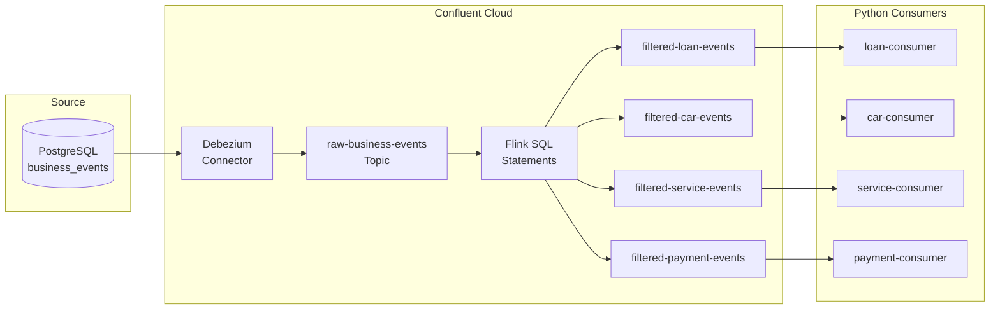
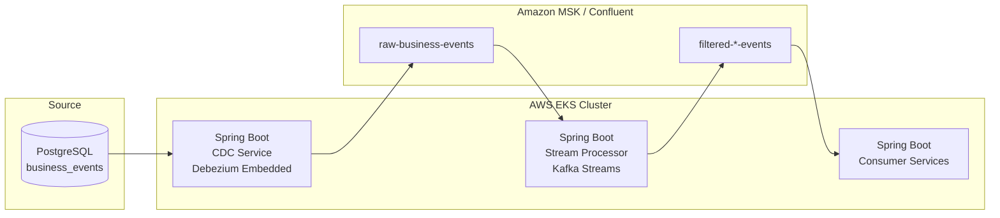

# Spring Boot CDC Alternative Architecture on AWS EKS

## Current Architecture Analysis

The existing CDC streaming system ([ARCHITECTURE.md](ARCHITECTURE.md)) uses:



**Key Components:**

- Debezium PostgreSQL CDC Connector (Confluent Cloud managed)
- Confluent Cloud Flink (SQL-based stream processing)
- 4 Python consumer applications
- JSON format with Schema Registry

---

## Proposed Spring Boot Alternative Architecture



### Service Components

| Service | Technology | Purpose |

|---------|------------|---------|

| CDC Service | Spring Boot + Debezium Embedded Engine | Capture PostgreSQL WAL changes |

| Stream Processor | Spring Boot + Kafka Streams | Filter and route events to topics |

| Consumer Services | Spring Boot + Spring Kafka | Process filtered events |

---

## Comprehensive Evaluation

### 1. Cost Analysis

| Category | Current (Confluent Cloud) | Spring Boot (AWS EKS) |

|----------|---------------------------|------------------------|

| **Infrastructure** | | |

| Kafka Broker | ~$1,200-3,000/mo (CKU-based) | ~$400-800/mo (MSK m5.large x3) |

| Flink Compute | ~$800-2,000/mo (4-8 CFU) | Included in EKS nodes |

| Connectors | ~$200-400/mo (managed) | Included in CDC service |

| Schema Registry | ~$100/mo | ~$50/mo (Glue) or self-hosted |

| EKS Cluster | N/A | ~$72/mo (control plane) |

| EC2 Nodes | N/A | ~$300-600/mo (3x m5.large) |

| **Engineering** | | |

| Initial Build | Low (managed services) | High (3-4 weeks) |

| Ongoing Maintenance | Low | Medium-High |

| **Total Estimated** | **$2,300-5,500/mo** | **$800-1,500/mo + eng time** |

**Cost Verdict:** Spring Boot is ~60-70% cheaper on infrastructure but requires significant engineering investment upfront and ongoing.

### 2. Maintainability

| Aspect | Current | Spring Boot Alternative |

|--------|---------|-------------------------|

| Code Ownership | Flink SQL files, Python consumers | Full Java codebase |

| Debugging | Confluent Cloud Console | Application logs, distributed tracing |

| Updates | Managed by Confluent | Manual dependency updates |

| Team Skills | SQL, Python | Java/Kotlin required |

| Configuration | JSON connector configs, SQL | Spring YAML, Java code |

**Assessment:**

- **Current:** Lower maintenance burden but less control
- **Spring Boot:** Full control but requires dedicated Java expertise and proactive maintenance

### 3. Risk Assessment

| Risk | Current | Spring Boot |

|------|---------|-------------|

| **Vendor Lock-in** | High (Confluent Cloud) | Lower (OSS stack) |

| **Single Point of Failure** | Managed HA by Confluent | Requires proper K8s setup |

| **Data Loss** | Managed replication | Manual checkpoint mgmt |

| **CDC Offset Management** | Automatic | Custom implementation |

| **Scaling Bottlenecks** | Auto-scaling | Manual HPA tuning |

| **Connector Failures** | Auto-restart | Custom error handling |

**Risk Mitigations for Spring Boot:**

1. Implement proper Debezium offset storage (Kafka-based)
2. Configure Kafka Streams state stores with changelog topics
3. Use PodDisruptionBudgets and multiple replicas
4. Implement circuit breakers and dead-letter queues

### 4. CI/CD Complexity

| Aspect | Current | Spring Boot |

|--------|---------|-------------|

| **Deployment Model** | SQL statements, connector JSON | Container images, Helm charts |

| **Testing** | Limited (SQL validation) | Full unit/integration tests |

| **Rollback** | Statement versioning | K8s rollout undo |

| **Pipeline Stages** | Deploy SQL, register connector | Build, test, push image, deploy |

| **Environment Parity** | Different configs per env | Same images, different configs |

**CI/CD Pipeline for Spring Boot:**

```yaml
# Simplified GitHub Actions workflow
stages:
  - build: ./gradlew build
  - test: ./gradlew test integrationTest
  - image: docker build + push to ECR
  - deploy: helm upgrade --install
```

**Complexity:** Spring Boot requires more sophisticated CI/CD but enables better testing and rollback capabilities.

### 5. Schema Evolution

| Aspect | Current | Spring Boot |

|--------|---------|-------------|

| **Registry** | Confluent Schema Registry | Glue Schema Registry or Confluent |

| **Compatibility** | BACKWARD, FORWARD, FULL | Same options available |

| **Validation** | Automatic (JSON Schema) | Manual or with libraries |

| **Breaking Changes** | Blocked by registry | Same with proper config |

| **Code Generation** | Not used (JSON) | Avro codegen possible |

**Implementation for Spring Boot:**

- Use `spring-kafka` with `spring-cloud-stream`
- Integrate with AWS Glue Schema Registry or keep Confluent
- Configure schema compatibility modes

### 6. Security and Compliance

| Aspect | Current | Spring Boot |

|--------|---------|-------------|

| **Authentication** | SASL_SSL (managed) | SASL_SSL (self-managed) |

| **Authorization** | Confluent RBAC | MSK IAM or Kafka ACLs |

| **Encryption** | TLS in transit | TLS + optional at-rest |

| **Secrets Management** | Confluent Cloud | AWS Secrets Manager / K8s secrets |

| **Audit Logging** | Confluent audit logs | CloudWatch, custom logging |

| **Network Isolation** | PrivateLink | VPC, Security Groups |

| **Compliance** | SOC 2, HIPAA (Confluent) | Self-managed compliance |

**Security Implementation:**

- Use AWS IAM for MSK authentication
- Kubernetes secrets + AWS Secrets Manager
- VPC-native deployment with private subnets
- Enable mTLS between services (optional)

### 7. Monitoring and Observability

| Aspect | Current | Spring Boot |

|--------|---------|-------------|

| **Metrics** | Confluent Cloud Console | Prometheus + Grafana |

| **Logs** | Confluent Cloud | CloudWatch / ELK |

| **Tracing** | Limited | OpenTelemetry + X-Ray/Jaeger |

| **Alerting** | Built-in alerts | CloudWatch Alarms / PagerDuty |

| **Dashboards** | Pre-built | Custom Grafana dashboards |

**Implementation Stack:**

- Micrometer for metrics export
- OpenTelemetry SDK for distributed tracing
- Spring Boot Actuator endpoints
- Prometheus ServiceMonitor CRDs

### 8. Performance

| Metric | Current (Flink) | Spring Boot (Kafka Streams) |

|--------|-----------------|------------------------------|

| **Throughput** | 100K+ events/sec | 50K-100K events/sec |

| **Latency** | 10-50ms | 5-20ms (lower for simple filtering) |

| **State Management** | RocksDB, managed | RocksDB, self-managed |

| **Exactly-Once** | Supported | Supported (EOS) |

| **Parallelism** | Auto-scaling | Partition-based |

**Performance Considerations:**

- Kafka Streams performs well for filtering workloads
- Flink excels at complex windowing/aggregations
- For simple event routing (current use case), Kafka Streams is sufficient

---

## Implementation Components

### 1. Spring Boot CDC Service

```java
// Key dependencies
spring-boot-starter
debezium-embedded
debezium-connector-postgres
spring-kafka
```

**Features:**

- Embedded Debezium engine capturing PostgreSQL WAL
- Publishes to `raw-business-events` topic
- Stores offsets in Kafka topic (not file-based)
- Health checks and metrics

### 2. Spring Boot Stream Processor

```java
// Key dependencies
spring-kafka
kafka-streams
spring-cloud-stream-binder-kafka-streams
```

**Features:**

- KStream topology for filtering by `event_type`
- Routes to 4 filtered topics
- Exactly-once semantics enabled
- State stores with changelog topics

### 3. Spring Boot Consumer Services

```java
// Key dependencies
spring-kafka
spring-boot-starter-actuator
```

**Features:**

- Replaces Python consumers (optional)
- Consistent tech stack across all services
- Better integration with monitoring

---

## Recommendation Summary

| Dimension | Winner | Notes |

|-----------|--------|-------|

| **Infrastructure Cost** | Spring Boot | 60-70% cheaper |

| **Engineering Cost** | Current | Lower initial and ongoing |

| **Maintainability** | Tie | Depends on team skills |

| **Risk** | Current | Managed HA, auto-recovery |

| **CI/CD** | Spring Boot | Better testing, but more complex |

| **Schema Evolution** | Tie | Both support well |

| **Security** | Current | Managed compliance |

| **Monitoring** | Current | Pre-built dashboards |

| **Performance** | Current | Flink auto-scales better |

**Overall Recommendation:**

Choose **Spring Boot** if:

- Cost reduction is primary driver
- Team has strong Java/Kotlin expertise
- You need full control over the stack
- Simple filtering workloads (current case)

Stay with **Confluent Cloud** if:

- Operational simplicity is priority
- Team prefers SQL-based development
- Compliance requirements need managed services
- Complex stream processing may be needed later

---

## Implementation Plan (No Terraform)

### Phase 1: CDC Service (Week 1-2)

1. Create Spring Boot CDC service with Debezium Embedded
2. Configure PostgreSQL connector properties
3. Implement offset storage in Kafka
4. Add health checks and metrics

### Phase 2: Stream Processor (Week 2-3)

1. Create Kafka Streams topology for event filtering
2. Implement routing to 4 filtered topics
3. Configure exactly-once semantics
4. Add state store management

### Phase 3: Consumer Services (Week 3-4) - Optional

1. Port Python consumers to Spring Boot
2. Maintain same consumer group IDs
3. Add structured logging

### Phase 4: Kubernetes Deployment (Week 4)

1. Create Dockerfiles for all services
2. Write Helm charts or K8s manifests
3. Configure HPA, PDB, resource limits
4. Set up monitoring (Prometheus, Grafana)

### Phase 5: CI/CD Pipeline

1. GitHub Actions workflows for build/test/deploy
2. Integration test suite with Testcontainers
3. Canary deployment configuration