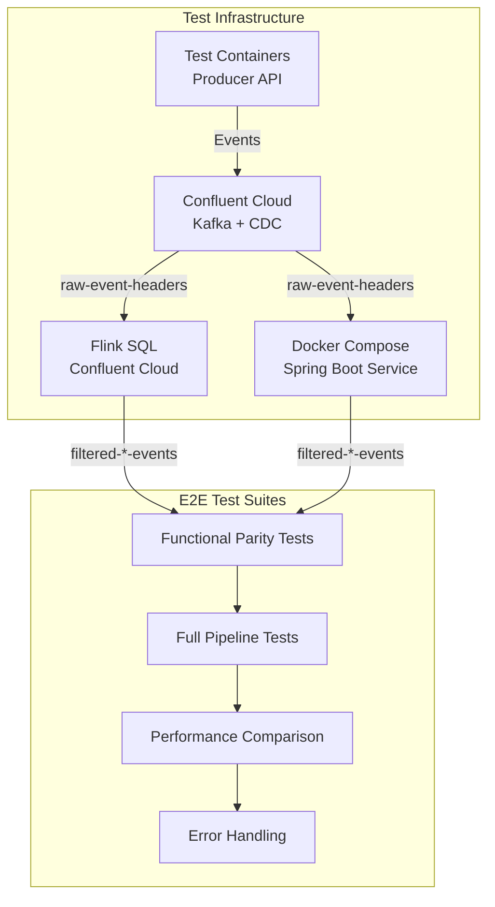

# Spring Boot Kafka Streams Event Router

Spring Boot application that replicates the Flink SQL filtering and routing functionality using Kafka Streams. This service reads from the `raw-event-headers` topic and routes events to filtered topics based on event type.

## Functional Requirements

The service replicates the exact filtering logic from the Flink SQL jobs:

| Event Type Filter | Source Field | Output Topic |
|-------------------|--------------|--------------|
| `CarCreated` | `event_type` | `filtered-car-created-events` |
| `LoanCreated` | `event_type` | `filtered-loan-created-events` |
| `LoanPaymentSubmitted` | `event_type` | `filtered-loan-payment-submitted-events` |
| `CarServiceDone` | `event_name` | `filtered-service-events` |

**Filtering Logic:**
- CarCreated, LoanCreated, LoanPaymentSubmitted: Filter by `event_type` AND `__op = 'c'` (create operations only)
- CarServiceDone: Filter by `event_name = 'CarServiceDone'`

## Architecture

```
raw-event-headers (Kafka Topic)
    ↓
Spring Boot Kafka Streams Processor
    ↓
    ├── filtered-car-created-events
    ├── filtered-loan-created-events
    ├── filtered-loan-payment-submitted-events
    └── filtered-service-events
```

## Building

```bash
./gradlew build
```

## Running Locally

### Prerequisites

- Java 17+
- Confluent Cloud Kafka cluster (or local Kafka)
- Environment variables:
  - `KAFKA_BOOTSTRAP_SERVERS`: Kafka bootstrap servers
  - `KAFKA_API_KEY`: Confluent Cloud API key (if using Confluent Cloud)
  - `KAFKA_API_SECRET`: Confluent Cloud API secret (if using Confluent Cloud)

### Run with Gradle

```bash
./gradlew bootRun
```

### Run with Docker Compose

The service is included in the main `cdc-streaming/docker-compose.yml`:

```bash
cd cdc-streaming
docker-compose up stream-processor
```

## Configuration

Configuration is managed via `application.yml` and environment variables:

- `KAFKA_BOOTSTRAP_SERVERS`: Kafka bootstrap servers (required)
- `KAFKA_API_KEY`: Confluent Cloud API key (required for Confluent Cloud)
- `KAFKA_API_SECRET`: Confluent Cloud API secret (required for Confluent Cloud)
- `SPRING_KAFKA_STREAMS_SOURCE_TOPIC`: Source topic name (default: `raw-event-headers`)

## Health Checks

The service exposes Spring Boot Actuator endpoints:

- Health: `http://localhost:8080/actuator/health`
- Metrics: `http://localhost:8080/actuator/metrics`
- Kafka Streams Health: Included in `/actuator/health`

## Deployment

### Docker

```bash
docker build -t stream-processor-spring:1.0.0 .
docker run -e KAFKA_BOOTSTRAP_SERVERS=... -e KAFKA_API_KEY=... -e KAFKA_API_SECRET=... stream-processor-spring:1.0.0
```

### Kubernetes (EKS) with Helm

```bash
# Create secret first
kubectl create secret generic stream-processor-secrets \
  --from-literal=kafka-api-key=YOUR_KEY \
  --from-literal=kafka-api-secret=YOUR_SECRET

# Install Helm chart
helm install stream-processor ./helm/stream-processor \
  --set kafka.bootstrapServers=YOUR_BOOTSTRAP_SERVERS \
  --set kafka.sourceTopic=raw-event-headers
```

## Testing

### Unit Tests

Run unit tests:

```bash
./gradlew test
```

The tests use `TopologyTestDriver` to verify filtering logic without requiring a real Kafka cluster.

### E2E Testing

Comprehensive end-to-end tests are available in the [`e2e-tests`](../e2e-tests/) directory. These tests verify functional parity between this Spring Boot service and the Flink SQL implementation.

#### Test Architecture



#### Test Categories

##### 1. Functional Parity Tests

**Purpose**: Verify both services produce identical output for the same input.

**Test Cases**:
- **testCarCreatedEventRouting**: Verify CarCreated events route to `filtered-car-created-events`
- **testLoanCreatedEventRouting**: Verify LoanCreated events route to `filtered-loan-created-events`
- **testLoanPaymentEventRouting**: Verify LoanPaymentSubmitted events route correctly
- **testServiceEventRouting**: Verify CarServiceDone events route to `filtered-service-events`
- **testEventFilteringByOp**: Verify only `__op='c'` events are processed (for CarCreated, LoanCreated, LoanPaymentSubmitted)
- **testEventStructurePreservation**: Verify all fields (id, event_name, event_type, header_data, __op, __table) are preserved
- **testMultipleEventTypesBatch**: Send batch of mixed event types and verify correct routing
- **testNullAndInvalidEvents**: Verify null/invalid events are filtered out

**Implementation**:
- Publish test events to `raw-event-headers` topic in Confluent Cloud
- Wait for both Flink and Spring Boot to process
- Consume from filtered topics and compare outputs
- Assert: Same event count, same event structure, same field values

##### 2. Full Pipeline Tests

**Purpose**: Test complete flow from Producer API through CDC to filtered topics.

**Test Cases**:
- **testEndToEndCarCreatedFlow**: Producer API → Database → CDC → Kafka → Stream Processor → Filtered Topic
- **testEndToEndLoanCreatedFlow**: Complete loan creation flow
- **testEndToEndLoanPaymentFlow**: Complete loan payment flow
- **testEndToEndServiceFlow**: Complete service event flow
- **testBulkEventProcessing**: Process 100+ events and verify all are routed correctly
- **testEventOrdering**: Verify events maintain order through the pipeline
- **testEventIdempotency**: Verify duplicate events are handled correctly

**Implementation**:
- Start Producer API (test container or local)
- Insert events via Producer API REST endpoint
- Wait for CDC to capture and publish to Kafka
- Verify events appear in `raw-event-headers` topic
- Wait for stream processors to filter and route
- Verify events in filtered topics match expected count and structure

##### 3. Performance Comparison Tests

**Purpose**: Compare performance characteristics of both services.

**Test Cases**:
- **testThroughputComparison**: Measure events/second for both services
- **testLatencyComparison**: Measure end-to-end latency (event published to filtered topic)
- **testResourceUsageComparison**: Compare CPU/memory usage (if metrics available)
- **testConcurrentEventProcessing**: Test with concurrent event streams
- **testBackpressureHandling**: Test behavior under high load

**Metrics to Collect**:
- Events processed per second
- P50, P95, P99 latency
- Error rate
- Consumer lag

##### 4. Error Handling Tests

**Purpose**: Verify resilience and error handling.

**Test Cases**:
- **testServiceRestartRecovery**: Restart Spring Boot service and verify it resumes processing
- **testFlinkJobRestartRecovery**: Restart Flink job and verify recovery
- **testKafkaConnectionLoss**: Simulate Kafka connection loss and verify reconnection
- **testInvalidEventHandling**: Send malformed events and verify they don't break processing
- **testTopicNotFoundHandling**: Test behavior when topics don't exist
- **testConsumerGroupOffsetManagement**: Verify offset management after restarts

## Performance Characteristics

### Throughput

- **Target**: >= 10,000 events/second per processor instance
- **Scaling**: Linear scaling with number of instances and partitions
- **Bottlenecks**: Network I/O, Kafka broker capacity, processor resources

### Latency

- **P50 Target**: < 50ms (publish to filtered topic)
- **P95 Target**: < 200ms
- **P99 Target**: < 500ms
- **Factors**: Network latency to Kafka, processing time, Kafka broker latency

### Resource Usage

- **CPU**: Typically 20-40% under normal load (varies by instance size)
- **Memory**: ~512MB-1GB per instance (depends on state store size)
- **Network**: Depends on event size and throughput

### Performance Validation

Performance is validated through comprehensive test suite:
- `PerformanceComparisonTest`: Throughput and latency comparison
- `LatencyBenchmarkTest`: Latency percentile measurements
- `LoadTest`: Sustained load, ramp-up, spike load testing

## Monitoring

### Metrics

Metrics are exposed via Spring Boot Actuator:

- **Prometheus Endpoint**: `/actuator/prometheus`
- **Metrics Endpoint**: `/actuator/metrics`
- **Health Endpoint**: `/actuator/health`

### Key Metrics Exposed

**Kafka Streams Metrics**:
- `kafka_streams_*`: Stream processing metrics
- `kafka_consumer_*`: Consumer metrics (throughput, lag)
- `kafka_producer_*`: Producer metrics

**Custom Business Metrics** (if implemented):
- `events_processed_total`: Total events processed
- `events_routed_total{event_type="CarCreated"}`: Events routed by type
- `processing_latency_seconds`: Processing latency histogram

**JVM Metrics**:
- `jvm_memory_*`: Memory usage
- `jvm_gc_*`: Garbage collection metrics
- `jvm_threads_*`: Thread metrics

### Health Checks

- **Liveness Probe**: `/actuator/health/liveness`
- **Readiness Probe**: `/actuator/health/readiness`
- **Kafka Streams Health**: Included in `/actuator/health`

### Logging

- **Format**: Structured JSON logging (configurable)
- **Level**: INFO by default, DEBUG for troubleshooting
- **Correlation IDs**: Event IDs traceable across logs
- **Log Aggregation**: CloudWatch, ELK, or similar

### Observability Validation

Observability is validated through test suite:
- `MetricsValidationTest`: Prometheus metrics exposure
- `HealthCheckTest`: Health endpoint validation
- `ObservabilityTest`: Logging and tracing validation

## Comparison with Flink

This Spring Boot implementation provides:

- **Same functionality**: Identical filtering and routing logic
- **Lower cost**: Runs on EKS without Confluent Cloud Flink compute costs
- **Full control**: Complete code ownership and customization
- **Java ecosystem**: Consistent with other Spring Boot services

See [spring-boot-alternative-architecture.md](../spring-boot-alternative-architecture.md) for detailed comparison.
