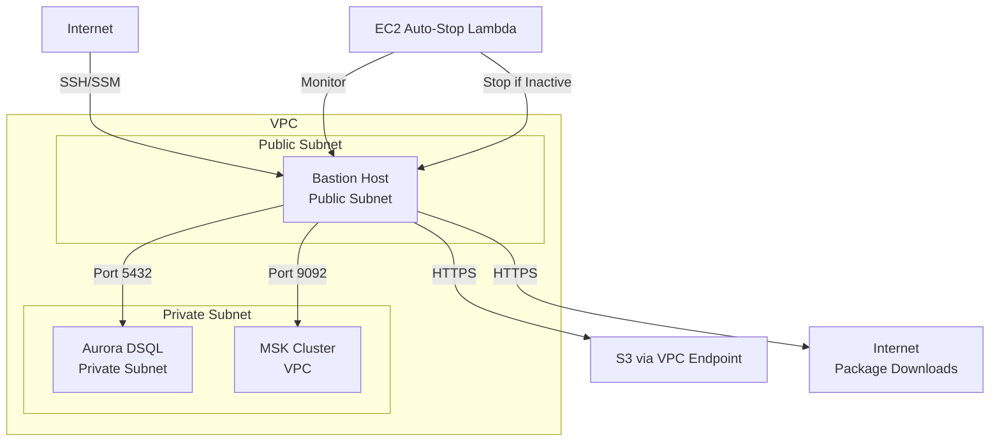

# Bastion Host Setup and Usage Guide

## Overview

The bastion host is an EC2 instance deployed in a public subnet that provides secure access to private resources within the VPC, primarily the Aurora DSQL database. It's also used for MSK operations, Debezium connector testing, and database validation.

## Table of Contents

1. [Architecture & Purpose](#architecture--purpose)
2. [Infrastructure Components](#infrastructure-components)
3. [Configuration Variables](#configuration-variables)
4. [IAM Permissions](#iam-permissions)
5. [Security Group Rules](#security-group-rules)
6. [Instance Configuration](#instance-configuration)
7. [Setup Instructions](#setup-instructions)
8. [Connection Methods](#connection-methods)
9. [Use Cases & Scripts](#use-cases--scripts)
10. [Cost Optimization](#cost-optimization)
11. [Troubleshooting](#troubleshooting)
12. [Quick Reference](#quick-reference)
13. [Related Documentation](#related-documentation)

## Architecture & Purpose

### Network Topology



### Primary Use Cases

1. **DSQL Database Access** (Primary)
   - Secure access to Aurora DSQL cluster in private subnet
   - IAM-based authentication
   - Interactive and non-interactive query execution

2. **MSK Topic Creation and Management**
   - Create and manage Kafka topics on MSK clusters
   - Requires additional IAM permissions for MSK operations

3. **Debezium Connector Testing**
   - Deploy and test Debezium connectors
   - Run connector validation and integration tests

4. **Database Validation and Querying**
   - Validate data integrity after load tests
   - Run ad-hoc queries for debugging

5. **Alternative to Dedicated Test Runner EC2**
   - Can be used instead of a separate test runner instance
   - More cost-effective for occasional testing

## Infrastructure Components

### Terraform Module

- **Module Location**: `terraform/modules/bastion-host/`
- **Main Configuration**: `terraform/main.tf` (lines 679-697)
- **Module Files**:
  - `main.tf` - Main infrastructure resources
  - `variables.tf` - Input variables
  - `outputs.tf` - Output values

### Dependencies

The bastion host requires the following infrastructure components:

1. **VPC with Public Subnet**
   - Bastion host must be in a public subnet with internet gateway access
   - Configured in: `terraform/modules/vpc/`

2. **S3 VPC Endpoint** (Gateway type)
   - Enables S3 access from VPC without internet gateway
   - Free, no data transfer charges
   - Configured in: `terraform/main.tf` (lines 639-652)

3. **EC2 Auto-Stop Lambda**
   - Automatically stops bastion after inactivity
   - Cost optimization feature
   - Configured in: `terraform/main.tf` (lines 699-715)

4. **DSQL IAM Grant Lambda**
   - Grants bastion IAM role access to DSQL IAM user
   - One-time setup automation
   - Configured in: `terraform/modules/dsql-iam-grant/`

## Configuration Variables

All configuration is done via Terraform variables in `terraform/variables.tf`:

### Required Variables

- `enable_bastion_host` (default: `false`)
  - Enable/disable bastion host creation
  - Must be `true` to create bastion host

- `enable_aurora_dsql_cluster` (default: `false`)
  - Bastion host is only created when DSQL cluster is enabled
  - Required for DSQL access use case

### Optional Variables

- `bastion_instance_type` (default: `"t4g.nano"`)
  - EC2 instance type for bastion host
  - Recommended: `t4g.nano` (ARM-based Graviton, cost-effective)
  - Options: `t4g.nano`, `t4g.small`, `t4g.medium`, etc.

- `bastion_ssh_public_key` (default: `""`)
  - SSH public key for bastion host access
  - Optional - can use SSM Session Manager instead
  - Format: `"ssh-rsa AAAAB3NzaC1yc2EAAAADAQABAAABAQ... user@host"`

- `bastion_ssh_allowed_cidr_blocks` (default: `["0.0.0.0/0"]`)
  - CIDR blocks allowed to SSH to bastion host
  - **Security Note**: Restrict to specific IPs in production
  - Example: `["1.2.3.4/32", "5.6.7.8/32"]`

- `bastion_allocate_elastic_ip` (default: `false`)
  - Whether to allocate an Elastic IP for consistent IP address
  - Useful if you need a static IP for firewall rules
  - Cost: ~$0.005/hour if not attached to running instance

### Example Configuration

```hcl
# terraform.tfvars
enable_bastion_host = true
enable_aurora_dsql_cluster = true
bastion_instance_type = "t4g.nano"
bastion_allocate_elastic_ip = false
bastion_ssh_public_key = ""  # Use SSM instead
bastion_ssh_allowed_cidr_blocks = ["0.0.0.0/0"]  # Restrict in production
```

## IAM Permissions

The bastion host uses an IAM role with the following permissions:

### IAM Role

- **Role Name**: `{project_name}-bastion-role`
- **Instance Profile**: `{project_name}-bastion-profile`
- **Assume Role Policy**: Allows EC2 service to assume the role

### Attached Policies

1. **AmazonSSMManagedInstanceCore** (AWS Managed Policy)
   - Enables SSM Session Manager access
   - Required for SSM-based connection

2. **DSQL Authentication Policy** (Inline)
   - Actions: `dsql:DbConnect`, `dsql:DbConnectAdmin`
   - Resource: DSQL cluster ARN
   - Required for database access

3. **KMS Decrypt Policy** (Inline, conditional)
   - Actions: `kms:Decrypt`, `kms:DescribeKey`
   - Resource: DSQL KMS key ARN
   - Required if DSQL cluster is encrypted

4. **S3 Read Policy** (Inline, conditional)
   - Actions: `s3:GetObject`, `s3:ListBucket`
   - Resource: S3 bucket ARN
   - Required for downloading deployment packages

### MSK Permissions (Additional Setup Required)

For MSK operations, additional IAM permissions are needed. See [MSK Topic Creation Guide](cdc-streaming/msk-topic-creation.md) for details.

Example policy for MSK:

```json
{
  "Version": "2012-10-17",
  "Statement": [
    {
      "Effect": "Allow",
      "Action": [
        "kafka-cluster:Connect",
        "kafka-cluster:DescribeCluster"
      ],
      "Resource": [
        "arn:aws:kafka:<region>:<account>:cluster/<cluster-name>/<cluster-uuid>/*"
      ]
    },
    {
      "Effect": "Allow",
      "Action": [
        "kafka-cluster:CreateTopic",
        "kafka-cluster:WriteData",
        "kafka-cluster:DescribeTopic"
      ],
      "Resource": [
        "arn:aws:kafka:<region>:<account>:topic/<cluster-name>/<cluster-uuid>/*"
      ]
    }
  ]
}
```

## Security Group Rules

### Ingress Rules

- **SSH (Port 22)**
  - From: `bastion_ssh_allowed_cidr_blocks` (default: `0.0.0.0/0`)
  - Protocol: TCP
  - **Security Note**: Restrict to specific IPs in production

### Egress Rules

- **DSQL (Port 5432)**
  - To: VPC CIDR block
  - Protocol: TCP
  - Purpose: Database access

- **HTTPS (Port 443)**
  - To: `0.0.0.0/0`
  - Protocol: TCP
  - Purpose: Package downloads, AWS API calls

- **HTTP (Port 80)**
  - To: `0.0.0.0/0`
  - Protocol: TCP
  - Purpose: Package downloads

- **Kafka (Port 9092)**
  - To: `0.0.0.0/0`
  - Protocol: TCP
  - Purpose: Confluent Cloud Kafka access

## Instance Configuration

### AMI and Instance Type

- **AMI**: Amazon Linux 2023 (ARM64)
  - Automatically selected via data source
  - Filter: `al2023-ami-*-arm64`
  - Virtualization: HVM

- **Instance Type**: `t4g.nano` (default)
  - ARM-based Graviton processor
  - Specs: 2 vCPU, 0.5 GB RAM
  - Cost: ~$0.0034/hour (~$0.08/day if running 24/7)

### Storage

- **Root Volume**: 20GB gp3 encrypted
  - Increased from default 8GB to accommodate Kafka tools
  - Volume type: gp3 (SSD)
  - Encryption: Enabled

### Pre-installed Software

The bastion host user data script installs the following:

1. **PostgreSQL Client** (`postgresql16`)
   - Required for DSQL database access
   - Command: `psql` or `psql16`

2. **AWS CLI v2**
   - Latest version installed from AWS
   - Required for IAM authentication and AWS API calls

3. **Python 3**
   - Python 3 with pip
   - Packages: `asyncpg`, `boto3`, `botocore`
   - Used for validation scripts

4. **Additional Tools**
   - Git
   - Unzip
   - Standard system utilities

### User Data Script

The user data script (`terraform/modules/bastion-host/main.tf` lines 228-263) performs:

1. System update (`dnf update -y`)
2. Package installation (PostgreSQL, Git, Python, etc.)
3. AWS CLI v2 installation
4. Python package installation
5. Validation script directory creation

## Setup Instructions

### Prerequisites

1. **Terraform Configured**
   - Terraform installed (>= 1.0)
   - AWS provider configured

2. **AWS Credentials**
   - AWS CLI configured with appropriate permissions
   - IAM permissions for EC2, VPC, IAM, DSQL, S3

3. **VPC and DSQL Cluster**
   - VPC with public subnet created
   - DSQL cluster created (if using for DSQL access)

### Terraform Setup

1. **Enable Bastion Host in `terraform.tfvars`**:

```hcl
enable_bastion_host = true
enable_aurora_dsql_cluster = true
bastion_instance_type = "t4g.nano"
bastion_allocate_elastic_ip = false  # Optional
bastion_ssh_public_key = ""  # Optional, can use SSM instead
bastion_ssh_allowed_cidr_blocks = ["0.0.0.0/0"]  # Restrict as needed
```

2. **Apply Terraform**:

```bash
cd terraform
terraform init
terraform plan
terraform apply
```

3. **Get Connection Information**:

```bash
# SSM connection command (recommended)
terraform output -raw bastion_host_ssm_command

# SSH connection command (if SSH key provided)
terraform output -raw bastion_host_ssh_command

# Instance details
terraform output bastion_host_instance_id
terraform output bastion_host_public_ip
terraform output bastion_host_elastic_ip  # If allocated
```

### One-Time IAM Setup

The bastion host IAM role must be granted access to the DSQL IAM database user. This is a one-time setup step.

#### Automated Method (Recommended)

Use the provided script:

```bash
./scripts/grant-bastion-dsql-access.sh
```

This script:

1. Gets bastion instance ID and DSQL host from Terraform
2. Connects to bastion via SSM
3. Grants IAM role access using admin credentials
4. Verifies the mapping

#### Manual Method

If you need to do it manually:

1. Connect to DSQL as admin (from a machine with admin access)
2. Run the grant command:

```sql
AWS IAM GRANT <iam_database_user> TO 'arn:aws:iam::<account-id>:role/<project-name>-bastion-role';
```

3. Verify the mapping:

```sql
SELECT pg_role_name, arn FROM sys.iam_pg_role_mappings 
WHERE pg_role_name = '<iam_database_user>';
```

#### Lambda Automation

After the initial manual grant, Terraform can automate subsequent grants via the `dsql-iam-grant` Lambda function. The Lambda's IAM role must first be mapped to the `postgres` user in DSQL (one-time manual step).

## Connection Methods

### SSM Session Manager (Recommended)

**Advantages**:

- No SSH keys required
- Secure, auditable (all sessions logged)
- Works through firewalls
- No open SSH port needed

**Connection Command**:

```bash
# Get command from Terraform output
terraform output -raw bastion_host_ssm_command | bash

# Or manually
aws ssm start-session --target <instance-id> --region <region>
```

**Example**:

```bash
$ terraform output -raw bastion_host_ssm_command
aws ssm start-session --target i-0123456789abcdef0 --region us-east-1

$ aws ssm start-session --target i-0123456789abcdef0 --region us-east-1

Starting session with SessionId: user-0123456789abcdef0
sh-4.2$ 
```

### SSH (Optional)

**Requirements**:

- SSH public key configured in `bastion_ssh_public_key`
- Security group allows SSH from your IP
- Private key file available locally

**Connection Command**:

```bash
# Get command from Terraform output
terraform output -raw bastion_host_ssh_command

# Or manually
ssh -i ~/.ssh/key.pem ec2-user@<public-ip>
```

**Example**:

```bash
$ terraform output -raw bastion_host_ssh_command
ssh -i ~/.ssh/producer-api-bastion-key.pem ec2-user@54.123.45.67

$ ssh -i ~/.ssh/producer-api-bastion-key.pem ec2-user@54.123.45.67
Last login: Mon Jan 15 10:30:00 2024 from 1.2.3.4
[ec2-user@ip-10-0-1-5 ~]$
```

## Use Cases & Scripts

### Database Access

#### Non-Interactive Query Script

**Script**: `scripts/query-dsql.sh`

Execute queries without connecting interactively:

```bash
# Run default table count query
./scripts/query-dsql.sh

# Run custom query
./scripts/query-dsql.sh "SELECT COUNT(*) FROM business_events WHERE created_date > NOW() - INTERVAL '1 hour';"

# Query recent events
./scripts/query-dsql.sh "SELECT id, event_name, event_type, created_date FROM business_events ORDER BY created_date DESC LIMIT 10;"
```

**How it works**:

1. Gets bastion instance ID and DSQL host from Terraform
2. Sends query command via SSM
3. Executes query on bastion using `psql`
4. Returns results

#### Interactive Connection

1. Connect to bastion via SSM:

```bash
terraform output -raw bastion_host_ssm_command | bash
```

2. Once connected, set environment variables:

```bash
export DSQL_HOST=$(terraform output -raw aurora_dsql_host)
export AWS_REGION=us-east-1
export PGPASSWORD=$(aws dsql generate-db-connect-admin-auth-token --region $AWS_REGION --hostname $DSQL_HOST)
```

3. Connect to DSQL:

```bash
psql -h $DSQL_HOST -U admin -d postgres -p 5432
```

4. Run queries:

```sql
-- Count events by table
SELECT 'business_events' as table_name, COUNT(*) as count FROM business_events
UNION ALL SELECT 'event_headers', COUNT(*) FROM event_headers
UNION ALL SELECT 'car_entities', COUNT(*) FROM car_entities
UNION ALL SELECT 'loan_entities', COUNT(*) FROM loan_entities
UNION ALL SELECT 'loan_payment_entities', COUNT(*) FROM loan_payment_entities
ORDER BY table_name;

-- View recent events
SELECT id, event_name, event_type, created_date 
FROM business_events 
ORDER BY created_date DESC 
LIMIT 10;
```

#### Database Validation

**Script**: `scripts/validate-dsql-via-bastion.sh`

Validate data integrity after load tests:

```bash
./scripts/validate-dsql-via-bastion.sh /path/to/events.json
```

This script:

1. Uploads events file to S3
2. Downloads file on bastion
3. Runs Python validation script
4. Compares sent events with database records
5. Returns validation results

### MSK Operations

#### MSK Topic Creation

**Guide**: `cdc-streaming/msk-topic-creation.md`

The bastion host can be used to create and manage Kafka topics on MSK clusters.

**Prerequisites**:

- Additional IAM permissions for MSK (see [IAM Permissions](#iam-permissions))
- Kafka binaries installed on bastion
- MSK cluster accessible from VPC

**Steps**:

1. Connect to bastion via SSM
2. Install Kafka tools (if not already installed)
3. Download IAM auth library
4. Create client configuration
5. Get bootstrap brokers
6. Create topics using `kafka-topics.sh`

See `cdc-streaming/msk-topic-creation.md` for detailed instructions.

#### MSK Consumer Deployment

**Script**: `cdc-streaming/scripts/deploy-msk-consumers-to-bastion.sh`

The bastion host can run MSK consumers as systemd services to consume events from MSK topics.

**Prerequisites**:

- MSK cluster deployed and accessible from VPC
- Bastion host has MSK IAM permissions (see [IAM Permissions](#iam-permissions))
- S3 bucket available for file transfer

**Deployment**:

```bash
# Deploy all 4 MSK consumers to bastion
./cdc-streaming/scripts/deploy-msk-consumers-to-bastion.sh
```

This script:

1. Packages consumer code (shared module + 4 consumers)
2. Uploads to S3
3. Downloads and extracts on bastion
4. Installs Python dependencies
5. Creates systemd service files for each consumer
6. Enables services (but doesn't start them)

**Consumers Deployed**:

- `loan-consumer-msk` - Consumes from `filtered-loan-created-events-msk`
- `loan-payment-consumer-msk` - Consumes from `filtered-loan-payment-submitted-events-msk`
- `car-consumer-msk` - Consumes from `filtered-car-created-events-msk`
- `service-consumer-msk` - Consumes from `filtered-service-events-msk`

**Managing Consumers**:

```bash
# Connect to bastion
terraform output -raw bastion_host_ssm_command | bash

# Start all consumers
sudo systemctl start loan-consumer-msk loan-payment-consumer-msk car-consumer-msk service-consumer-msk

# Check status
sudo systemctl status loan-consumer-msk

# View logs
sudo journalctl -u loan-consumer-msk -f

# Stop a consumer
sudo systemctl stop loan-consumer-msk

# Restart a consumer
sudo systemctl restart loan-consumer-msk
```

**Consumer Configuration**:

Consumers are configured via systemd environment variables:
- `KAFKA_BOOTSTRAP_SERVERS` - MSK bootstrap servers (from Terraform)
- `KAFKA_TOPIC` - Topic name (auto-configured per consumer)
- `AWS_REGION` - AWS region (from Terraform)
- `CONSUMER_GROUP_ID` - Consumer group ID
- `KAFKA_CLIENT_ID` - Client ID for monitoring

**Consumer Code Structure**:

```
/opt/msk-consumers/
├── shared/
│   ├── msk_consumer_base.py  # Shared base class
│   └── requirements.txt       # Shared dependencies
├── loan-consumer/
│   └── consumer.py
├── loan-payment-consumer/
│   └── consumer.py
├── car-consumer/
│   └── consumer.py
└── service-consumer/
    └── consumer.py
```

**Troubleshooting**:

1. **Consumer not starting**:
   ```bash
   sudo journalctl -u loan-consumer-msk -n 50
   ```

2. **Check Python dependencies**:
   ```bash
   python3 -c "import confluent_kafka; import aws_msk_iam_sasl_signer_python"
   ```

3. **Verify MSK connectivity**:
   ```bash
   # Test DNS resolution
   nslookup boot-yjc0v78h.c1.kafka-serverless.us-east-1.amazonaws.com
   
   # Test IAM permissions
   aws sts get-caller-identity
   ```

4. **Check consumer logs for errors**:
   ```bash
   sudo journalctl -u loan-consumer-msk --since "10 minutes ago"
   ```

### Debezium Connector Testing

Multiple scripts in `debezium-connector-dsql/scripts/` use the bastion host:

- **`setup-bastion-for-testing.sh`** - Initial setup for connector testing
- **`deploy-kafka-connect-bastion.sh`** - Deploy Kafka Connect on bastion
- **`test-dsql-from-bastion.sh`** - Run connector tests
- **`create-connector-bastion.sh`** - Create Debezium connector
- **`verify-bastion-setup.sh`** - Verify bastion configuration
- **`run-tests-on-bastion.sh`** - Run full test suite
- **`upload-to-bastion.sh`** - Upload connector JAR to bastion
- **`setup-bastion-complete.sh`** - Complete setup script

**Usage Example**:

```bash
cd debezium-connector-dsql
./scripts/setup-bastion-for-testing.sh
./scripts/deploy-kafka-connect-bastion.sh
./scripts/create-connector-bastion.sh
```

### Load Testing

**Script**: `load-test/dsql-load-test-java/deploy-to-bastion.sh`

The bastion host can be used as an alternative to a dedicated test runner EC2 instance for load testing.

**Usage**:

```bash
cd load-test/dsql-load-test-java
./deploy-to-bastion.sh
```

This script:

1. Builds the load test application
2. Uploads deployment package to S3
3. Downloads and runs tests on bastion
4. Retrieves test results

## Cost Optimization

### EC2 Auto-Stop Lambda

The bastion host is automatically stopped after 30 minutes of inactivity to reduce costs.

**Configuration**:

- **Module**: `terraform/modules/ec2-auto-stop/`
- **Inactivity Threshold**: 30 minutes (0.5 hours)
- **Monitoring**: SSM sessions, DSQL API calls, EC2 activity
- **Notification**: Email sent when instance is stopped

**How it works**:

1. Lambda function runs every 5 minutes
2. Checks for SSM sessions, DSQL API calls, and EC2 activity
3. If no activity for 30 minutes, stops the instance
4. Sends email notification (if configured)

**Manual Start**:

If the bastion is stopped, start it manually:

```bash
# Get instance ID
INSTANCE_ID=$(cd terraform && terraform output -raw bastion_host_instance_id)

# Start instance
aws ec2 start-instances --instance-ids $INSTANCE_ID

# Wait for running state
aws ec2 wait instance-running --instance-ids $INSTANCE_ID
```

**Adjusting Inactivity Threshold**:

Edit `terraform/main.tf` (line 709):

```hcl
module "ec2_auto_stop" {
  # ...
  inactivity_hours = 1.0  # Change from 0.5 (30 min) to 1.0 (1 hour)
  # ...
}
```

### Instance Sizing

- **Default**: `t4g.nano` (smallest, most cost-effective)
- **Cost**: ~$0.0034/hour (~$0.08/day if running 24/7)
- **Recommendation**: Keep default unless you need more resources

**Note**: The bastion host is not used for load tests. Use a dedicated test runner EC2 instance (`enable_dsql_test_runner_ec2 = true`) for load testing.

### Cost Breakdown

**Per Hour** (if running):

- Instance: $0.0034/hour (t4g.nano)
- Storage: $0.08/GB/month × 20GB ÷ 730 hours = ~$0.0022/hour
- **Total**: ~$0.0056/hour

**Per Day** (if running 24/7):

- **Total**: ~$0.13/day

**With Auto-Stop** (30 min inactivity):

- If used 2 hours/day: ~$0.01/day
- If used 8 hours/day: ~$0.05/day

## Troubleshooting

### Common Issues

#### Cannot Connect to DSQL

**Symptoms**:

- `psql` connection fails
- Authentication errors
- "Access denied" errors

**Solutions**:

1. **Check IAM Role Mapping**:

   ```bash
   # Connect to DSQL as admin and verify
   SELECT pg_role_name, arn FROM sys.iam_pg_role_mappings 
   WHERE pg_role_name = '<iam_database_user>';
   ```

2. **Re-run IAM Grant Script**:

   ```bash
   ./scripts/grant-bastion-dsql-access.sh
   ```

3. **Verify IAM Permissions**:
   - Check bastion IAM role has `dsql:DbConnect` and `dsql:DbConnectAdmin`
   - Verify DSQL cluster resource ID matches

4. **Check Token Generation**:

   ```bash
   # On bastion host
   aws dsql generate-db-connect-admin-auth-token \
     --region us-east-1 \
     --hostname <dsql-host>
   ```

#### SSM Connection Fails

**Symptoms**:

- `aws ssm start-session` fails
- "Target not found" error
- Connection timeout

**Solutions**:

1. **Verify SSM Agent Running**:

   ```bash
   # Check instance status
   aws ec2 describe-instances --instance-ids <instance-id>
   
   # If instance is stopped, start it
   aws ec2 start-instances --instance-ids <instance-id>
   ```

2. **Check IAM Permissions**:
   - Verify bastion role has `AmazonSSMManagedInstanceCore` policy
   - Check your AWS credentials have `ssm:StartSession` permission

3. **Verify Network Connectivity**:
   - Bastion must be in public subnet with internet gateway
   - Check security group allows outbound HTTPS (port 443)

4. **Check SSM Agent Logs** (if you can access via SSH):

   ```bash
   sudo systemctl status amazon-ssm-agent
   sudo tail -f /var/log/amazon/ssm/amazon-ssm-agent.log
   ```

#### Out of Disk Space

**Symptoms**:

- Commands fail with "No space left on device"
- Cannot install packages

**Solutions**:

1. **Check Disk Usage**:

   ```bash
   # On bastion host
   df -h
   du -sh /opt/* /tmp/* /var/log/*
   ```

2. **Clean Up**:

   ```bash
   # Remove old logs
   sudo journalctl --vacuum-time=7d
   
   # Remove temporary files
   sudo rm -rf /tmp/*
   
   # Remove old packages
   sudo dnf clean all
   ```

3. **Increase Root Volume** (if needed):
   - Edit `terraform/modules/bastion-host/main.tf`
   - Change `volume_size = 20` to larger value
   - Apply Terraform changes

#### Auto-Stop Too Aggressive

**Symptoms**:

- Bastion stops while you're using it
- Frequent stops during active work

**Solutions**:

1. **Increase Inactivity Threshold**:

   ```hcl
   # terraform/main.tf
   module "ec2_auto_stop" {
     # ...
     inactivity_hours = 1.0  # Change from 0.5 to 1.0 (1 hour)
   }
   ```

2. **Disable Auto-Stop** (temporary):

   ```bash
   # Get Lambda function name
   FUNCTION_NAME=$(cd terraform && terraform output -raw bastion_auto_stop_function_name)
   
   # Disable
   aws lambda put-function-event-invoke-config \
     --function-name $FUNCTION_NAME \
     --maximum-retry-attempts 0
   ```

3. **Manual Keep-Alive**:

   ```bash
   # Run a command every 25 minutes to keep instance alive
   while true; do
     aws ssm send-command \
       --instance-ids <instance-id> \
       --document-name "AWS-RunShellScript" \
       --parameters '{"commands":["echo keepalive"]}'
     sleep 1500  # 25 minutes
   done
   ```

#### Query Script Fails

**Symptoms**:

- `scripts/query-dsql.sh` returns errors
- No results returned

**Solutions**:

1. **Check Bastion Status**:

   ```bash
   INSTANCE_ID=$(cd terraform && terraform output -raw bastion_host_instance_id)
   aws ec2 describe-instances --instance-ids $INSTANCE_ID
   ```

2. **Verify DSQL Host**:

   ```bash
   cd terraform
   terraform output aurora_dsql_host
   ```

3. **Test Connection Manually**:

   ```bash
   # Connect to bastion and test
   terraform output -raw bastion_host_ssm_command | bash
   # Then run psql commands manually
   ```

4. **Check Script Logs**:
   - Script uses SSM `send-command` and `get-command-invocation`
   - Check CloudWatch Logs for SSM command execution

### Validation Commands

Use these commands to verify bastion host status:

```bash
# Check instance status
INSTANCE_ID=$(cd terraform && terraform output -raw bastion_host_instance_id)
aws ec2 describe-instances --instance-ids $INSTANCE_ID \
  --query 'Reservations[0].Instances[0].[State.Name,PublicIpAddress,PrivateIpAddress]' \
  --output table

# Check SSM agent (if accessible via SSH)
aws ssm describe-instance-information \
  --filters "Key=InstanceIds,Values=$INSTANCE_ID"

# Test DSQL connection
./scripts/query-dsql.sh "SELECT version();"

# Check IAM role
aws sts get-caller-identity  # Run on bastion via SSM
```

## Quick Reference

### Connection Commands

```bash
# SSM (Recommended)
terraform output -raw bastion_host_ssm_command | bash

# SSH (if configured)
terraform output -raw bastion_host_ssh_command

# Get instance details
terraform output bastion_host_instance_id
terraform output bastion_host_public_ip
```

### Common Operations

```bash
# Query database
./scripts/query-dsql.sh "SELECT COUNT(*) FROM business_events;"

# Grant IAM access
./scripts/grant-bastion-dsql-access.sh

# Validate data
./scripts/validate-dsql-via-bastion.sh /path/to/events.json

# Deploy MSK consumers
./cdc-streaming/scripts/deploy-msk-consumers-to-bastion.sh

# Start stopped instance
INSTANCE_ID=$(cd terraform && terraform output -raw bastion_host_instance_id)
aws ec2 start-instances --instance-ids $INSTANCE_ID
```

### DSQL Connection (Interactive)

```bash
# 1. Connect to bastion
terraform output -raw bastion_host_ssm_command | bash

# 2. Set environment variables (on bastion)
export DSQL_HOST=$(cd terraform && terraform output -raw aurora_dsql_host)
export AWS_REGION=us-east-1
export PGPASSWORD=$(aws dsql generate-db-connect-admin-auth-token --region $AWS_REGION --hostname $DSQL_HOST)

# 3. Connect to DSQL
psql -h $DSQL_HOST -U admin -d postgres -p 5432
```

### File Locations

- **Terraform Module**: `terraform/modules/bastion-host/`
- **Main Config**: `terraform/main.tf` (lines 679-697)
- **Variables**: `terraform/variables.tf` (lines 377-405)
- **Outputs**: `terraform/outputs.tf` (lines 194-229)
- **Query Script**: `scripts/query-dsql.sh`
- **IAM Grant Script**: `scripts/grant-bastion-dsql-access.sh`
- **Validation Script**: `scripts/validate-dsql-via-bastion.sh`
- **MSK Consumer Deployment**: `cdc-streaming/scripts/deploy-msk-consumers-to-bastion.sh`
- **MSK Consumer Code**: `cdc-streaming/consumers-msk/`

## Related Documentation

- **[CDC Streaming README](cdc-streaming/README.md)** - Database validation section with bastion host usage
- **[MSK Topic Creation Guide](cdc-streaming/msk-topic-creation.md)** - Using bastion for MSK operations
- **[Infrastructure and Costs](load-test/INFRASTRUCTURE_AND_COSTS.md)** - Cost breakdown and infrastructure details
- **[Bastion Setup Complete](terraform/debezium-connector-dsql/BASTION_SETUP_COMPLETE.md)** - Debezium connector setup guide
- **[AWS MSK Flink Setup Guide](cdc-streaming/AWS_MSK_FLINK_SETUP_GUIDE.md)** - Network access requirements

## Support

For issues or questions:

1. Check [Troubleshooting](#troubleshooting) section
2. Review related documentation
3. Check Terraform outputs for configuration details
4. Verify IAM permissions and role mappings
