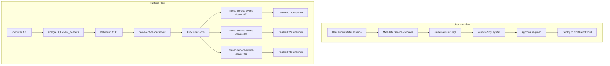
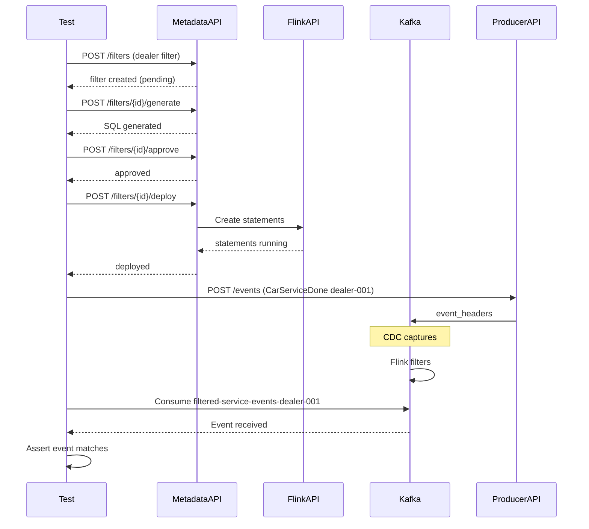

# Metadata-Driven Flink Filters Implementation

## Architecture Overview



## Business Filter: Service by Dealer

Route `CarServiceDone` events to dealer-specific topics based on `dealerId`. Example filter configuration:

```json
{
  "id": "service-by-dealer-001",
  "name": "Service Events for Dealer 001",
  "description": "Routes service events from Tesla Service Center SF to dedicated topic",
  "consumerId": "dealer-001-service-consumer",
  "outputTopic": "filtered-service-events-dealer-001",
  "conditions": [
    { "field": "event_type", "operator": "equals", "value": "CarServiceDone" },
    { "field": "header_data.dealerId", "operator": "equals", "value": "DEALER-001" }
  ],
  "enabled": true,
  "status": "pending_approval"
}
```

---

## Key Files to Modify/Create

### Metadata Service (Go)

| File | Purpose |

|------|---------|

| [`metadata-service/internal/api/handlers.go`](metadata-service/internal/api/handlers.go) | Add filter CRUD + deploy handlers |

| `metadata-service/internal/api/filter_models.go` (new) | Filter request/response models |

| `metadata-service/internal/filter/generator.go` (new) | Flink SQL generator |

| `metadata-service/internal/filter/deployer.go` (new) | Confluent Cloud API client |

| `metadata-service/internal/filter/storage.go` (new) | Filter persistence (git-based) |

### CDC Streaming

| File | Purpose |

|------|---------|

| [`cdc-streaming/schemas/filter-schema.json`](cdc-streaming/schemas/filter-schema.json) | Extend with status/approval fields |

| `cdc-streaming/flink-jobs/generated/` (new dir) | Generated Flink SQL files |

### Dealer Consumers (new)

| File | Purpose |

|------|---------|

| `cdc-streaming/consumers/dealer-001-consumer/consumer.py` | Consumes `filtered-service-events-dealer-001` (Tesla SF) |

| `cdc-streaming/consumers/dealer-001-consumer/Dockerfile` | Docker config for dealer-001 consumer |

| `cdc-streaming/consumers/dealer-001-consumer/requirements.txt` | Python dependencies |

| `cdc-streaming/consumers/dealer-002-consumer/consumer.py` | Consumes `filtered-service-events-dealer-002` (BMW LA) |

| `cdc-streaming/consumers/dealer-002-consumer/Dockerfile` | Docker config for dealer-002 consumer |

| `cdc-streaming/consumers/dealer-002-consumer/requirements.txt` | Python dependencies |

| `cdc-streaming/consumers/dealer-003-consumer/consumer.py` | Consumes `filtered-service-events-dealer-003` (Mercedes NYC) |

| `cdc-streaming/consumers/dealer-003-consumer/Dockerfile` | Docker config for dealer-003 consumer |

| `cdc-streaming/consumers/dealer-003-consumer/requirements.txt` | Python dependencies |

### Integration Tests

| File | Purpose |

|------|---------|

| `metadata-service/integration_filter_e2e_test.go` (new) | Full E2E filter tests |

---

## Dealer Consumer Details

Three dealer-specific consumers to process filtered service events:

| Dealer ID | Dealer Name | Topic | Consumer Group |
|-----------|-------------|-------|----------------|
| DEALER-001 | Tesla Service Center - San Francisco | `filtered-service-events-dealer-001` | `dealer-001-service-consumer-group` |
| DEALER-002 | BMW Service Center - Los Angeles | `filtered-service-events-dealer-002` | `dealer-002-service-consumer-group` |
| DEALER-003 | Mercedes Service Center - New York | `filtered-service-events-dealer-003` | `dealer-003-service-consumer-group` |

Each consumer will:
- Subscribe to their dealer-specific filtered topic
- Process service events for their location only
- Log service details (car VIN, service type, amount paid, mileage at service)
- Can be extended to integrate with dealer-specific systems (CRM, inventory, billing)

Consumer Python implementation pattern (based on existing `car-consumer`):

```python
# Example: dealer-001-consumer/consumer.py
KAFKA_TOPIC = 'filtered-service-events-dealer-001'
CONSUMER_GROUP_ID = 'dealer-001-service-consumer-group'
DEALER_ID = 'DEALER-001'
DEALER_NAME = 'Tesla Service Center - San Francisco'

def process_event(event_value):
    """Process a dealer-specific service event"""
    header_data = json.loads(event_value.get('header_data', '{}'))
    dealer_id = header_data.get('dealerId')
    
    # Verify this event is for our dealer (defensive check)
    if dealer_id != DEALER_ID:
        logger.warning(f"Received event for wrong dealer: {dealer_id}")
        return
    
    # Extract and log service details
    logger.info(f"Service Event for {DEALER_NAME}")
    logger.info(f"  Car ID: {header_data.get('carId')}")
    logger.info(f"  Service Date: {header_data.get('serviceDate')}")
    logger.info(f"  Amount: ${header_data.get('amountPaid', 0):.2f}")
    logger.info(f"  Mileage: {header_data.get('mileageAtService')}")
```

---

## Implementation Details

### 1. Metadata Service API Extensions

New endpoints for filter management:

```
POST   /api/v1/filters                  - Create filter configuration
GET    /api/v1/filters                  - List all filters
GET    /api/v1/filters/{id}             - Get filter by ID
PUT    /api/v1/filters/{id}             - Update filter
DELETE /api/v1/filters/{id}             - Delete filter
POST   /api/v1/filters/{id}/generate    - Generate Flink SQL
POST   /api/v1/filters/{id}/validate    - Validate generated SQL  
POST   /api/v1/filters/{id}/approve     - Approve for deployment
POST   /api/v1/filters/{id}/deploy      - Deploy to Confluent Cloud
GET    /api/v1/filters/{id}/status      - Get deployment status
```

### 2. Flink SQL Generator

Transform filter JSON to SQL statements. For the dealer filter:

```sql
-- Sink Table
CREATE TABLE `filtered-service-events-dealer-001` (
    `key` BYTES,
    `id` STRING,
    `event_name` STRING,
    `event_type` STRING,
    `created_date` STRING,
    `saved_date` STRING,
    `header_data` STRING,
    `__op` STRING,
    `__table` STRING
) WITH (
    'connector' = 'confluent',
    'value.format' = 'json-registry'
);

-- INSERT Statement with JSON path extraction
INSERT INTO `filtered-service-events-dealer-001`
SELECT 
    CAST(`id` AS BYTES) AS `key`,
    `id`, `event_name`, `event_type`, `created_date`, 
    `saved_date`, `header_data`, `__op`, `__table`
FROM `raw-event-headers`
WHERE `event_type` = 'CarServiceDone' 
  AND `__op` = 'c'
  AND JSON_VALUE(`header_data`, '$.dealerId') = 'DEALER-001';
```

### 3. Confluent Cloud Deployment

Use Confluent Cloud REST API for Flink statement management:

- Authenticate via API key/secret
- Create statements with proper compute pool
- Monitor statement status
- Handle errors and rollbacks

### 4. Filter Storage

Store filters in git repository (same as schemas) at:

```
schemas/
├── v1/
│   └── filters/
│       ├── service-by-dealer-001.json
│       ├── service-by-dealer-002.json
│       └── service-by-dealer-003.json
```

### 5. Integration Test Flow



---

## Environment Variables Required

```bash
# Confluent Cloud Flink API
CONFLUENT_CLOUD_API_KEY=...
CONFLUENT_CLOUD_API_SECRET=...
CONFLUENT_ENVIRONMENT_ID=env-xxxxx
CONFLUENT_KAFKA_CLUSTER_ID=lkc-xxxxx
CONFLUENT_FLINK_COMPUTE_POOL_ID=lfcp-xxxxx
CONFLUENT_FLINK_API_ENDPOINT=https://flink.region.aws.confluent.cloud
```

---

## Test Data: Service Events

Create dealer-specific test events in `data/schemas/event/samples/`:

| Test File | Dealer ID | Dealer Name |
|-----------|-----------|-------------|
| `service-dealer-001-event.json` | DEALER-001 | Tesla Service Center - San Francisco |
| `service-dealer-002-event.json` | DEALER-002 | BMW Service Center - Los Angeles |
| `service-dealer-003-event.json` | DEALER-003 | Mercedes Service Center - New York |

Example event structure:

```json
{
  "eventHeader": {
    "uuid": "service-dealer-001-test",
    "eventName": "Car Service Done",
    "eventType": "CarServiceDone",
    "createdDate": "2025-01-15T10:00:00Z",
    "savedDate": "2025-01-15T10:00:01Z"
  },
  "entities": [{
    "entityHeader": {
      "entityId": "SERVICE-TEST-001",
      "entityType": "ServiceRecord",
      "createdAt": "2025-01-15T10:00:00Z",
      "updatedAt": "2025-01-15T10:00:00Z"
    },
    "id": "SERVICE-TEST-001",
    "carId": "CAR-2025-001",
    "serviceDate": "2025-01-15T10:00:00Z",
    "amountPaid": 450.00,
    "dealerId": "DEALER-001",
    "dealerName": "Tesla Service Center - San Francisco",
    "mileageAtService": 15000,
    "description": "Annual maintenance and tire rotation"
  }]
}
```
