# Metadata Service - Enterprise Documentation Report

## Table of Contents

### Part 1: Introduction & Overview
- [Executive Summary](#executive-summary)
- [1. Service Purpose and Core Capabilities](#1-service-purpose-and-core-capabilities)

### Part 2: Architecture & Design
- [3. Architecture Overview](#3-architecture-overview)
  - [3.1 High-Level Architecture](#31-high-level-architecture)
  - [3.2 Component Architecture](#32-component-architecture)
  - [3.3 Connectivity Diagram](#33-connectivity-diagram)
- [4. Data Flow Diagrams](#4-data-flow-diagrams)
  - [4.1 Event Validation Flow](#41-event-validation-flow)
  - [4.2 Git Sync Flow](#42-git-sync-flow)
  - [4.3 Filter Deployment Flow](#43-filter-deployment-flow)
  - [4.4 Filter Lifecycle Workflow](#44-filter-lifecycle-workflow)
  - [4.5 Integration Pattern Flow](#45-integration-pattern-flow)

### Part 3: Core Concepts
- [5. Schema Management](#5-schema-management)
  - [5.1 Schema Repository Structure](#51-schema-repository-structure)
  - [5.2 How Schemas Define Filters](#52-how-schemas-define-filters)
  - [5.3 Schema Versioning and Filters](#53-schema-versioning-and-filters)
  - [5.4 Filter Field Path Resolution](#54-filter-field-path-resolution)
- [6. Database Schema and Storage](#6-database-schema-and-storage)
- [7. Compatibility Rules](#7-compatibility-rules)
- [8. Filter Management](#8-filter-management)

### Part 4: API & Integration
- [9. API Reference](#9-api-reference)
- [10. Integration Guide](#10-integration-guide)

### Part 5: Configuration & Deployment
- [11. Configuration Reference](#11-configuration-reference)
- [12. Deployment Architecture](#12-deployment-architecture)

### Part 6: Development & Operations
- [13. Testing and Validation](#13-testing-and-validation)
- [14. Key Files Reference](#14-key-files-reference)
- [15. Operational Considerations](#15-operational-considerations)

### Part 7: Advanced Features
- [16. Spring Boot YAML Generation](#16-spring-boot-yaml-generation)
- [17. Jenkins CI/CD Integration](#17-jenkins-cicd-integration)

### Part 8: Appendices
- [18. Future Enhancements](#18-future-enhancements)
- [Appendix A: Glossary](#appendix-a-glossary)
- [Appendix B: Related Documentation](#appendix-b-related-documentation)

---

## Executive Summary {#executive-summary}

The Metadata Service is a centralized microservice providing schema validation, filter management, and Flink SQL deployment capabilities for the event-based processing platform. It is implemented using Spring Boot (Java).

---

## 1. Service Purpose and Core Capabilities

The Metadata Service provides six primary capabilities:

| Capability | Description |
|------------|-------------|
| **Schema Validation** | Validates events against JSON Schema Draft 2020-12 with $ref resolution |
| **Schema Management** | Git-based versioned schema storage with periodic sync |
| **Compatibility Checking** | Detects breaking vs non-breaking schema changes |
| **Filter Management** | CRUD operations for Flink SQL filter configurations with deployment to Confluent Cloud |
| **Spring Boot YAML Generation** | Automatically generates and updates `filters.yml` for Spring Boot stream processor |
| **CI/CD Integration** | Triggers Jenkins builds on filter lifecycle events for change management |

---

## 3. Architecture Overview

### 3.1 High-Level Architecture

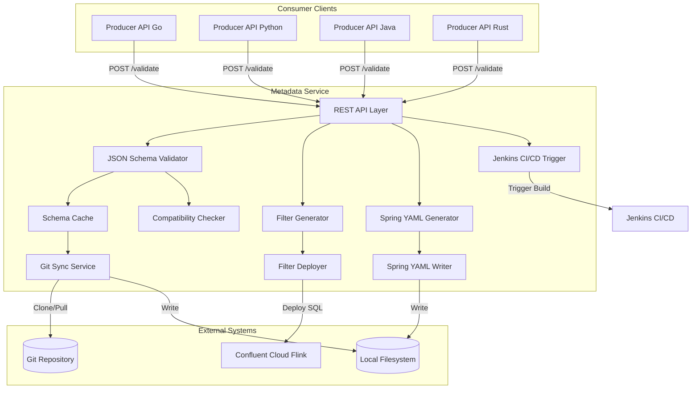

### 3.2 Component Architecture

#### 3.2.1 Java Implementation (`metadata-service-java/`)

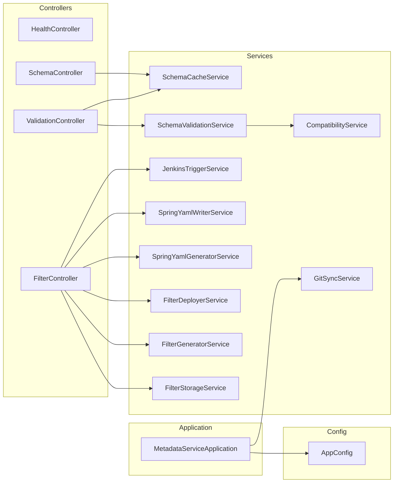

### 3.3 Connectivity Diagram

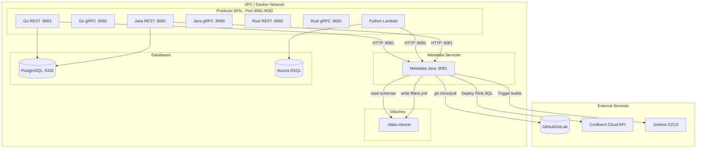

---

## 4. Data Flow Diagrams

### 4.1 Event Validation Flow


### 4.2 Git Sync Flow

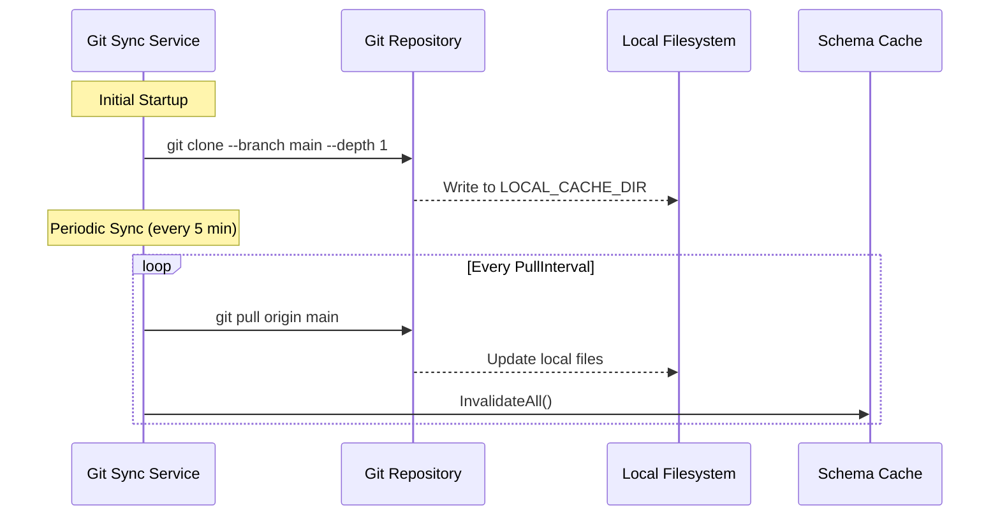

### 4.3 Filter Deployment Flow

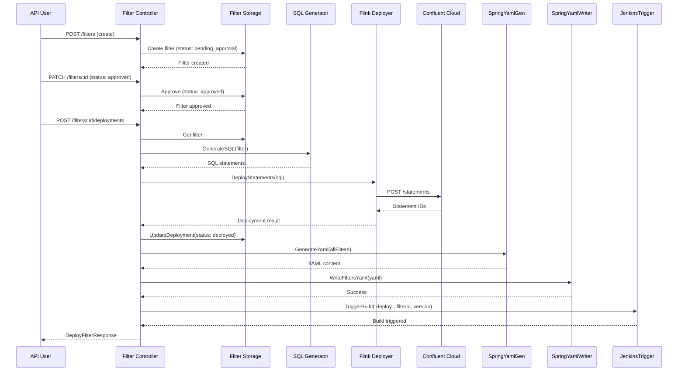

### 4.4 Filter Lifecycle Workflow

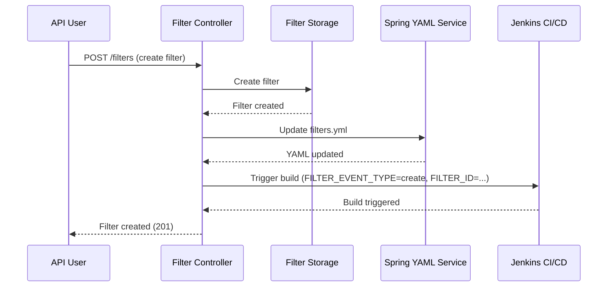

### 4.5 Integration Pattern Flow

Producer APIs integrate using a "fail-open" pattern to ensure availability even if the metadata service is unavailable:

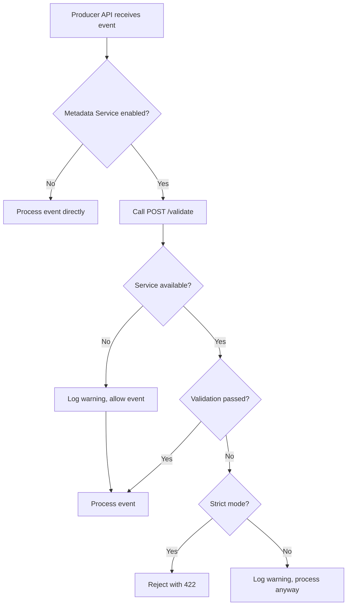

---

## 8. Filter Management

### 8.1 Filter Structure

A filter configuration defines conditions for filtering events in Flink SQL:

```json
{
  "id": "service-events-for-dealer-001",
  "name": "Service Events for Dealer 001",
  "description": "Filters service events for dealer ID 001",
  "consumerId": "dealer-001-consumer",
  "outputTopic": "service-events-dealer-001",
  "conditions": [
    {
      "field": "event_type",
      "operator": "equals",
      "value": "CarServiceDone",
      "valueType": "string"
    },
    {
      "field": "header_data.dealerId",
      "operator": "equals",
      "value": "001",
      "valueType": "string"
    }
  ],
  "conditionLogic": "AND",
  "enabled": true,
  "status": "approved",
  "version": 1
}
```

### 8.2 Supported Operators

| Operator | Description | Example |
|----------|-------------|---------|
| `equals` | Exact match | `event_type = 'CarCreated'` |
| `in` | Value in list | `event_type IN ('CarCreated', 'LoanCreated')` |
| `notIn` | Value not in list | `event_type NOT IN ('Deleted')` |
| `greaterThan` | Numeric comparison | `amount > 1000` |
| `lessThan` | Numeric comparison | `amount < 5000` |
| `greaterThanOrEqual` | Numeric comparison | `amount >= 1000` |
| `lessThanOrEqual` | Numeric comparison | `amount <= 5000` |
| `between` | Range check | `amount BETWEEN 1000 AND 5000` |
| `matches` | Regex pattern | `event_name REGEXP '.*Service.*'` |
| `isNull` | Null check | `dealerId IS NULL` |
| `isNotNull` | Not null check | `dealerId IS NOT NULL` |

### 8.3 Generated Flink SQL

The filter generator creates two SQL statements:

1. **Sink Table Definition:**
```sql
CREATE TABLE `service-events-dealer-001` (
    `key` BYTES,
    `id` STRING,
    `event_name` STRING,
    `event_type` STRING,
    `created_date` STRING,
    `saved_date` STRING,
    `header_data` STRING,
    `__op` STRING,
    `__table` STRING
) WITH (
    'connector' = 'confluent',
    'value.format' = 'json-registry'
);
```

2. **INSERT Statement:**
```sql
INSERT INTO `service-events-dealer-001`
SELECT 
    CAST(`id` AS BYTES) AS `key`,
    `id`,
    `event_name`,
    `event_type`,
    `created_date`,
    `saved_date`,
    `header_data`,
    `__op`,
    `__table`
FROM `raw-event-headers`
WHERE `__op` = 'c' 
  AND `event_type` = 'CarServiceDone'
  AND JSON_VALUE(`header_data`, '$.dealerId') = '001';
```

### 8.4 Filter Lifecycle

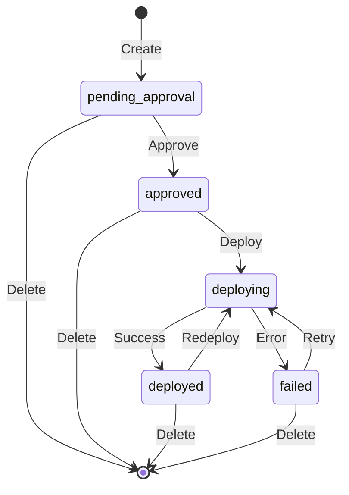

---

## 9. API Reference

### 9.1 Validation Endpoints

| Method | Endpoint | Description |
|--------|----------|-------------|
| POST | `/api/v1/validate` | Validate single event |
| POST | `/api/v1/validate/bulk` | Validate multiple events |

**Request Example (Single Validation):**
```json
{
  "event": {
    "eventHeader": {
      "uuid": "550e8400-e29b-41d4-a716-446655440000",
      "eventName": "Car Created",
      "eventType": "CarCreated",
      "createdDate": "2025-12-14T10:00:00Z",
      "savedDate": "2025-12-14T10:00:01Z"
    },
    "entities": [...]
  },
  "version": "v1"
}
```

**Response Example:**
```json
{
  "valid": true,
  "version": "v1",
  "errors": []
}
```

### 9.2 Schema Endpoints

| Method | Endpoint | Description |
|--------|----------|-------------|
| GET | `/api/v1/schemas/versions` | List available schema versions |
| GET | `/api/v1/schemas/:version` | Get schema by version |
| POST | `/api/v1/schemas/compatibility-checks` | Create compatibility check between schema versions |

**Query Parameters for `/api/v1/schemas/:version`:**
- `type` - Schema type: `event` (default) or entity name (e.g., `car`, `loan`)

**Example:**
```
GET /api/v1/schemas/v1?type=event
GET /api/v1/schemas/v1?type=car
```

**Compatibility Check Request Example:**
```json
{
  "oldVersion": "v1",
  "newVersion": "v2",
  "type": "event"
}
```

**Compatibility Check Response Example:**
```json
{
  "compatible": true,
  "reason": "No breaking changes detected",
  "breakingChanges": [],
  "nonBreakingChanges": ["Added optional field 'newField'"],
  "oldVersion": "v1",
  "newVersion": "v2"
}
```

### 9.3 Filter Endpoints

| Method | Endpoint | Description |
|--------|----------|-------------|
| POST | `/api/v1/filters` | Create filter |
| GET | `/api/v1/filters` | List all filters (supports query parameters) |
| GET | `/api/v1/filters/:id` | Get filter by ID (includes status) |
| PUT | `/api/v1/filters/:id` | Update filter |
| PATCH | `/api/v1/filters/:id` | Update filter status (e.g., approve) |
| DELETE | `/api/v1/filters/:id` | Delete filter |
| GET | `/api/v1/filters/:id/sql` | Get generated Flink SQL for filter |
| POST | `/api/v1/filters/:id/validations` | Create SQL validation |
| POST | `/api/v1/filters/:id/deployments` | Create deployment to Confluent Cloud |

**Query Parameters for `GET /api/v1/filters`:**
- `version` (optional, default: `v1`) - Schema version to retrieve filters for
- `enabled` (optional) - Filter by enabled status (true/false)
- `status` (optional) - Filter by status (e.g., "deployed", "approved", "pending_approval")

**Example:**
```
GET /api/v1/filters?version=v1&enabled=true&status=deployed
```

#### 9.3.1 Filter Status Updates

**PATCH `/api/v1/filters/:id`**

Updates filter status. Currently supports approving filters.

**Request Example:**
```json
{
  "status": "approved",
  "approvedBy": "reviewer@example.com",
  "notes": "Approved for production deployment"
}
```

**Response:** Returns the updated filter with status included.

#### 9.3.2 Get Filter SQL

**GET `/api/v1/filters/:id/sql`**

Retrieves the generated Flink SQL for a filter. This is a read-only operation.

**Response Example:**
```json
{
  "valid": true,
  "sql": "CREATE TABLE `filtered-service-events-dealer-001` (...); INSERT INTO ...",
  "statements": [
    "CREATE TABLE ...",
    "INSERT INTO ..."
  ],
  "validationErrors": []
}
```

#### 9.3.3 SQL Validation

**POST `/api/v1/filters/:id/validations`**

Creates a validation check for SQL syntax. Returns 201 Created on success.

**Request Example:**
```json
{
  "sql": "CREATE TABLE test (id STRING); INSERT INTO test SELECT * FROM source;"
}
```

**Response Example:**
```json
{
  "valid": true,
  "errors": []
}
```

#### 9.3.4 Filter Deployment

**POST `/api/v1/filters/:id/deployments`**

Creates a deployment to Confluent Cloud. Returns 201 Created on success.

**Request Example:**
```json
{
  "force": false
}
```

**Response Example:**
```json
{
  "filterId": "service-events-for-dealer-001",
  "status": "deployed",
  "flinkStatementIds": ["stmt-123", "stmt-456"],
  "message": "Filter deployed successfully"
}
```

**Response Example:**
```json
[
  {
    "id": "service-events-for-dealer-001",
    "name": "Service Events for Dealer 001",
    "outputTopic": "service-events-dealer-001",
    "enabled": true,
    "status": "deployed",
    "conditions": [
      {
        "field": "event_type",
        "operator": "equals",
        "value": "CarServiceDone",
        "valueType": "string"
      }
    ],
    "conditionLogic": "AND",
    "version": 2
  }
]
```

**Use Cases:**
- CDC Streaming Service dynamic filter loading
- Filter monitoring and reporting
- Integration with external systems

**Filter Lifecycle States:**
1. `pending_approval` - Initial state after creation
2. `approved` - Approved by reviewer, ready for deployment
3. `deploying` - Deployment in progress
4. `deployed` - Successfully deployed to Confluent Cloud
5. `failed` - Deployment failed

### 9.4 Health Endpoint

| Method | Endpoint | Description |
|--------|----------|-------------|
| GET | `/api/v1/health` | Health check |

**Response Example:**
```json
{
  "status": "healthy",
  "version": "v1"
}
```

---

## 5. Schema Management

### 5.1 Schema Repository Structure

The metadata service expects schemas organized in a versioned directory structure. Filters are embedded directly within the Event Schema (`event.json`) as a `filters` property:

```
data/
├── schemas/
│   ├── v1/
│   │   ├── event/
│   │   │   ├── event.json          (contains filters array)
│   │   │   └── event-header.json
│   │   └── entity/
│   │       ├── car.json
│   │       ├── loan.json
│   │       ├── loan-payment.json
│   │       ├── service-record.json
│   │       ├── service-details.json
│   │       ├── part-used.json
│   │       └── entity-header.json
│   └── v2/
│       └── ...
└── templates/
    └── event-templates.json
```

**Schema File Structure:**

Event schema (`event.json`) references entity schemas using `$ref` and includes filters:
```json
{
  "$schema": "https://json-schema.org/draft/2020-12/schema",
  "type": "object",
  "properties": {
    "eventHeader": {
      "$ref": "event-header.json"
    },
    "entities": {
      "type": "array",
      "items": {
        "oneOf": [
          {"$ref": "../entity/car.json"},
          {"$ref": "../entity/loan.json"}
        ]
      }
    },
    "filters": {
      "type": "array",
      "description": "Filter configurations for this schema version",
      "items": {
        "type": "object",
        "properties": {
          "id": { "type": "string" },
          "name": { "type": "string" },
          "outputTopic": { "type": "string" },
          "conditions": { "type": "array" },
          "enabled": { "type": "boolean" },
          ...
        }
      }
    }
  },
  "required": ["eventHeader", "entities"]
}
```

### 5.2 How Schemas Define Filters

The event schemas define the structure and available fields that filters can reference in their conditions. The relationship between schemas and filters is fundamental to how the metadata service generates Flink SQL queries.

#### 5.2.1 Schema-to-Database Mapping

The event schema defines the logical structure of events, which maps to the database table structure used in Flink SQL:

**Event Schema Structure:**
```json
{
  "eventHeader": {
    "uuid": "string",
    "eventName": "string",
    "eventType": "enum",
    "createdDate": "date-time",
    "savedDate": "date-time"
  },
  "entities": [...]
}
```

**Database Table Structure (`event_headers`):**
```sql
CREATE TABLE event_headers (
    id VARCHAR(255) PRIMARY KEY,              -- Maps to eventHeader.uuid
    event_name VARCHAR(255) NOT NULL,         -- Maps to eventHeader.eventName
    event_type VARCHAR(255),                   -- Maps to eventHeader.eventType
    created_date TIMESTAMP WITH TIME ZONE,    -- Maps to eventHeader.createdDate
    saved_date TIMESTAMP WITH TIME ZONE,      -- Maps to eventHeader.savedDate
    header_data JSONB NOT NULL               -- Contains full eventHeader JSON
);
```

#### 5.2.2 Available Filter Fields

Filters can reference fields in three ways:

1. **Direct Column References** - Fields that map directly to database columns:
   - `id` - Event ID (UUID)
   - `event_name` - Event name string
   - `event_type` - Event type enum value
   - `created_date` - Creation timestamp
   - `saved_date` - Save timestamp
   - `__op` - CDC operation type ('c' for create, 'u' for update, 'd' for delete)
   - `__table` - Source table name

2. **JSON Path References** - Fields within the `header_data` JSONB column:
   - `header_data.uuid` - Event UUID
   - `header_data.eventName` - Event name
   - `header_data.eventType` - Event type
   - `header_data.createdDate` - Creation date
   - `header_data.savedDate` - Save date
   - `header_data.dealerId` - Custom fields (if present in header_data)

3. **Nested JSON Paths** - Deep references into JSON structures:
   - `header_data.customField.nestedValue` - Multi-level JSON paths

#### 5.2.3 Filter Field Path Examples

**Example 1: Direct Column Reference**
```json
{
  "field": "event_type",
  "operator": "equals",
  "value": "CarServiceDone",
  "valueType": "string"
}
```
**Generated SQL:**
```sql
WHERE `event_type` = 'CarServiceDone'
```

**Example 2: JSON Path Reference**
```json
{
  "field": "header_data.dealerId",
  "operator": "equals",
  "value": "DEALER-001",
  "valueType": "string"
}
```
**Generated SQL:**
```sql
WHERE JSON_VALUE(`header_data`, '$.dealerId') = 'DEALER-001'
```

**Example 3: Complex Filter with Multiple Conditions**
```json
{
  "conditions": [
    {
      "field": "event_type",
      "operator": "equals",
      "value": "CarServiceDone",
      "valueType": "string"
    },
    {
      "field": "header_data.dealerId",
      "operator": "in",
      "values": ["DEALER-001", "DEALER-002"],
      "valueType": "string"
    },
    {
      "field": "created_date",
      "operator": "greaterThan",
      "value": "2025-01-01T00:00:00Z",
      "valueType": "timestamp"
    }
  ],
  "conditionLogic": "AND"
}
```
**Generated SQL:**
```sql
WHERE `__op` = 'c'
  AND `event_type` = 'CarServiceDone'
  AND JSON_VALUE(`header_data`, '$.dealerId') IN ('DEALER-001', 'DEALER-002')
  AND `created_date` > '2025-01-01T00:00:00Z'
```

#### 5.2.4 Schema-Driven Filter Validation

The metadata service uses schema information to:

1. **Validate Field Existence** - Ensures filter fields reference valid schema properties
2. **Type Checking** - Validates that filter values match schema field types
3. **Enum Validation** - For enum fields, ensures values are from the allowed set
4. **SQL Generation** - Converts schema field paths to appropriate SQL expressions

### 5.3 Schema Versioning and Filters

Filters are embedded directly in the Event Schema and versioned alongside schemas:

```
schemas/
├── v1/
│   ├── event/
│   │   └── event.json          (contains filters array)
│   └── entity/
│       └── ...
└── v2/
    ├── event/
    │   └── event.json          (contains filters array for v2)
    └── ...
```

**Key Points:**
- Filters are stored as a `filters` array property within `event.json`
- Each schema version has its own `event.json` with embedded filters
- Filters reference fields from their corresponding schema version
- When schemas evolve, filters must be updated to match new field structures
- Filter deployment validates that filters are compatible with the current schema version
- Schema and filters are updated atomically (single file write)

### 5.4 Filter Field Path Resolution

The filter generator resolves field paths as follows:

1. **Direct Column Match** - If field matches a database column name, use direct reference
2. **JSON Path Extraction** - If field contains dots (e.g., `header_data.dealerId`), extract using `JSON_VALUE()`
3. **Type Coercion** - Apply appropriate SQL casting based on `valueType` (string, number, boolean, timestamp)

**Field Path Resolution Flow:**
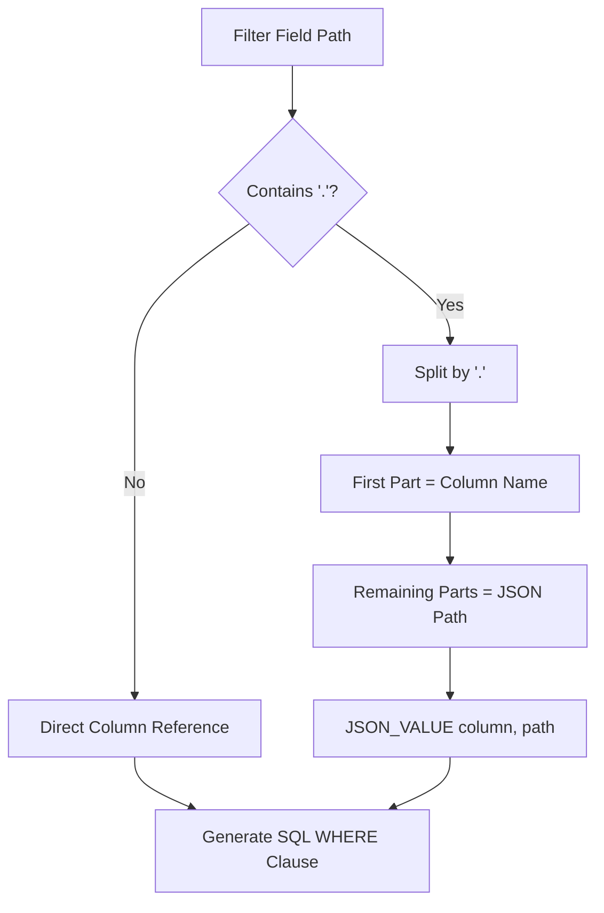

#### 5.4.1 Example: Complete Filter Using Schema Fields

**Filter Definition:**
```json
{
  "id": "service-events-for-dealer-001",
  "name": "Service Events for Dealer 001",
  "outputTopic": "filtered-service-events-dealer-001",
  "conditions": [
    {
      "field": "event_type",
      "operator": "equals",
      "value": "CarServiceDone",
      "valueType": "string"
    },
    {
      "field": "header_data.dealerId",
      "operator": "equals",
      "value": "DEALER-001",
      "valueType": "string"
    }
  ],
  "conditionLogic": "AND"
}
```

**Generated Flink SQL:**
```sql
-- Sink Table
CREATE TABLE `filtered-service-events-dealer-001` (
    `key` BYTES,
    `id` STRING,
    `event_name` STRING,
    `event_type` STRING,
    `created_date` STRING,
    `saved_date` STRING,
    `header_data` STRING,
    `__op` STRING,
    `__table` STRING
) WITH (
    'connector' = 'confluent',
    'value.format' = 'json-registry'
);

-- INSERT with Filter Conditions
INSERT INTO `filtered-service-events-dealer-001`
SELECT 
    CAST(`id` AS BYTES) AS `key`,
    `id`,
    `event_name`,
    `event_type`,
    `created_date`,
    `saved_date`,
    `header_data`,
    `__op`,
    `__table`
FROM `raw-event-headers`
WHERE `__op` = 'c'
  AND `event_type` = 'CarServiceDone'
  AND JSON_VALUE(`header_data`, '$.dealerId') = 'DEALER-001';
```

This demonstrates how the schema-defined fields (`event_type` from the event header schema and `dealerId` from the header_data JSON) are used to create precise filtering conditions in the generated Flink SQL.

---

## 6. Database Schema and Storage

### 6.1 PostgreSQL Filter Storage

The Metadata Service stores filter configurations in PostgreSQL for improved concurrency, querying capabilities, and production readiness. Filters are associated with schema versions (matching Git folder structure: v1, v2, etc.).

#### 6.1.1 Filters Table Schema

```sql
CREATE TABLE filters (
    id VARCHAR(255) PRIMARY KEY,
    schema_version VARCHAR(50) NOT NULL,
    name VARCHAR(255) NOT NULL,
    description TEXT,
    consumer_id VARCHAR(255),
    output_topic VARCHAR(255) NOT NULL,
    conditions JSONB NOT NULL,
    enabled BOOLEAN NOT NULL DEFAULT true,
    condition_logic VARCHAR(10) NOT NULL DEFAULT 'AND',
    status VARCHAR(50) NOT NULL DEFAULT 'pending_approval',
    version INTEGER NOT NULL DEFAULT 1,
    created_at TIMESTAMP WITH TIME ZONE NOT NULL DEFAULT CURRENT_TIMESTAMP,
    updated_at TIMESTAMP WITH TIME ZONE NOT NULL DEFAULT CURRENT_TIMESTAMP,
    approved_at TIMESTAMP WITH TIME ZONE,
    approved_by VARCHAR(255),
    deployed_at TIMESTAMP WITH TIME ZONE,
    deployment_error TEXT,
    flink_statement_ids JSONB
);
```

#### 6.1.2 Indexes

The following indexes are created for optimal query performance:

- `idx_filters_schema_version` - On `schema_version` column
- `idx_filters_status` - On `status` column
- `idx_filters_enabled` - On `enabled` column
- `idx_filters_schema_version_enabled` - Composite index on `(schema_version, enabled)`
- `idx_filters_schema_version_status` - Composite index on `(schema_version, status)`

#### 6.1.3 JSONB Columns

- **`conditions`**: Stores filter conditions array as JSONB for efficient querying and indexing
- **`flink_statement_ids`**: Stores array of Flink statement IDs deployed for this filter

#### 6.1.4 Database Migration

Database schema is managed using Flyway. Migration scripts are located in `src/main/resources/db/migration/`:

- `V1__create_filters_table.sql` - Creates the filters table and indexes

Migrations run automatically on application startup when `spring.flyway.enabled=true`.

### 6.2 Filter Storage Architecture

Filters are stored in PostgreSQL with the following characteristics:

- **Schema Version Association**: Each filter is associated with a schema version (v1, v2, etc.) matching the Git folder structure
- **Optimistic Locking**: Uses `version` field for optimistic locking to prevent concurrent update conflicts
- **JSONB Storage**: Filter conditions stored as JSONB for flexibility and efficient querying
- **Audit Trail**: Timestamps (`created_at`, `updated_at`, `approved_at`, `deployed_at`) track filter lifecycle
- **Status Management**: Filter status (`pending_approval`, `approved`, `deployed`, `failed`, etc.) tracks deployment state

### 6.3 Backward Compatibility

During migration from file-based to database storage, the service supports:

- **Dual-Write Mode**: Optionally write to both database and files (controlled by `filter.storage.dual-write`)
- **Fallback to Files**: If database is empty, fall back to reading from files (controlled by `filter.storage.fallback-to-files`)

These features ensure zero-downtime migration and rollback capability.

---

## 11. Configuration Reference

### 11.1 Environment Variables

| Variable | Default | Description |
|----------|---------|-------------|
| `GIT_REPOSITORY` | Required | Git repository URL (or `file://` for local) |
| `GIT_BRANCH` | `main` | Git branch to sync |
| `LOCAL_CACHE_DIR` | `/tmp/schema-cache` | Local directory for schema cache |
| `SERVER_PORT` | `8080` | HTTP server port |
| `DEFAULT_VERSION` | `latest` | Default schema version |
| `STRICT_MODE` | `true` | Reject invalid events with 422 |
| `DATABASE_URL` | `jdbc:postgresql://localhost:5432/metadata_service` | PostgreSQL connection URL |
| `DATABASE_USERNAME` | `postgres` | Database username |
| `DATABASE_PASSWORD` | `postgres` | Database password |
| `FLYWAY_ENABLED` | `true` | Enable Flyway migrations |
| `JPA_SHOW_SQL` | `false` | Log SQL queries |
| `filter.storage.dual-write` | `false` | Enable dual-write mode (database + files) |
| `filter.storage.fallback-to-files` | `true` | Fallback to files if database is empty |
| `CONFLUENT_CLOUD_API_KEY` | - | Confluent Cloud API key |
| `CONFLUENT_CLOUD_API_SECRET` | - | Confluent Cloud API secret |
| `CONFLUENT_FLINK_COMPUTE_POOL_ID` | - | Flink compute pool ID |
| `CONFLUENT_FLINK_API_ENDPOINT` | - | Flink API endpoint |
| `SPRING_BOOT_FILTERS_YAML_PATH` | `../cdc-streaming/stream-processor-spring/src/main/resources/filters.yml` | Path to Spring Boot filters.yml file |
| `SPRING_BOOT_YAML_BACKUP_ENABLED` | `true` | Enable automatic backups of filters.yml before updates |
| `SPRING_BOOT_YAML_BACKUP_DIR` | `/tmp/filters-yaml-backups` | Directory for filters.yml backups |
| `JENKINS_ENABLED` | `false` | Enable Jenkins CI/CD triggering |
| `JENKINS_BASE_URL` | `http://localhost:8080` | Jenkins server base URL |
| `JENKINS_JOB_NAME` | `filter-integration-tests` | Jenkins job name to trigger |
| `JENKINS_USERNAME` | - | Jenkins username for authentication |
| `JENKINS_API_TOKEN` | - | Jenkins API token for authentication |
| `JENKINS_BUILD_TOKEN` | - | Jenkins build token (alternative to username/token) |
| `JENKINS_TRIGGER_ON_CREATE` | `true` | Trigger build on filter create |
| `JENKINS_TRIGGER_ON_UPDATE` | `true` | Trigger build on filter update |
| `JENKINS_TRIGGER_ON_DELETE` | `true` | Trigger build on filter delete |
| `JENKINS_TRIGGER_ON_DEPLOY` | `true` | Trigger build on filter deploy |
| `JENKINS_TRIGGER_ON_APPROVE` | `true` | Trigger build on filter approve |
| `JENKINS_TIMEOUT_SECONDS` | `30` | Timeout for Jenkins build trigger requests |

### 11.2 Configuration File (application.yml)

`application.yml`:

```yaml
server:
  port: ${SERVER_PORT:8080}

git:
  repository: ${GIT_REPOSITORY:file:///app/data}
  branch: ${GIT_BRANCH:main}
  pull-interval: ${GIT_PULL_INTERVAL:PT5M}
  local-cache-dir: ${LOCAL_CACHE_DIR:/tmp/schema-cache}

validation:
  default-version: ${DEFAULT_VERSION:latest}
  accepted-versions: ${ACCEPTED_VERSIONS:v1,v2}
  strict-mode: ${STRICT_MODE:true}

confluent:
  cloud:
    api-key: ${CONFLUENT_CLOUD_API_KEY:}
    api-secret: ${CONFLUENT_CLOUD_API_SECRET:}
    flink-compute-pool-id: ${CONFLUENT_FLINK_COMPUTE_POOL_ID:}
    flink-api-endpoint: ${CONFLUENT_FLINK_API_ENDPOINT:}

spring-boot:
  filters-yaml-path: ${SPRING_BOOT_FILTERS_YAML_PATH:../cdc-streaming/stream-processor-spring/src/main/resources/filters.yml}
  backup-enabled: ${SPRING_BOOT_YAML_BACKUP_ENABLED:true}
  backup-dir: ${SPRING_BOOT_YAML_BACKUP_DIR:/tmp/filters-yaml-backups}

jenkins:
  enabled: ${JENKINS_ENABLED:false}
  base-url: ${JENKINS_BASE_URL:http://localhost:8080}
  job-name: ${JENKINS_JOB_NAME:filter-integration-tests}
  username: ${JENKINS_USERNAME:}
  api-token: ${JENKINS_API_TOKEN:}
  build-token: ${JENKINS_BUILD_TOKEN:}
  trigger-on-create: ${JENKINS_TRIGGER_ON_CREATE:true}
  trigger-on-update: ${JENKINS_TRIGGER_ON_UPDATE:true}
  trigger-on-delete: ${JENKINS_TRIGGER_ON_DELETE:true}
  trigger-on-deploy: ${JENKINS_TRIGGER_ON_DEPLOY:true}
  trigger-on-approve: ${JENKINS_TRIGGER_ON_APPROVE:true}
  timeout-seconds: ${JENKINS_TIMEOUT_SECONDS:30}
```

### 11.3 Database Configuration

#### 11.3.1 Connection Properties

Configure PostgreSQL connection in `application.yml`:

```yaml
spring:
  datasource:
    url: ${DATABASE_URL:jdbc:postgresql://localhost:5432/metadata_service}
    username: ${DATABASE_USERNAME:postgres}
    password: ${DATABASE_PASSWORD:postgres}
    driver-class-name: org.postgresql.Driver
  jpa:
    hibernate:
      ddl-auto: validate
    show-sql: ${JPA_SHOW_SQL:false}
    properties:
      hibernate:
        dialect: org.hibernate.dialect.PostgreSQLDialect
        format_sql: true
        jdbc:
          time_zone: UTC
  flyway:
    enabled: ${FLYWAY_ENABLED:true}
    locations: classpath:db/migration
    baseline-on-migrate: true
    validate-on-migrate: true
```

### 11.4 Confluent Cloud Configuration

Confluent Cloud settings are configured via environment variables (see section 11.1) and mapped in `application.yml`:

```yaml
confluent:
  cloud:
    api-key: ${CONFLUENT_CLOUD_API_KEY:}
    api-secret: ${CONFLUENT_CLOUD_API_SECRET:}
    flink-compute-pool-id: ${CONFLUENT_FLINK_COMPUTE_POOL_ID:}
    flink-api-endpoint: ${CONFLUENT_FLINK_API_ENDPOINT:}
```

### 11.5 Spring Boot YAML Configuration

Spring Boot YAML generation settings:

```yaml
spring-boot:
  filters-yaml-path: ${SPRING_BOOT_FILTERS_YAML_PATH:../cdc-streaming/stream-processor-spring/src/main/resources/filters.yml}
  backup-enabled: ${SPRING_BOOT_YAML_BACKUP_ENABLED:true}
  backup-dir: ${SPRING_BOOT_YAML_BACKUP_DIR:/tmp/filters-yaml-backups}
```

### 11.6 Jenkins CI/CD Configuration

Jenkins integration settings:

```yaml
jenkins:
  enabled: ${JENKINS_ENABLED:false}
  base-url: ${JENKINS_BASE_URL:http://localhost:8080}
  job-name: ${JENKINS_JOB_NAME:filter-integration-tests}
  username: ${JENKINS_USERNAME:}
  api-token: ${JENKINS_API_TOKEN:}
  build-token: ${JENKINS_BUILD_TOKEN:}
  trigger-on-create: ${JENKINS_TRIGGER_ON_CREATE:true}
  trigger-on-update: ${JENKINS_TRIGGER_ON_UPDATE:true}
  trigger-on-delete: ${JENKINS_TRIGGER_ON_DELETE:true}
  trigger-on-deploy: ${JENKINS_TRIGGER_ON_DEPLOY:true}
  trigger-on-approve: ${JENKINS_TRIGGER_ON_APPROVE:true}
  timeout-seconds: ${JENKINS_TIMEOUT_SECONDS:30}
```

---

## 7. Compatibility Rules

The metadata service implements automatic compatibility checking between schema versions to support gradual migrations.

### 7.1 Non-Breaking Changes (Allowed)

These changes are automatically accepted and allow events to validate against multiple schema versions:

- **Adding optional properties** - New fields not in `required` array
- **Relaxing minimum/maximum constraints** - Increasing max or decreasing min values
- **Adding new enum values** - Expanding enum options
- **Making required fields optional** - Moving fields from `required` to optional
- **Changing `additionalProperties: false` to `true`** - Allowing additional properties

### 7.2 Breaking Changes (Rejected)

These changes cause validation failures and require explicit version migration:

- **Removing required properties** - Fields in `required` array are removed
- **Adding new required properties** - New fields added to `required` array
- **Removing enum values** - Existing enum values are removed
- **Tightening constraints** - Decreasing max or increasing min values
- **Changing property types** - Type changes (e.g., `string` to `number`)

### 7.3 Compatibility Check Flow

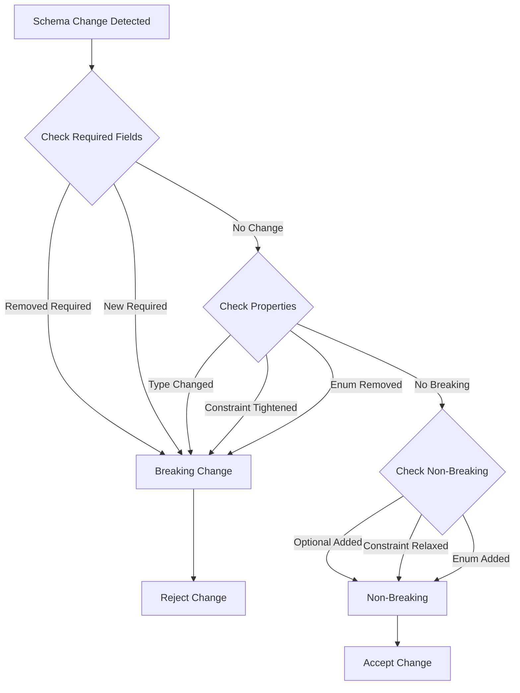

---

## 10. Integration Guide

### 10.1 Integration Pattern

Producer APIs integrate using a "fail-open" pattern to ensure availability even if the metadata service is unavailable. See section 4.5 for the integration pattern flow diagram.

### 10.2 Integration Code Examples

**Python Producer API:**
```python
metadata_client = MetadataClient(
    base_url=os.getenv("METADATA_SERVICE_URL"),
    timeout=5.0
)

if metadata_client.is_enabled():
    result = await metadata_client.validate_event(event)
    if not result.get("valid") and strict_mode:
        raise ValidationError("Event validation failed")
```

### 10.3 Fail-Open Benefits

- **High Availability**: Producer APIs continue operating if metadata service is down
- **Graceful Degradation**: Validation is optional, not blocking
- **Operational Resilience**: No single point of failure
- **Monitoring**: All failures are logged for alerting

---

## 12. Deployment Architecture

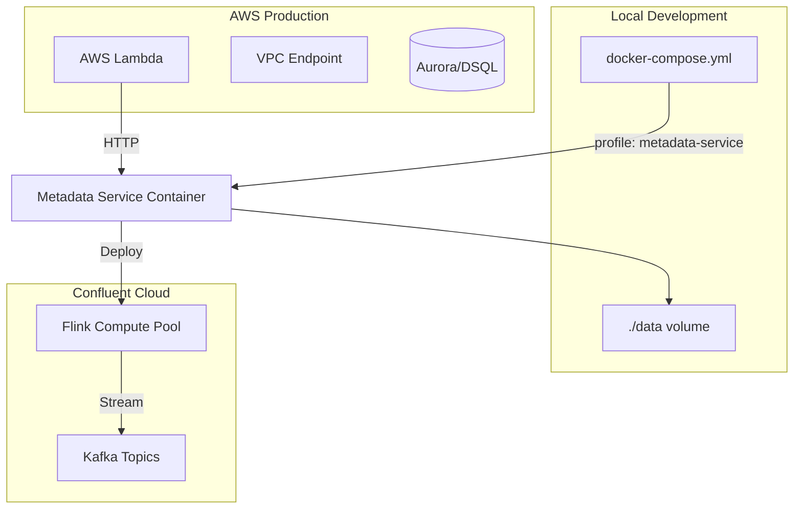

### 12.1 Local Development

**Docker Compose:**
```bash
# Start metadata service
docker-compose --profile metadata-service-java up -d metadata-service-java
```

**Environment Setup:**
```bash
export GIT_REPOSITORY=file:///path/to/data
export GIT_BRANCH=main
export LOCAL_CACHE_DIR=/tmp/schema-cache
export SERVER_PORT=8080
```

### 12.2 Production Deployment

**Container Orchestration:**
- Stateless service - can scale horizontally
- Each instance maintains independent cache
- Git sync runs independently per instance
- Health checks via `/api/v1/health`

**Resource Requirements:**
- Memory: 512MB - 1GB
- CPU: 0.5 - 1.0 cores
- Disk: Minimal (cache only, schemas in git)

---

## 13. Testing and Validation

For comprehensive testing documentation including detailed test catalog, coverage reports, and implementation details, see the [Testing Guide](docs/TESTING.md).

### 13.1 Running Tests

#### All Tests (Unit + Integration)
```bash
./gradlew test
```

#### Unit Tests Only
```bash
./gradlew test --tests "*ServiceTest"
```

#### Integration Tests Only
```bash
./gradlew test --tests "*IntegrationTest"
# or
./run-tests.sh --integration
```

#### Workflow Tests Only
```bash
./run-tests.sh --workflow
# or
./scripts/run-integration-tests-local.sh --workflow-only
```

#### Generate Coverage Report
```bash
./gradlew test jacocoTestReport
open build/reports/jacoco/test/html/index.html
```

### 13.2 Unit Testing

The Java implementation includes comprehensive unit tests:
- `FilterControllerTest.java` - Controller unit tests
- `SchemaValidationServiceTest.java` - Validation service tests
- `FilterGeneratorServiceTest.java` - SQL generation tests
- `SpringYamlGeneratorServiceTest.java` - Spring YAML generation tests
- `SpringYamlWriterServiceTest.java` - Spring YAML file writing tests
- `JenkinsTriggerServiceTest.java` - Jenkins CI/CD triggering tests

### 13.3 Integration Testing

Integration tests verify end-to-end functionality across 9 test classes:

- `FilterE2EIntegrationTest.java` - End-to-end filter lifecycle tests (8 tests)
- `SpringYamlUpdateIntegrationTest.java` - Spring YAML update integration tests (5 tests)
- `JenkinsTriggerIntegrationTest.java` - Jenkins triggering integration tests (9 tests)
- `ValidationIntegrationTest.java` - Schema validation integration tests (7 tests)
- `ApiErrorHandlingIntegrationTest.java` - API error handling tests (18 tests)
- `MultiVersionValidationIntegrationTest.java` - Multi-version schema tests (4 tests)
- `GitSyncIntegrationTest.java` - Git synchronization tests (4 tests)
- `GitSyncEdgeCasesIntegrationTest.java` - Git sync edge cases (4 tests)
- `WorkflowIntegrationTest.java` - Comprehensive workflow tests (15 tests)

**Total Integration Tests**: 75 tests

For detailed test catalog and descriptions, see the [Testing Guide - Test Catalog](docs/TESTING.md#test-catalog).

### 13.4 Test Coverage

#### Coverage Metrics

- **Target Coverage**: 70% minimum
- **Class Coverage**: 60% minimum (excluding config, models, exceptions)
- **Service Layer**: 80% minimum

#### Component Coverage

| Component | Coverage | Unit Tests | Integration Tests |
|-----------|----------|------------|-------------------|
| Schema validation | ✅ 95%+ | 15+ | 7 |
| Filter generation | ✅ 90%+ | 15+ | 7 |
| Git sync | ✅ 85%+ | 10+ | 8 |
| Compatibility checking | ✅ 90%+ | 10+ | 4 |
| Spring YAML generation | ✅ 95%+ | 27 | 6 |
| Jenkins triggering | ✅ 95%+ | 10 | 8 |
| Filter management | ✅ 85%+ | 20+ | 7 |

#### Coverage Tool

The project uses **JaCoCo** for code coverage analysis. Generate reports with:
```bash
./gradlew test jacocoTestReport
./gradlew jacocoTestCoverageVerification
```

For detailed coverage information, see the [Testing Guide - Test Coverage](docs/TESTING.md#test-coverage).

### 13.5 Test Infrastructure

#### Mock Jenkins Server

The test suite includes a `MockJenkinsServer` for CI/CD emulation:
- Embedded HTTP server using Java's HttpServer
- Captures build trigger requests with parameters
- Supports Basic Auth and build token authentication
- Can simulate failures and timeouts
- Thread-safe request capture

#### Test Utilities

- `TestRepoSetup` - Creates test Git repository structure
- `TestEventGenerator` - Generates test events for validation
- `MockJenkinsServer` - Embedded Jenkins server for CI/CD testing

#### Test Configuration

- Uses H2 in-memory database for all tests
- Temporary directories for test isolation
- Git sync disabled in test mode (`test.mode=true`)
- All tests use `@SpringBootTest` with random port for web tests

For implementation details, see the [Testing Guide - Implementation Details](docs/TESTING.md#implementation-details).

### 13.6 Manual Testing

**Validation Test:**
```bash
curl -X POST http://localhost:8080/api/v1/validate \
  -H "Content-Type: application/json" \
  -d '{
    "event": {
      "eventHeader": {...},
      "entities": [...]
    },
    "version": "v1"
  }'
```

**Filter Creation Test:**
```bash
curl -X POST http://localhost:8080/api/v1/filters \
  -H "Content-Type: application/json" \
  -d '{
    "name": "Test Filter",
    "outputTopic": "test-topic",
    "conditions": [...]
  }'
```

---

## 14. Key Files Reference

### 14.1 Java Implementation

| File | Purpose |
|------|---------|
| [`MetadataServiceApplication.java`](metadata-service-java/src/main/java/com/example/metadata/MetadataServiceApplication.java) | Spring Boot application entry point |
| [`controller/FilterController.java`](metadata-service-java/src/main/java/com/example/metadata/controller/FilterController.java) | Filter management REST endpoints |
| [`controller/ValidationController.java`](metadata-service-java/src/main/java/com/example/metadata/controller/ValidationController.java) | Event validation endpoints |
| [`controller/SchemaController.java`](metadata-service-java/src/main/java/com/example/metadata/controller/SchemaController.java) | Schema retrieval endpoints |
| [`controller/HealthController.java`](metadata-service-java/src/main/java/com/example/metadata/controller/HealthController.java) | Health check endpoint |
| [`service/SchemaValidationService.java`](metadata-service-java/src/main/java/com/example/metadata/service/SchemaValidationService.java) | JSON Schema validation logic |
| [`service/SchemaCacheService.java`](metadata-service-java/src/main/java/com/example/metadata/service/SchemaCacheService.java) | Schema caching service |
| [`service/GitSyncService.java`](metadata-service-java/src/main/java/com/example/metadata/service/GitSyncService.java) | Git synchronization service |
| [`service/CompatibilityService.java`](metadata-service-java/src/main/java/com/example/metadata/service/CompatibilityService.java) | Schema compatibility checking |
| [`service/FilterStorageService.java`](metadata-service-java/src/main/java/com/example/metadata/service/FilterStorageService.java) | Filter persistence service |
| [`service/FilterGeneratorService.java`](metadata-service-java/src/main/java/com/example/metadata/service/FilterGeneratorService.java) | Flink SQL generation service |
| [`service/FilterDeployerService.java`](metadata-service-java/src/main/java/com/example/metadata/service/FilterDeployerService.java) | Confluent Cloud deployment service |
| [`service/SpringYamlGeneratorService.java`](metadata-service-java/src/main/java/com/example/metadata/service/SpringYamlGeneratorService.java) | Spring Boot YAML generation service |
| [`service/SpringYamlWriterService.java`](metadata-service-java/src/main/java/com/example/metadata/service/SpringYamlWriterService.java) | Spring Boot YAML file writing service |
| [`service/JenkinsTriggerService.java`](metadata-service-java/src/main/java/com/example/metadata/service/JenkinsTriggerService.java) | Jenkins CI/CD triggering service |
| [`config/AppConfig.java`](metadata-service-java/src/main/java/com/example/metadata/config/AppConfig.java) | Application configuration |

---

## 15. Operational Considerations

### 15.1 Health Monitoring

**Health Endpoint:**
- `GET /api/v1/health`
- Returns schema version and status
- Use for container orchestration health checks (Kubernetes, Docker Swarm, ECS)

**Health Check Example:**
```bash
curl http://localhost:8080/api/v1/health
# Response: {"status":"healthy","version":"v1"}
```

**Monitoring Metrics:**
- Request latency (p50, p95, p99)
- Error rates (4xx, 5xx)
- Cache hit/miss ratios
- Git sync success/failure rates
- Validation throughput

### 15.2 Performance Characteristics

| Operation | Typical Latency | Notes |
|-----------|----------------|-------|
| Schema validation (cached) | < 10ms | In-memory cache hit |
| Schema validation (uncached) | 50-100ms | Disk I/O + validation |
| Bulk validation (100 events) | 500-1000ms | Sequential validation |
| Git sync (initial) | 1-5s | Depends on repository size |
| Git sync (incremental) | 100-500ms | Pull only |
| Filter SQL generation | < 50ms | Template-based |
| Filter deployment | 2-5s | Confluent Cloud API call |

**Cache Performance:**
- Cache TTL: 1 hour
- Cache invalidation: On git sync
- Memory footprint: ~10-50MB per schema version

### 15.3 Scaling Considerations

**Horizontal Scaling:**
- Stateless service - can scale horizontally
- Each instance maintains its own cache
- Git sync happens independently per instance
- No shared state between instances

**Vertical Scaling:**
- Memory: Increase for larger schema repositories
- CPU: Increase for higher validation throughput
- Disk: Minimal (cache only, schemas in git)

**Recommended Instance Sizes:**
- **Development**: 512MB RAM, 0.5 CPU
- **Production (Low)**: 1GB RAM, 1 CPU (handles ~100 req/s)
- **Production (High)**: 2GB RAM, 2 CPU (handles ~500 req/s)

### 15.4 Error Handling

**Validation Errors:**
- Invalid events return `422 Unprocessable Entity` (strict mode)
- Validation errors include field path and message
- Bulk validation returns per-event results

**Service Errors:**
- Git sync failures: Logged, cached schemas used
- Confluent Cloud API failures: Returned to client
- Schema loading errors: Returned to client

**Retry Logic:**
- Producer APIs: No retry (fail-open pattern)
- Filter deployment: Retry on transient failures
- Git sync: Automatic retry on next interval

### 15.5 Security Considerations

**Authentication:**
- No built-in authentication (assumes network-level security)
- Can be fronted by API Gateway with authentication
- Confluent Cloud uses API key/secret

**Authorization:**
- Filter approval requires manual review
- Deployment requires approved status (unless force flag)

**Input Validation:**
- Filter IDs validated to prevent path traversal
- SQL injection prevention in filter generation
- JSON Schema validation prevents malformed events

### 15.6 Troubleshooting

**Common Issues:**

1. **Schemas not updating:**
   - Check git repository access (SSH keys or HTTPS credentials)
   - Verify branch name is correct
   - Check logs for git pull errors
   - Ensure `LOCAL_CACHE_DIR` has write permissions

2. **Validation failures:**
   - Check schema version is correct
   - Verify event structure matches schema
   - Review validation errors in response
   - Check if strict mode is enabled

3. **Service unavailable:**
   - Verify service is running: `curl http://localhost:8080/api/v1/health`
   - Check network connectivity (Docker network if using containers)
   - Verify port is not blocked by firewall
   - Check service logs for errors

4. **Filter deployment failures:**
   - Verify Confluent Cloud credentials are configured
   - Check compute pool ID is correct
   - Verify API endpoint is accessible
   - Review deployment error messages

---

## 16. Spring Boot YAML Generation

The Metadata Service automatically generates and updates a `filters.yml` file for the Spring Boot stream processor whenever filters are created, updated, deleted, or deployed via the API. This ensures synchronization between Flink SQL filters and the Spring Boot Kafka Streams implementation.

### 16.1 Automatic YAML Updates

The `filters.yml` file is automatically updated when:
- A filter is **created** via `POST /api/v1/filters`
- A filter is **updated** via `PUT /api/v1/filters/:id`
- A filter is **deleted** via `DELETE /api/v1/filters/:id`
- A filter is **deployed** via `POST /api/v1/filters/:id/deployments`

### 16.2 YAML File Format

The generated YAML follows this structure:

```yaml
filters:
  - id: service-events-for-dealer-001
    name: Service Events for Dealer 001
    outputTopic: service-events-dealer-001-spring
    enabled: true
    conditions:
      - field: event_type
        operator: equals
        value: CarServiceDone
        valueType: string
      - field: header_data.dealerId
        operator: equals
        value: DEALER-001
        valueType: string
    conditionLogic: AND
  - id: car-created-events
    name: Car Created Events
    outputTopic: car-created-events-spring
    enabled: true
    conditions:
      - field: event_type
        operator: equals
        value: CarCreated
        valueType: string
    conditionLogic: AND
```

**Key Features:**
- Output topics automatically get the `-spring` suffix to distinguish from Flink topics
- Disabled or deleted filters are marked with `enabled: false` or removed
- Deprecated filters include comments indicating their status
- Atomic file writes ensure data consistency (writes to temp file, then renames)

### 16.3 Backup Management

Before updating `filters.yml`, the service creates a timestamped backup if `backup-enabled` is `true`:

```
/tmp/filters-yaml-backups/
├── filters.yml.2025-12-30T10-15-30.backup
├── filters.yml.2025-12-30T10-20-45.backup
└── filters.yml.2025-12-30T10-25-12.backup
```

Old backups are automatically cleaned up (default: keeps last 10 backups).

### 16.4 Configuration

Configure the YAML generation in `application.yml`:

```yaml
spring-boot:
  filters-yaml-path: ${SPRING_BOOT_FILTERS_YAML_PATH:../cdc-streaming/stream-processor-spring/src/main/resources/filters.yml}
  backup-enabled: ${SPRING_BOOT_YAML_BACKUP_ENABLED:true}
  backup-dir: ${SPRING_BOOT_YAML_BACKUP_DIR:/tmp/filters-yaml-backups}
```

**Environment Variables:**
- `SPRING_BOOT_FILTERS_YAML_PATH` - Path to the `filters.yml` file
- `SPRING_BOOT_YAML_BACKUP_ENABLED` - Enable/disable backups (default: `true`)
- `SPRING_BOOT_YAML_BACKUP_DIR` - Directory for backups (default: `/tmp/filters-yaml-backups`)

### 16.5 Error Handling

If YAML generation or writing fails:
- The error is logged but does **not** fail the API operation
- The filter operation (create/update/delete/deploy) still succeeds
- Previous `filters.yml` content is preserved
- Administrators are notified via logs

---

## 17. Jenkins CI/CD Integration

The Metadata Service can automatically trigger Jenkins CI/CD builds when filters are created, updated, deleted, approved, or deployed. This enables automated change management and integration testing.

### 17.1 Automatic Build Triggering

Jenkins builds are triggered on the following filter lifecycle events:

| Event | Triggered When | Default |
|-------|----------------|---------|
| `create` | Filter is created | ✅ Enabled |
| `update` | Filter is updated | ✅ Enabled |
| `delete` | Filter is deleted | ✅ Enabled |
| `approve` | Filter is approved | ✅ Enabled |
| `deploy` | Filter is deployed | ✅ Enabled |

Each event type can be individually enabled/disabled via configuration.

### 17.2 Build Parameters

When triggering a Jenkins build, the following parameters are passed:

| Parameter | Description | Example |
|-----------|-------------|---------|
| `FILTER_EVENT_TYPE` | Type of event that triggered the build | `create`, `update`, `delete`, `approve`, `deploy` |
| `FILTER_ID` | ID of the filter that changed | `service-events-for-dealer-001` |
| `FILTER_VERSION` | Version of the filter | `v1`, `v2` |

Additional parameters can be passed via the API for custom workflows.

### 17.3 Authentication

Jenkins authentication supports two methods:

**Method 1: Username and API Token**
```yaml
jenkins:
  username: ${JENKINS_USERNAME:admin}
  api-token: ${JENKINS_API_TOKEN:your-api-token}
```

**Method 2: Build Token**
```yaml
jenkins:
  build-token: ${JENKINS_BUILD_TOKEN:your-build-token}
```

### 16.4 Configuration

Configure Jenkins integration in `application.yml`:

```yaml
jenkins:
  enabled: ${JENKINS_ENABLED:false}
  base-url: ${JENKINS_BASE_URL:http://localhost:8080}
  job-name: ${JENKINS_JOB_NAME:filter-integration-tests}
  username: ${JENKINS_USERNAME:}
  api-token: ${JENKINS_API_TOKEN:}
  build-token: ${JENKINS_BUILD_TOKEN:}
  trigger-on-create: ${JENKINS_TRIGGER_ON_CREATE:true}
  trigger-on-update: ${JENKINS_TRIGGER_ON_UPDATE:true}
  trigger-on-delete: ${JENKINS_TRIGGER_ON_DELETE:true}
  trigger-on-deploy: ${JENKINS_TRIGGER_ON_DEPLOY:true}
  trigger-on-approve: ${JENKINS_TRIGGER_ON_APPROVE:true}
  timeout-seconds: ${JENKINS_TIMEOUT_SECONDS:30}
```

**Environment Variables:**
- `JENKINS_ENABLED` - Enable/disable Jenkins triggering (default: `false`)
- `JENKINS_BASE_URL` - Jenkins server URL (default: `http://localhost:8080`)
- `JENKINS_JOB_NAME` - Jenkins job name to trigger (default: `filter-integration-tests`)
- `JENKINS_USERNAME` - Jenkins username for authentication
- `JENKINS_API_TOKEN` - Jenkins API token for authentication
- `JENKINS_BUILD_TOKEN` - Jenkins build token (alternative to username/token)
- `JENKINS_TRIGGER_ON_*` - Enable/disable triggering for specific events
- `JENKINS_TIMEOUT_SECONDS` - Request timeout (default: `30` seconds)

### 17.5 Jenkins Job Setup

Your Jenkins job should be configured as a **parameterized build** that accepts:

- `FILTER_EVENT_TYPE` (String)
- `FILTER_ID` (String)
- `FILTER_VERSION` (String)

**Example Jenkinsfile:**
```groovy
pipeline {
    agent any
    parameters {
        string(name: 'FILTER_EVENT_TYPE', defaultValue: 'create', description: 'Filter event type')
        string(name: 'FILTER_ID', defaultValue: '', description: 'Filter ID')
        string(name: 'FILTER_VERSION', defaultValue: 'v1', description: 'Filter version')
    }
    stages {
        stage('Run Integration Tests') {
            steps {
                echo "Running tests for filter: ${params.FILTER_ID} (${params.FILTER_EVENT_TYPE})"
                sh './scripts/run-all-integration-tests.sh'
            }
        }
    }
}
```

### 17.6 Error Handling

If Jenkins build triggering fails:
- The error is logged but does **not** fail the filter operation
- The filter operation (create/update/delete/approve/deploy) still succeeds
- Retry logic is applied for transient failures (5xx errors)
- Timeout is configurable (default: 30 seconds)

---

## 18. Future Enhancements

Potential improvements for future versions:

1. **Schema Versioning:**
   - Automatic schema version detection
   - Schema migration tools
   - Version compatibility matrix UI

2. **Performance:**
   - Async validation for bulk operations
   - Distributed caching (Redis)
   - Schema preloading on startup

3. **Features:**
   - GraphQL API support
   - Webhook notifications for schema changes
   - Filter templates and presets
   - Advanced filter condition builders

4. **Observability:**
   - OpenTelemetry integration
   - Prometheus metrics export
   - Distributed tracing

---

## Appendix A: Glossary

| Term | Definition |
|------|------------|
| **Schema** | JSON Schema definition for event structure |
| **Filter** | Configuration for filtering events in Flink SQL |
| **Flink SQL** | Apache Flink SQL statements for stream processing |
| **Confluent Cloud** | Managed Kafka and Flink platform |
| **$ref** | JSON Schema reference to external schema definitions |
| **Fail-Open** | Pattern where service failures don't block operations |
| **Strict Mode** | Mode where invalid events are rejected with 422 status |

---

## Appendix B: Related Documentation

- [CDC Streaming Backend Implementation](../cdc-streaming/BACKEND_IMPLEMENTATION.md)
- [Metadata Service Java README](README.md)
- [Testing Guide](docs/TESTING.md) - Comprehensive testing documentation
- [Producer API Documentation](../producer-api-go-rest/README.md)

---

**Document Version:** 2.0  
**Last Updated:** December 30, 2025  
**Maintained By:** Platform Engineering Team

**Recent Updates:**
- Added Spring Boot YAML generation and automatic updates
- Added Jenkins CI/CD integration for filter lifecycle events
- Updated architecture diagrams to include new services
- Expanded configuration reference with Spring Boot and Jenkins settings
- Updated test coverage information
