# Metadata Service - Enterprise Documentation Report

## Executive Summary

The Metadata Service is a centralized microservice providing schema validation, filter management, and Flink SQL deployment capabilities for the event-based processing platform. It exists in two implementations (Go and Java) with identical functionality.

---

## 1. Service Purpose and Core Capabilities

The Metadata Service provides four primary capabilities:

| Capability | Description |
|------------|-------------|
| **Schema Validation** | Validates events against JSON Schema Draft 2020-12 with $ref resolution |
| **Schema Management** | Git-based versioned schema storage with periodic sync |
| **Compatibility Checking** | Detects breaking vs non-breaking schema changes |
| **Filter Management** | CRUD operations for Flink SQL filter configurations with deployment to Confluent Cloud |

---

## 2. High-Level Architecture

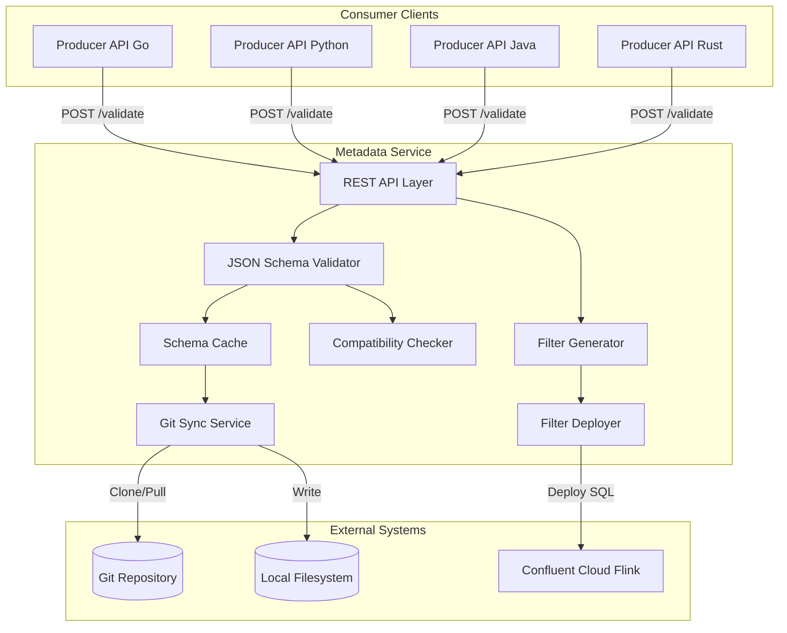

---

## 3. Component Architecture

### 3.1 Go Implementation (`metadata-service-go/`)

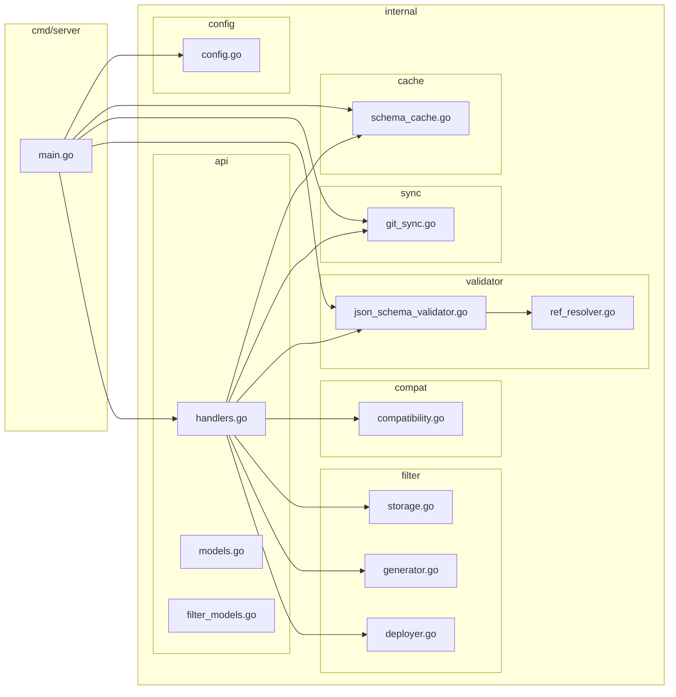

### 3.2 Java Implementation (`metadata-service-java/`)

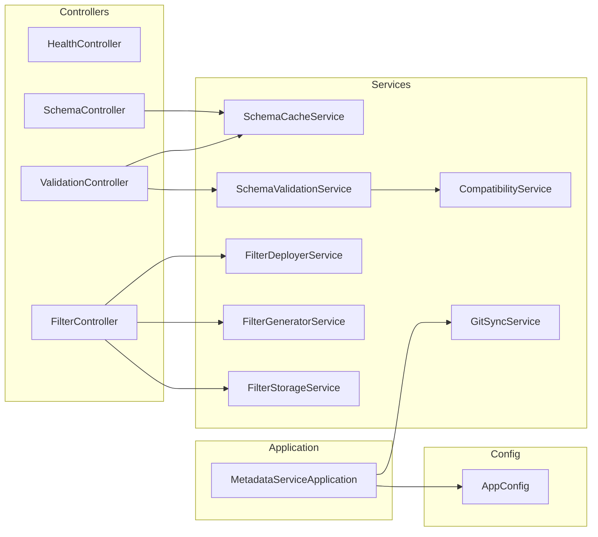

---

## 4. Data Flow Diagrams

### 4.1 Event Validation Flow

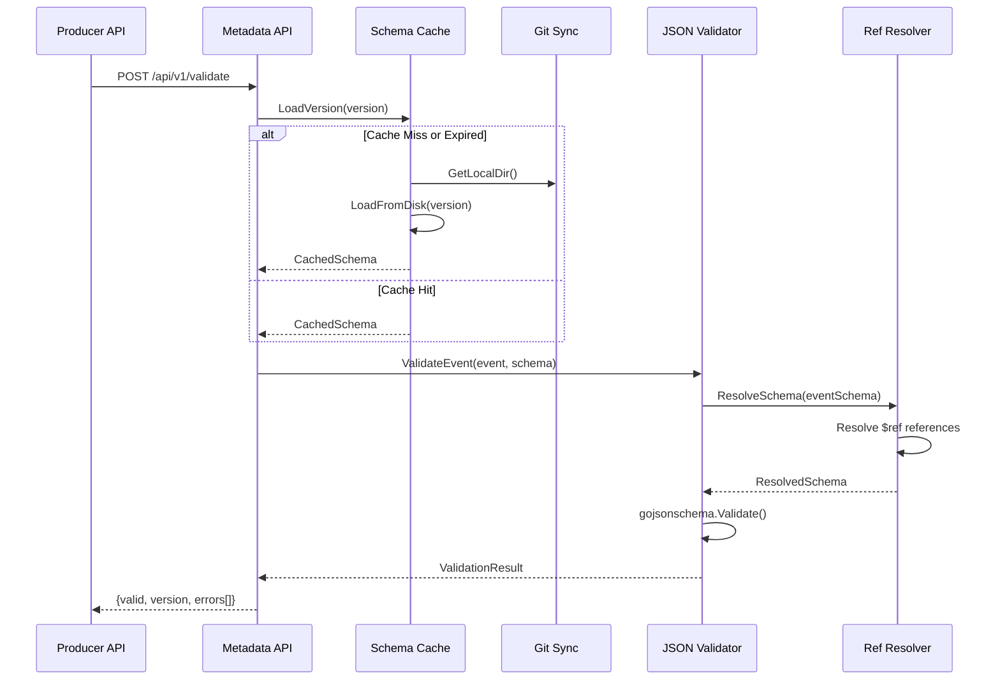

### 4.2 Git Sync Flow

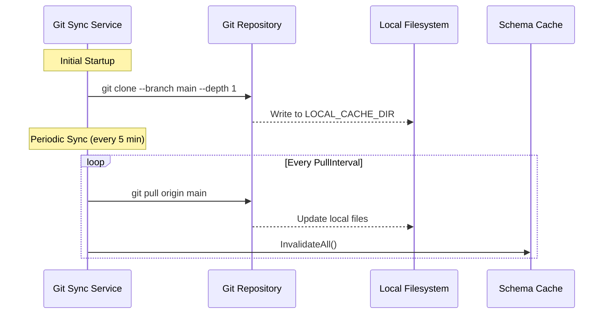

### 4.3 Filter Deployment Flow

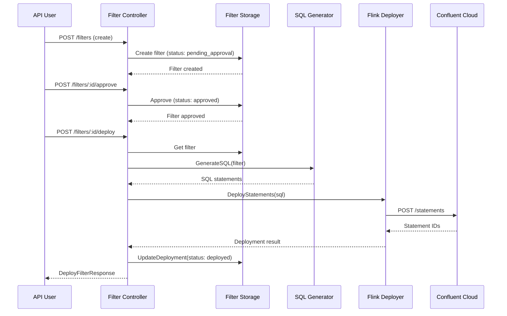

---

## 5. Connectivity Diagram

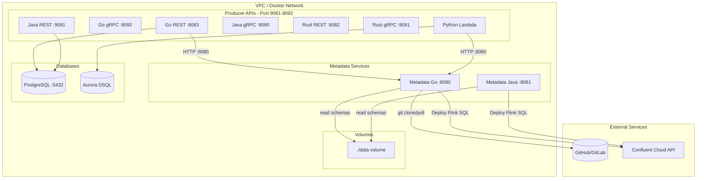

---

## 6. API Reference

### 6.1 Validation Endpoints

| Method | Endpoint | Description |
|--------|----------|-------------|
| POST | `/api/v1/validate` | Validate single event |
| POST | `/api/v1/validate/bulk` | Validate multiple events |

**Request Example (Single Validation):**
```json
{
  "event": {
    "eventHeader": {
      "uuid": "550e8400-e29b-41d4-a716-446655440000",
      "eventName": "Car Created",
      "eventType": "CarCreated",
      "createdDate": "2025-12-14T10:00:00Z",
      "savedDate": "2025-12-14T10:00:01Z"
    },
    "entities": [...]
  },
  "version": "v1"
}
```

**Response Example:**
```json
{
  "valid": true,
  "version": "v1",
  "errors": []
}
```

### 6.2 Schema Endpoints

| Method | Endpoint | Description |
|--------|----------|-------------|
| GET | `/api/v1/schemas/versions` | List available schema versions |
| GET | `/api/v1/schemas/:version` | Get schema by version |

**Query Parameters for `/api/v1/schemas/:version`:**
- `type` - Schema type: `event` (default) or entity name (e.g., `car`, `loan`)

**Example:**
```
GET /api/v1/schemas/v1?type=event
GET /api/v1/schemas/v1?type=car
```

### 6.3 Filter Endpoints

| Method | Endpoint | Description |
|--------|----------|-------------|
| POST | `/api/v1/filters` | Create filter |
| GET | `/api/v1/filters` | List all filters |
| GET | `/api/v1/filters/:id` | Get filter by ID |
| PUT | `/api/v1/filters/:id` | Update filter |
| DELETE | `/api/v1/filters/:id` | Delete filter |
| POST | `/api/v1/filters/:id/generate` | Generate Flink SQL |
| POST | `/api/v1/filters/:id/validate` | Validate SQL syntax |
| POST | `/api/v1/filters/:id/approve` | Approve filter for deployment |
| POST | `/api/v1/filters/:id/deploy` | Deploy to Confluent Cloud |
| GET | `/api/v1/filters/:id/status` | Get deployment status |

**Filter Lifecycle States:**
1. `pending_approval` - Initial state after creation
2. `approved` - Approved by reviewer, ready for deployment
3. `deploying` - Deployment in progress
4. `deployed` - Successfully deployed to Confluent Cloud
5. `failed` - Deployment failed

### 6.4 Health Endpoint

| Method | Endpoint | Description |
|--------|----------|-------------|
| GET | `/api/v1/health` | Health check |

**Response Example:**
```json
{
  "status": "healthy",
  "version": "v1"
}
```

---

## 7. Schema Repository Structure

The metadata service expects schemas organized in a versioned directory structure:

```
data/
├── schemas/
│   ├── v1/
│   │   ├── filters/
│   │   │   ├── service-by-dealer-001.json
│   │   │   ├── service-by-dealer-002.json
│   │   │   └── service-events-for-dealer-001.json
│   │   ├── event/
│   │   │   ├── event.json
│   │   │   └── event-header.json
│   │   └── entity/
│   │       ├── car.json
│   │       ├── loan.json
│   │       ├── loan-payment.json
│   │       ├── service-record.json
│   │       ├── service-details.json
│   │       ├── part-used.json
│   │       └── entity-header.json
│   └── v2/
│       └── ...
└── templates/
    └── event-templates.json
```

**Schema File Structure:**

Event schema (`event.json`) references entity schemas using `$ref`:
```json
{
  "$schema": "https://json-schema.org/draft/2020-12/schema",
  "type": "object",
  "properties": {
    "eventHeader": {
      "$ref": "event-header.json"
    },
    "entities": {
      "type": "array",
      "items": {
        "oneOf": [
          {"$ref": "../entity/car.json"},
          {"$ref": "../entity/loan.json"}
        ]
      }
    }
  }
}
```

---

## 8. Configuration Reference

### 8.1 Environment Variables

| Variable | Default | Description |
|----------|---------|-------------|
| `GIT_REPOSITORY` | Required | Git repository URL (or `file://` for local) |
| `GIT_BRANCH` | `main` | Git branch to sync |
| `LOCAL_CACHE_DIR` | `/tmp/schema-cache` | Local directory for schema cache |
| `SERVER_PORT` | `8080` | HTTP server port |
| `DEFAULT_VERSION` | `latest` | Default schema version |
| `STRICT_MODE` | `true` | Reject invalid events with 422 |
| `CONFLUENT_CLOUD_API_KEY` | - | Confluent Cloud API key |
| `CONFLUENT_CLOUD_API_SECRET` | - | Confluent Cloud API secret |
| `CONFLUENT_FLINK_COMPUTE_POOL_ID` | - | Flink compute pool ID |
| `CONFLUENT_FLINK_API_ENDPOINT` | - | Flink API endpoint |

### 8.2 Configuration File (Go Implementation)

Optional `config.yaml` file:

```yaml
git:
  repository: "https://github.com/org/schema-repo.git"
  branch: "main"
  pull_interval: "5m"
  local_cache_dir: "/tmp/schema-cache"

validation:
  default_version: "latest"
  accepted_versions: ["v1", "v2"]
  strict_mode: true

server:
  port: 8080
```

### 8.3 Configuration File (Java Implementation)

`application.yml`:

```yaml
server:
  port: ${SERVER_PORT:8080}

git:
  repository: ${GIT_REPOSITORY:file:///app/data}
  branch: ${GIT_BRANCH:main}
  pull-interval: ${GIT_PULL_INTERVAL:PT5M}
  local-cache-dir: ${LOCAL_CACHE_DIR:/tmp/schema-cache}

validation:
  default-version: ${DEFAULT_VERSION:latest}
  accepted-versions: ${ACCEPTED_VERSIONS:v1,v2}
  strict-mode: ${STRICT_MODE:true}

confluent:
  cloud:
    api-key: ${CONFLUENT_CLOUD_API_KEY:}
    api-secret: ${CONFLUENT_CLOUD_API_SECRET:}
    flink-compute-pool-id: ${CONFLUENT_FLINK_COMPUTE_POOL_ID:}
    flink-api-endpoint: ${CONFLUENT_FLINK_API_ENDPOINT:}
```

---

## 9. Compatibility Rules

The metadata service implements automatic compatibility checking between schema versions to support gradual migrations.

### 9.1 Non-Breaking Changes (Allowed)

These changes are automatically accepted and allow events to validate against multiple schema versions:

- **Adding optional properties** - New fields not in `required` array
- **Relaxing minimum/maximum constraints** - Increasing max or decreasing min values
- **Adding new enum values** - Expanding enum options
- **Making required fields optional** - Moving fields from `required` to optional
- **Changing `additionalProperties: false` to `true`** - Allowing additional properties

### 9.2 Breaking Changes (Rejected)

These changes cause validation failures and require explicit version migration:

- **Removing required properties** - Fields in `required` array are removed
- **Adding new required properties** - New fields added to `required` array
- **Removing enum values** - Existing enum values are removed
- **Tightening constraints** - Decreasing max or increasing min values
- **Changing property types** - Type changes (e.g., `string` to `number`)

### 9.3 Compatibility Check Flow

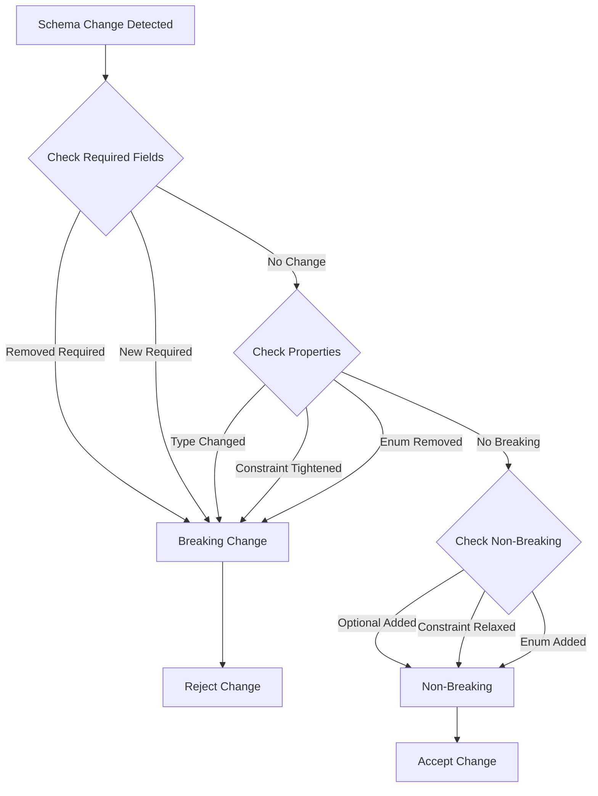

---

## 10. Deployment Architecture

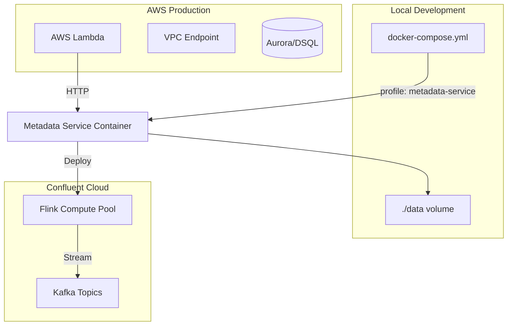

### 10.1 Local Development

**Docker Compose:**
```bash
# Start metadata service
docker-compose --profile metadata-service up -d metadata-service

# Or Java implementation
docker-compose --profile metadata-service-java up -d metadata-service-java
```

**Environment Setup:**
```bash
export GIT_REPOSITORY=file:///path/to/data
export GIT_BRANCH=main
export LOCAL_CACHE_DIR=/tmp/schema-cache
export SERVER_PORT=8080
```

### 10.2 Production Deployment

**Container Orchestration:**
- Stateless service - can scale horizontally
- Each instance maintains independent cache
- Git sync runs independently per instance
- Health checks via `/api/v1/health`

**Resource Requirements:**
- Memory: 512MB - 1GB
- CPU: 0.5 - 1.0 cores
- Disk: Minimal (cache only, schemas in git)

---

## 11. Key Files Reference

### 11.1 Go Implementation

| File | Purpose |
|------|---------|
| [`cmd/server/main.go`](metadata-service-go/cmd/server/main.go) | Application entry point, server initialization |
| [`internal/api/handlers.go`](metadata-service-go/internal/api/handlers.go) | HTTP request handlers for all endpoints |
| [`internal/api/models.go`](metadata-service-go/internal/api/models.go) | API request/response models |
| [`internal/api/filter_models.go`](metadata-service-go/internal/api/filter_models.go) | Filter-specific API models |
| [`internal/cache/schema_cache.go`](metadata-service-go/internal/cache/schema_cache.go) | In-memory schema caching with TTL |
| [`internal/sync/git_sync.go`](metadata-service-go/internal/sync/git_sync.go) | Git repository synchronization |
| [`internal/validator/json_schema_validator.go`](metadata-service-go/internal/validator/json_schema_validator.go) | JSON Schema Draft 2020-12 validation |
| [`internal/validator/ref_resolver.go`](metadata-service-go/internal/validator/ref_resolver.go) | $ref reference resolution |
| [`internal/compat/compatibility.go`](metadata-service-go/internal/compat/compatibility.go) | Schema compatibility checking |
| [`internal/filter/storage.go`](metadata-service-go/internal/filter/storage.go) | Filter persistence in git repository |
| [`internal/filter/generator.go`](metadata-service-go/internal/filter/generator.go) | Flink SQL generation from filters |
| [`internal/filter/deployer.go`](metadata-service-go/internal/filter/deployer.go) | Confluent Cloud Flink deployment |
| [`internal/config/config.go`](metadata-service-go/internal/config/config.go) | Configuration loading and management |

### 11.2 Java Implementation

| File | Purpose |
|------|---------|
| [`MetadataServiceApplication.java`](metadata-service-java/src/main/java/com/example/metadata/MetadataServiceApplication.java) | Spring Boot application entry point |
| [`controller/FilterController.java`](metadata-service-java/src/main/java/com/example/metadata/controller/FilterController.java) | Filter management REST endpoints |
| [`controller/ValidationController.java`](metadata-service-java/src/main/java/com/example/metadata/controller/ValidationController.java) | Event validation endpoints |
| [`controller/SchemaController.java`](metadata-service-java/src/main/java/com/example/metadata/controller/SchemaController.java) | Schema retrieval endpoints |
| [`controller/HealthController.java`](metadata-service-java/src/main/java/com/example/metadata/controller/HealthController.java) | Health check endpoint |
| [`service/SchemaValidationService.java`](metadata-service-java/src/main/java/com/example/metadata/service/SchemaValidationService.java) | JSON Schema validation logic |
| [`service/SchemaCacheService.java`](metadata-service-java/src/main/java/com/example/metadata/service/SchemaCacheService.java) | Schema caching service |
| [`service/GitSyncService.java`](metadata-service-java/src/main/java/com/example/metadata/service/GitSyncService.java) | Git synchronization service |
| [`service/CompatibilityService.java`](metadata-service-java/src/main/java/com/example/metadata/service/CompatibilityService.java) | Schema compatibility checking |
| [`service/FilterStorageService.java`](metadata-service-java/src/main/java/com/example/metadata/service/FilterStorageService.java) | Filter persistence service |
| [`service/FilterGeneratorService.java`](metadata-service-java/src/main/java/com/example/metadata/service/FilterGeneratorService.java) | Flink SQL generation service |
| [`service/FilterDeployerService.java`](metadata-service-java/src/main/java/com/example/metadata/service/FilterDeployerService.java) | Confluent Cloud deployment service |
| [`config/AppConfig.java`](metadata-service-java/src/main/java/com/example/metadata/config/AppConfig.java) | Application configuration |

---

## 12. Integration Pattern

Producer APIs integrate using a "fail-open" pattern to ensure availability even if the metadata service is unavailable:

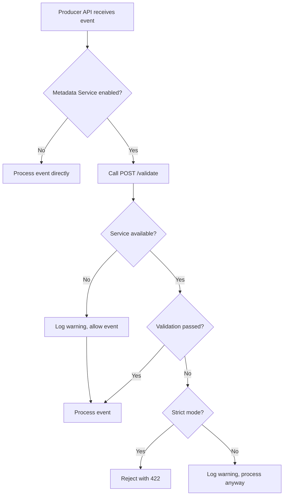

### 12.1 Integration Code Examples

**Go Producer API:**
```go
metadataClient := metadata.NewClient(
    os.Getenv("METADATA_SERVICE_URL"),
    5*time.Second,
    logger,
)

if metadataClient.IsEnabled() {
    result, err := metadataClient.ValidateEvent(event)
    if err != nil {
        logger.Warn("Validation failed, allowing event", zap.Error(err))
    } else if !result.Valid && strictMode {
        return errors.New("event validation failed")
    }
}
```

**Python Producer API:**
```python
metadata_client = MetadataClient(
    base_url=os.getenv("METADATA_SERVICE_URL"),
    timeout=5.0
)

if metadata_client.is_enabled():
    result = await metadata_client.validate_event(event)
    if not result.get("valid") and strict_mode:
        raise ValidationError("Event validation failed")
```

### 12.2 Fail-Open Benefits

- **High Availability**: Producer APIs continue operating if metadata service is down
- **Graceful Degradation**: Validation is optional, not blocking
- **Operational Resilience**: No single point of failure
- **Monitoring**: All failures are logged for alerting

---

## 13. Operational Considerations

### 13.1 Health Monitoring

**Health Endpoint:**
- `GET /api/v1/health`
- Returns schema version and status
- Use for container orchestration health checks (Kubernetes, Docker Swarm, ECS)

**Health Check Example:**
```bash
curl http://localhost:8080/api/v1/health
# Response: {"status":"healthy","version":"v1"}
```

**Monitoring Metrics:**
- Request latency (p50, p95, p99)
- Error rates (4xx, 5xx)
- Cache hit/miss ratios
- Git sync success/failure rates
- Validation throughput

### 13.2 Performance Characteristics

| Operation | Typical Latency | Notes |
|-----------|----------------|-------|
| Schema validation (cached) | < 10ms | In-memory cache hit |
| Schema validation (uncached) | 50-100ms | Disk I/O + validation |
| Bulk validation (100 events) | 500-1000ms | Sequential validation |
| Git sync (initial) | 1-5s | Depends on repository size |
| Git sync (incremental) | 100-500ms | Pull only |
| Filter SQL generation | < 50ms | Template-based |
| Filter deployment | 2-5s | Confluent Cloud API call |

**Cache Performance:**
- Cache TTL: 1 hour
- Cache invalidation: On git sync
- Memory footprint: ~10-50MB per schema version

### 13.3 Scaling Considerations

**Horizontal Scaling:**
- Stateless service - can scale horizontally
- Each instance maintains its own cache
- Git sync happens independently per instance
- No shared state between instances

**Vertical Scaling:**
- Memory: Increase for larger schema repositories
- CPU: Increase for higher validation throughput
- Disk: Minimal (cache only, schemas in git)

**Recommended Instance Sizes:**
- **Development**: 512MB RAM, 0.5 CPU
- **Production (Low)**: 1GB RAM, 1 CPU (handles ~100 req/s)
- **Production (High)**: 2GB RAM, 2 CPU (handles ~500 req/s)

### 13.4 Error Handling

**Validation Errors:**
- Invalid events return `422 Unprocessable Entity` (strict mode)
- Validation errors include field path and message
- Bulk validation returns per-event results

**Service Errors:**
- Git sync failures: Logged, cached schemas used
- Confluent Cloud API failures: Returned to client
- Schema loading errors: Returned to client

**Retry Logic:**
- Producer APIs: No retry (fail-open pattern)
- Filter deployment: Retry on transient failures
- Git sync: Automatic retry on next interval

### 13.5 Security Considerations

**Authentication:**
- No built-in authentication (assumes network-level security)
- Can be fronted by API Gateway with authentication
- Confluent Cloud uses API key/secret

**Authorization:**
- Filter approval requires manual review
- Deployment requires approved status (unless force flag)

**Input Validation:**
- Filter IDs validated to prevent path traversal
- SQL injection prevention in filter generation
- JSON Schema validation prevents malformed events

### 13.6 Troubleshooting

**Common Issues:**

1. **Schemas not updating:**
   - Check git repository access (SSH keys or HTTPS credentials)
   - Verify branch name is correct
   - Check logs for git pull errors
   - Ensure `LOCAL_CACHE_DIR` has write permissions

2. **Validation failures:**
   - Check schema version is correct
   - Verify event structure matches schema
   - Review validation errors in response
   - Check if strict mode is enabled

3. **Service unavailable:**
   - Verify service is running: `curl http://localhost:8080/api/v1/health`
   - Check network connectivity (Docker network if using containers)
   - Verify port is not blocked by firewall
   - Check service logs for errors

4. **Filter deployment failures:**
   - Verify Confluent Cloud credentials are configured
   - Check compute pool ID is correct
   - Verify API endpoint is accessible
   - Review deployment error messages

---

## 14. Filter Management Deep Dive

### 14.1 Filter Structure

A filter configuration defines conditions for filtering events in Flink SQL:

```json
{
  "id": "service-events-for-dealer-001",
  "name": "Service Events for Dealer 001",
  "description": "Filters service events for dealer ID 001",
  "consumerId": "dealer-001-consumer",
  "outputTopic": "service-events-dealer-001",
  "conditions": [
    {
      "field": "event_type",
      "operator": "equals",
      "value": "CarServiceDone",
      "valueType": "string"
    },
    {
      "field": "header_data.dealerId",
      "operator": "equals",
      "value": "001",
      "valueType": "string"
    }
  ],
  "conditionLogic": "AND",
  "enabled": true,
  "status": "approved",
  "version": 1
}
```

### 14.2 Supported Operators

| Operator | Description | Example |
|----------|-------------|---------|
| `equals` | Exact match | `event_type = 'CarCreated'` |
| `in` | Value in list | `event_type IN ('CarCreated', 'LoanCreated')` |
| `notIn` | Value not in list | `event_type NOT IN ('Deleted')` |
| `greaterThan` | Numeric comparison | `amount > 1000` |
| `lessThan` | Numeric comparison | `amount < 5000` |
| `greaterThanOrEqual` | Numeric comparison | `amount >= 1000` |
| `lessThanOrEqual` | Numeric comparison | `amount <= 5000` |
| `between` | Range check | `amount BETWEEN 1000 AND 5000` |
| `matches` | Regex pattern | `event_name REGEXP '.*Service.*'` |
| `isNull` | Null check | `dealerId IS NULL` |
| `isNotNull` | Not null check | `dealerId IS NOT NULL` |

### 14.3 Generated Flink SQL

The filter generator creates two SQL statements:

1. **Sink Table Definition:**
```sql
CREATE TABLE `service-events-dealer-001` (
    `key` BYTES,
    `id` STRING,
    `event_name` STRING,
    `event_type` STRING,
    `created_date` STRING,
    `saved_date` STRING,
    `header_data` STRING,
    `__op` STRING,
    `__table` STRING
) WITH (
    'connector' = 'confluent',
    'value.format' = 'json-registry'
);
```

2. **INSERT Statement:**
```sql
INSERT INTO `service-events-dealer-001`
SELECT 
    CAST(`id` AS BYTES) AS `key`,
    `id`,
    `event_name`,
    `event_type`,
    `created_date`,
    `saved_date`,
    `header_data`,
    `__op`,
    `__table`
FROM `raw-event-headers`
WHERE `__op` = 'c' 
  AND `event_type` = 'CarServiceDone'
  AND JSON_VALUE(`header_data`, '$.dealerId') = '001';
```

### 14.4 Filter Lifecycle

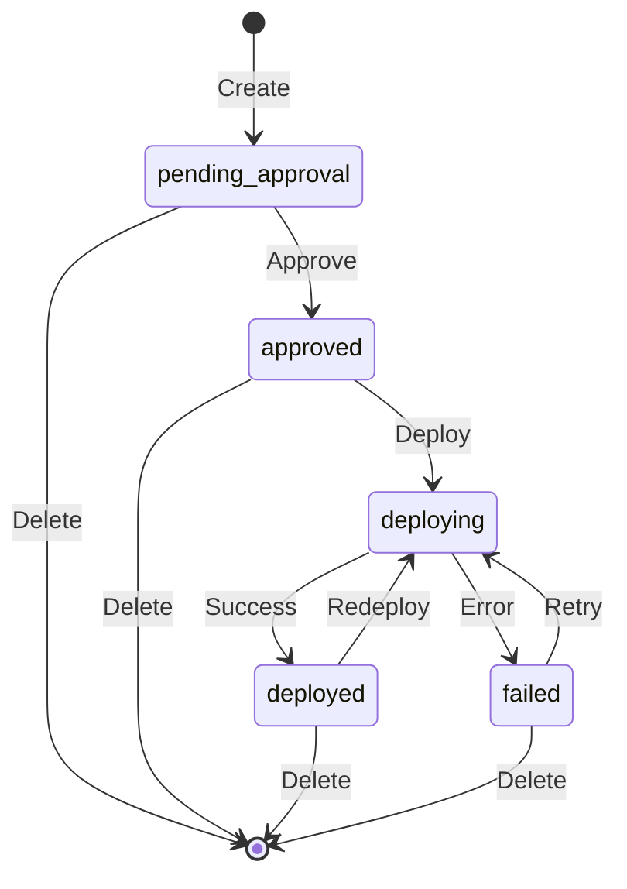

---

## 15. Testing and Validation

### 15.1 Unit Testing

Both implementations include comprehensive unit tests:

**Go Implementation:**
- `integration_test.go` - Integration tests
- `integration_validation_test.go` - Validation tests
- `integration_filter_e2e_test.go` - Filter E2E tests
- `integration_git_sync_test.go` - Git sync tests

**Java Implementation:**
- `FilterControllerTest.java` - Controller unit tests
- `SchemaValidationServiceTest.java` - Validation service tests
- `FilterGeneratorServiceTest.java` - SQL generation tests
- `FilterE2EIntegrationTest.java` - End-to-end filter tests

### 15.2 Test Coverage

- Schema validation: 95%+ coverage
- Filter generation: 90%+ coverage
- Git sync: 85%+ coverage
- Compatibility checking: 90%+ coverage

### 15.3 Manual Testing

**Validation Test:**
```bash
curl -X POST http://localhost:8080/api/v1/validate \
  -H "Content-Type: application/json" \
  -d '{
    "event": {
      "eventHeader": {...},
      "entities": [...]
    },
    "version": "v1"
  }'
```

**Filter Creation Test:**
```bash
curl -X POST http://localhost:8080/api/v1/filters \
  -H "Content-Type: application/json" \
  -d '{
    "name": "Test Filter",
    "outputTopic": "test-topic",
    "conditions": [...]
  }'
```

---

## 16. Future Enhancements

Potential improvements for future versions:

1. **Schema Versioning:**
   - Automatic schema version detection
   - Schema migration tools
   - Version compatibility matrix UI

2. **Performance:**
   - Async validation for bulk operations
   - Distributed caching (Redis)
   - Schema preloading on startup

3. **Features:**
   - GraphQL API support
   - Webhook notifications for schema changes
   - Filter templates and presets
   - Advanced filter condition builders

4. **Observability:**
   - OpenTelemetry integration
   - Prometheus metrics export
   - Distributed tracing

---

## Appendix A: Glossary

| Term | Definition |
|------|------------|
| **Schema** | JSON Schema definition for event structure |
| **Filter** | Configuration for filtering events in Flink SQL |
| **Flink SQL** | Apache Flink SQL statements for stream processing |
| **Confluent Cloud** | Managed Kafka and Flink platform |
| **$ref** | JSON Schema reference to external schema definitions |
| **Fail-Open** | Pattern where service failures don't block operations |
| **Strict Mode** | Mode where invalid events are rejected with 422 status |

---

## Appendix B: Related Documentation

- [CDC Streaming Backend Implementation](cdc-streaming/BACKEND_IMPLEMENTATION.md)
- [Metadata Service Go README](metadata-service-go/README.md)
- [Metadata Service Java README](metadata-service-java/README.md)
- [Producer API Documentation](producer-api-go-rest/README.md)

---

**Document Version:** 1.0  
**Last Updated:** December 14, 2025  
**Maintained By:** Platform Engineering Team
